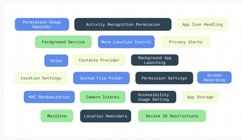
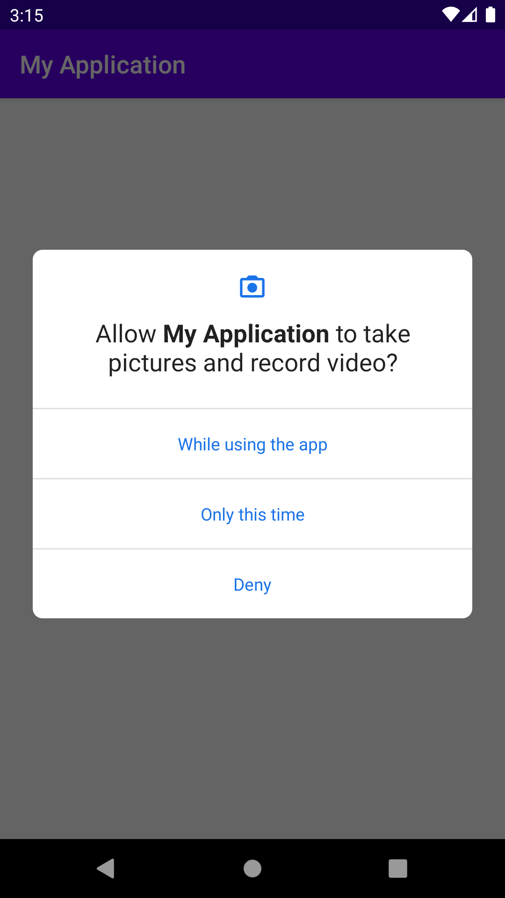
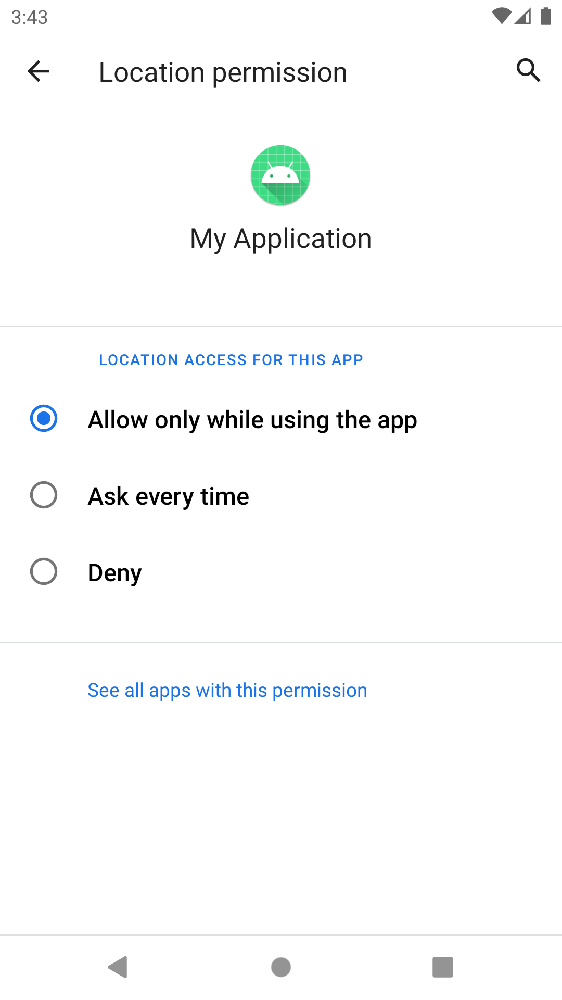
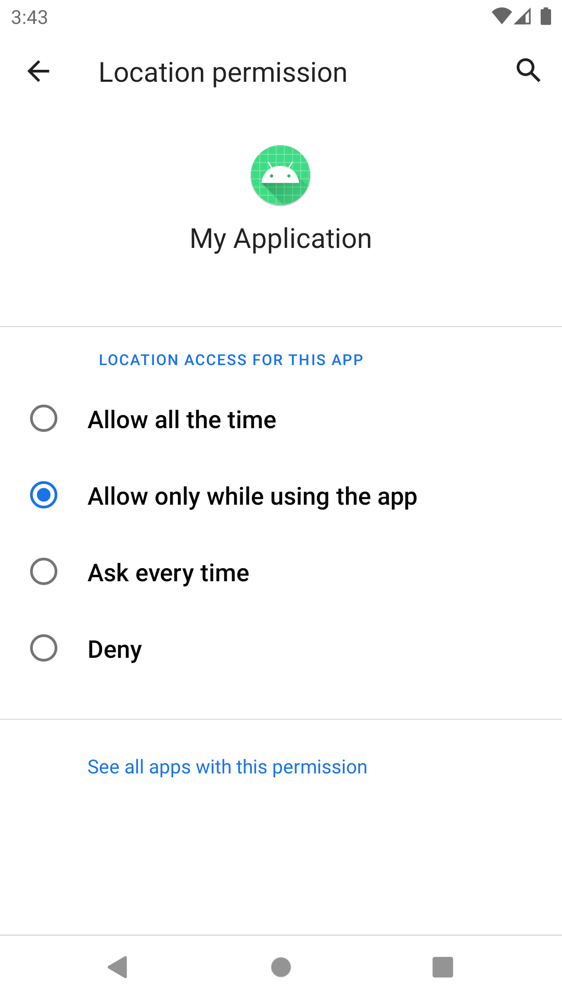
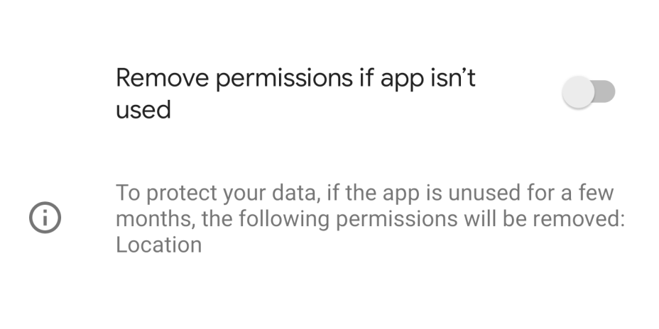
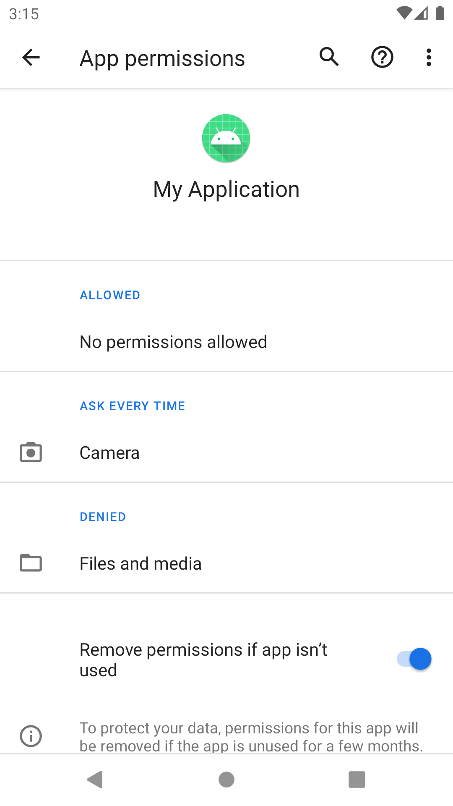

## Android 11 (P)

### 보안 (All things privacy in Android 11)

[목표]
사용자가 데이터를 통제할 수 있으며 어떤 데이터에 접근할수 있도록 할지 선택할수 있게 하고 누구와 데이터를 공유할 것인지 결정
개인 정보 보안 책임은 환경 제공자, 앱 개발자, 사용자가 가지고 있고, 각자 노력을 해야한다.

재밌는건, Android 10 피드백에 따른 보안 강화를 했다는 점.
추후, 개인 맞춤형 보안도 나오지 않을까 라는 기대!


그렇다면 Android 10에서는 어떤 보안을 진행했을까?




### Android 11에서 보안

**권한**
One-time permissions

> "대부분 위치 공유 서비스에서 위치 사용에 대한 권한 승인을 앱을 사용할 때만 접근하도록 승인한다.” 



위치, 마이크, 카메라와 관련된 포그라운드 권한 요청 세분화

- Android 10 접근 권한 - 항상 허용 / 앱 사용중일 때만 허용 / 거부
- Android 11 접근 권한 - 앱 사용중일 때만 허용 / 이번만 허용(Only this time) / 거절

데이터 엑세스

- 앱의 활동이 표시되는 동안 앱에서 데이터에 액세스할 수 있습니다.
- 사용자가 앱을 백그라운드로 가져오면 앱에서 짧은 시간 데이터에 계속 액세스할 수 있습니다.
- 활동이 표시되는 동안 포그라운드 서비스가 실행되고 사용자가 앱을 백그라운드로 이동하면 포그라운드 서비스가 중지될 때까지 앱에
  서 데이터에 계속 액세스할 수 있습니다.

대응? Nothing!

> "사용자가 배경화면에서 앱이 접근하고 있음을 인지했을 때 그들 중 2/3는 배경 화면에서의 접근을 승인하지 않는다.”
>
> "앱이 백그라운드에서 위치에 엑세스 하는 합법적인 사용사례는 드물다.”




ACCESS_COARSE_LOCATION, ACCESS_FINE_LOCATION




+ACCESS_BACKGROUND_LOCATION


백그라운드에서도 접근이 가능한 경우, 항상 허용이 생긴다.

shouldShowPermissionRationale() == true 라면, 위치에 엑세스 하는 이유를 설명하는 문구를 다이얼로그로 가이드 해야한다.

**중요!** 백그라운드 서비스 권한과 포그라운드 서비스 권한을 함께 요청 런타임 에러가 발생한다.

- 백그라운드 서비스 권한 : ACCESS_BACKGROUND_LOCATION
- 포그라운드 서비스 권한 : ACCESS_COARSE_LOCATION, ACCESS_FINE_LOCATION

이런 경우 포그라운드 서비스 권한 > 백그라운드 서비스 권한, 즉 점차적으로 권한 요청을 해야 한다.
포그라운드 권한 없이 백그라운드 권한을 요청하면 아무 동작 하지 않는다.

> 평균적으로 스마트폰 사용자들은 75개의 앱을 가지고 있으나 주로 사용하는 앱은 1/3 이다.

잘 사용하지 않는 2/3의 앱에 이미 허용된 권한은 사용자의 데이터를 접근할 수 있다.

→ 앱을 특정 시간동안(몇달) 사용하지 않으면 Android 시스템에서 그 앱에 허용된 권한을 거부로 변경한것 같이 동작하며 사용자에게 알림. (시스템 설정 > 앱에서 변경x이 아닌 runtime permission으로 다시 요청하면 된다.)

?? 그렇다면, 사용자와 상호작용하지 않는 앱은 어떻게 할까?

- Provide family safety
- Sync data
- Communicate with smart devices
- Pair to companion devices





Settings.ACTION_APPLICATION_DETAILS_SETTINGS 인텐트 액션으로 실행 하거나, 직접 시스템 설정 페이지에서 해당 앱에 들어가서 자동 권한 거부를 제외 시키면된다.

PackageManager.isAutoRevokeWhitelisted() 메소드로 제외인지 체크 가능

*전화번호
전화 번호 API 엑세스시 READ_PHONE_STATE 권한 to READ_PHONE_NUMBERS 변경


------

### 포그라운드 서비스

```
카메라, 마이크 정보를 획득하는 서비스는 다음의 Attribute 를 명시해야함 attribute
```

- attribute
  
  - foregroundServiceType
    
    
  
- values
  
  - camera
  - microphone

------

### 패키지 공개 상태

10 이전 : 설치된 모든 앱 확인 허용
11 이후 : 특정 앱 확인 허용

<manifest>

​	<queries>	</queries>

​	...

<manifest> 요소 내에는 '패키지 이름' 이나 '인텐트 정보'가 들어감

이 요소를 사용하기 위해서는 아래 도구가 필요

- Android 스튜디오 3.6.1 이상 (현재 4.0.0)
- Android Gradle 플러그인 최신 버전 (현재 3.6.0 2월 출시)

단, 모든 앱에 쿼리 또는 상호작용 해야한다면, **QUERY_ALL_PACKAGES** 권한을 포함하면 된다.

이 경우, Google Play 가이드 라인 확인하여 적용

- 런처 앱
- 브라우저
- 보안 앱
- 기기 관리앱

테스트 방법

- https://developer.android.com/preview/privacy/package-visibility?hl=ko#test
- 중요한점은 targetAPI 30인 상태에서 getInstalledApplications() 또는 getInstalledPackages()


------

### 데이터 엑세스 분석

스레드 등록시, 해당 스레드에서 데이터 엑세스 진행시 콜백 발생

SDK, 라이브러리 에서 엑세스 하는 경우도 알수 있음

AppOpsManager.OnOpNotedCallback
참조: https://developer.android.com/preview/privacy/data-access-auditing?hl=ko#log-access

또한 Context에 속성 태그를 만들어서, 어떤 속성 태그가 데이터에 접근하는지 인지할수 있음.
https://developer.android.com/preview/privacy/data-access-auditing?hl=ko#create-attribution-tags

