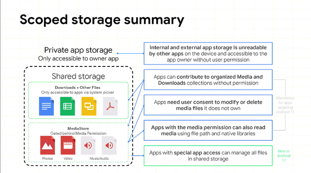

**범위 저장소 (Scoped Storage) 필수!**

Storage Scope (범위 저장소)는 Target API 30에서 필수

### **Storage Scope In Android 10**

1. 앱은 해당 저장소에 제한 없이 접근 가능 (내부, 외부)
2. 공유된 저장소는 4개의 조직화된 공간으루 분리 (사진, 영상, 음악, 다운로드), 앱은 허가 없이 파일은 전송 가능
3. 저장소 런타임 퍼미션은 공유된 사진, 영상, 음악파일에 읽기 접근만 허용
   다운로드나 조직화되지 않은 파일에 접근하려면, 문서 선택기를 통해 접근 가능
4. 앱에서 생성되지 않은 미디어 파일을 수정하는 것은 사용자 확인이 필요
5.  사진 위치 메타데이터에 접근 하려면 새로운 퍼미션이 필요 (ACCESS_MEDIA_LOCATION)

→ targeting 10이라면, requestLegacyExternalStorage를 통해 범위 저장소를 취소 할수 있었다.

 

### **New Features In Android 11**

1. Enabled File Path APIs
   SAF (Storage Access Framework)에서 제공하는 문서 선택기만 접근 허용했으나, 많은 앱에서 라이브러리나 기존 API에서 이미 직접 접근을 사용하고 있던 경우에 변경하기 쉽지 않으므로 이를 지원하기 위해(호환성) 파일 경로 접근을 다시 허용 → 내부적으로 파일 경로 사용을 요청하는 IO는 MediaStore API로 위임하여 동작
   \- MediaStore APIs 사용을 권장
   \- 파일 경로로, 새로운 파일을 생성할때 즉시 MediaStore에 추가
   \- 구글에서 성능 향상에 대한 노력을 하고 있지만, 앱에서 사용하는 코드는 파일 경로/ MediaStore 성능 비교를 해서 적절한걸 사용해라

   

2. Bulk media modification APIs 
   미디어 파일의 편집, 삭제가 멀티 파일 가능하도록 지원
   기존 앱 내부 파일이 아닌 경우, 단일로 사용자 확인을 요청해야 했으므로 불편했음
   \- createWriteRequest
   \- createDeleteRequest

   1) Trash 
   컴퓨터의 휴지통과 같은 개념
   기본적으로 숨김파일이나 표시하게도 설정 가능
   30일 이후 OS에 의해 자동삭제, But 자동삭제전 사용자의 승인과 퍼미션을 추가한 앱에서 복구 가능
   \- createTrashRequest
   2) Favorite
   파일 수정과 유사하게 앱이 가지고 있지 않은 파일에 대해서는 사용자 승인을 받아야함 (기본 사진 앱은 예외로 모든 사진 즐겨찾기에 대해 사용자 승인 필요 없음)
   \- createFavoriteRequest

   

3. All Files Access
   공유 파일로 구동되는 대부분의 앱은 외부 저장소 읽기가 허용되어 있으면 사진, 음악, 영상에 접근 가능

   하지만, 파일 관리자 또는 백업 앱과 같이 공유 스토리지에 광범위하게 액세스해야하는 경우에 대한 요청
   1) MANAGE_EXTERNAL_STORAGE ​​권한 선언
   2) ACTION_MANAGE_ALL_FILES_ACCESS_PERMISSION 시스템 설정 페이지로 안내 (특별한 권한이므로 런타임 권한은 요청은 x)
   3) Environment.isExternalStorageManager()로 권한이 부여되었는지 확인 가능

   미디어가 아닌 파일에 대해 모든 공유 스토리지에 대한 읽기 및 쓰기 액세스 권한이 부여. 
   단, 내/외부 저장소의 앱별 디렉토리 내용, Android/data 포함 모든 하위 폴더, Android/obb 포함 모든 하위폴더 에 액세스 할 수 없음

   

4. Private app storage 
   다른 앱 저장소에 접근 할 수 없음- Target SDK 관계 없이 Android 11 Device에 적용

   

 

### 주의!

1. preserveLegacyExternalStorage 플래그를 사용 하여 앱이 Android 11을 대상으로하는 새 버전의 앱으로 업그레이드 할 때 사용자의 데이터를 마이그레이션 할 수 있도록 레거시 저장소 모델*을 유지

------

*레거시 저장소 모델

앱별 디렉토리, 공용 공유 디렉토리가 아닌 디렉토리

------

단, Android 11에서 새로 설치하는 앱은 Storage Scope를 해제 할수 없음

 

2. requestLegacyExternalStorage 플래그는 Android 11에서 무시한다.

 

### **Tips on Migrating**

1. Legacy storage flag
   앱이 파일 경로나 모든 파일 접근을 사용한다면 앱의 메니페스트에 레거시 저장소 플래그를 유지 (Android 10에서 앱을 구동하는 사용자와의 호환성 유지)
2. Storage access framework
   앱이 문서와 같은 미디어가 아닌 파일 선택을 위해 커스텀 선택을 개발했다면 저장소 접근 프레임워크 사용을 하도록 개발해아함 - 앱 권한(Permission)이 필요하지 않음
3. Modifying media
   MediaStore consent APIs 로  소유하지 않은 미디어 파일을 수정하거나 선택하는건 사용자 승인이 필요없음
4. Top level directories
   최상위 디렉토리에 파일을 저장하는건 권장하지 않음, 앱을 삭제후 재설치하면 이 파일에 접근 불가능함
   앱 저장소 or 조직화된 공간에 저장
   -> 최상위 디렉토리를 사용중이라면 업그레이드전 위치를 옮겨라
5. Content provider
   다른 특정앱과 데이터를 공유하려면 컨텐츠 프로바이더 사용

 

 

### **별첨, FAQ** 

1. 파일 경로 엑세스 성능 vs Media Store API 성능
   사용 사례에 따라 다름. 순차적 읽기는 비슷하고, 임의 읽기 쓰기는 파일 경로 사용이 최대 두배 느림