# Screens - large, small, and foldable

Links: https://youtu.be/llHMxCz2Jig


# Overview

안드로이드가 지원하는 다른 유형의 디스플레이와 앱의 새로운 방식의 화면 및 창의 기능, 디자인, 이를 지원하기 위한 API 와 툴 일부 소개

- Screens and Windows
- Adaptive design
- New tools and APIs

# Screens and Design

휴대폰, 태블릿, 그리고 데스크톱의 범주들 사이에 존재하는 경계가 사라짐

기기 상태를 변경하는 것은 이전 화면의 크기가 제공하는 이상의 편리함을 원한다는 뜻

## More Screen Space

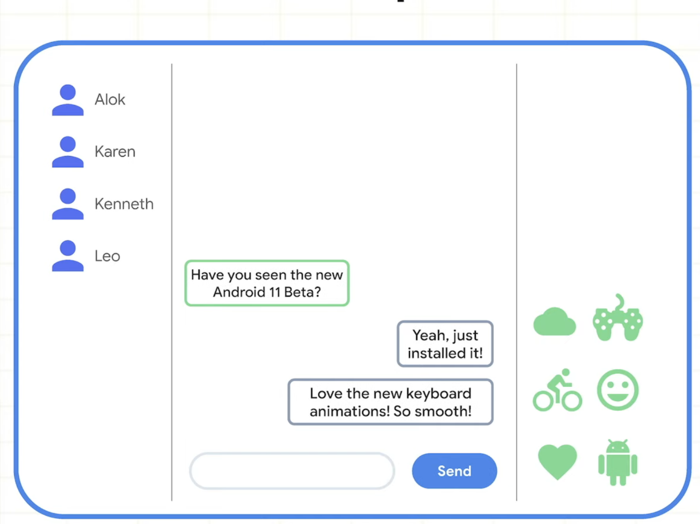
1. 기존 휴대전화 사이즈에서는 필요한 최소한의 요소의 배치만 고려
2. 더 큰 화면에 맞는 개별 요소의 크기를 확대
3. 마스터 디테일 네비게이션 패턴을 사용해서 다른 화면 사이를 쉽게 탐색하는 방법을 제공(왼쪽)
4. 이용 가능한 공간을 단축키로 설정하여 좋아할 만한 기능에 쉽게 접근할 수 있도록(오른쪽)

이는 화면의 어긋남을 줄일 수 있고 사용자가 중심이 되는 주요 콘텐츠나 공간을 막는 행위를 피할 수 있다.


## Hinge

### 경첩에 따라 앱이 공간을 활용하고 분리하는 방법

- 접히는 부분을 사용자가 화면 공간을 인식하는 방식에 따라 논리적 구분을 형성할 수 있다.
- 각도에 따라 선택적으로 분리기로 사용
- 큰 화면의 기기에도 콘텐츠 버튼 정리에 같은 방식을 적용
1. 경첩으로 연결된 두 패널로 앱이 확장되는 경우, 두 개의 컨테이너에 콘텐츠를 분할하는 것이 더 나을 수 있음.
2. 다양한 유형의 콘텐츠나 기능에 기반하여 분리하는 것을 선택할 수 있음.  
3. 화면의 다른 부분에 대화형 요소와 별도로 시각 콘텐츠를 분리 배치
4. 게임 컨트롤을 분리 배치해서 코어 비주얼에 방해를 주지 않고 플레이 가능

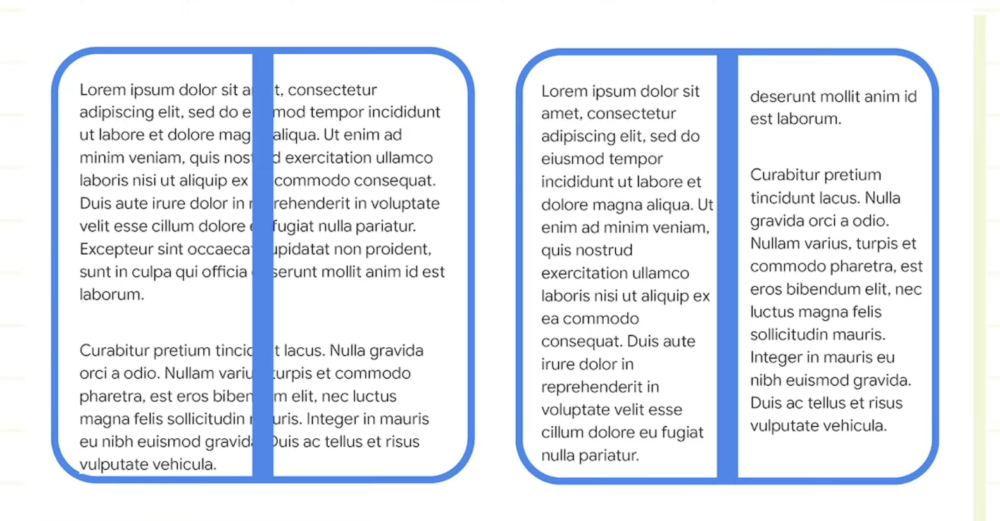

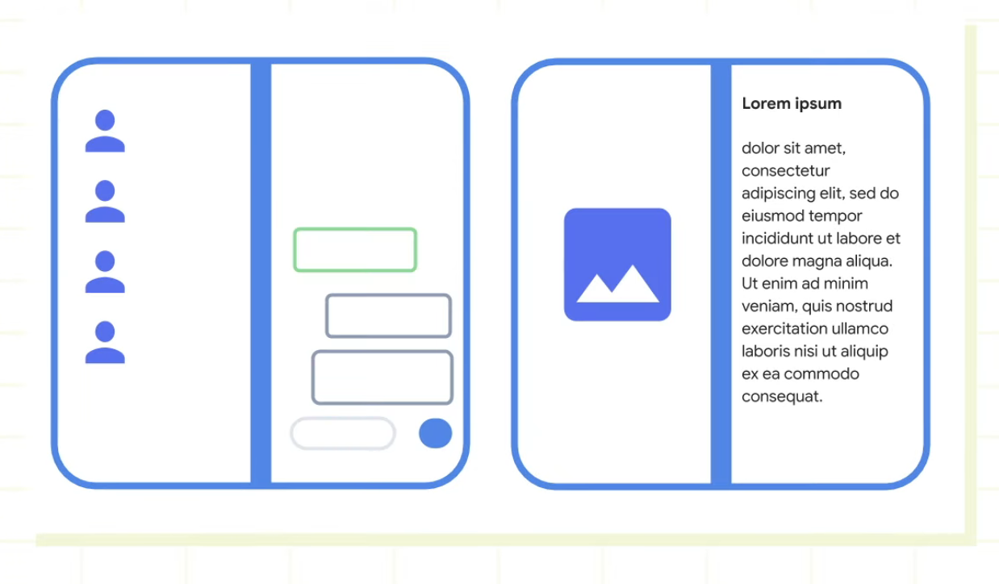

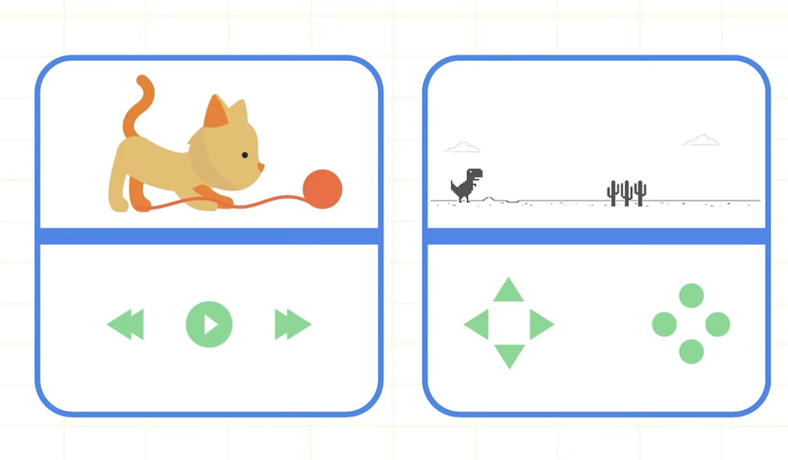


## Multi-tasking

화면이 클수록 사람들이 여러 창을 사용

1. 앱 창의 사이즈가 변경 가능하며 여러 창을 처리할 수 있도록 
2. 데스크톱 같은 윈도우 설정 환경에서도  전자 펜으로 끌어서 놓기나 커서 같은 다양한 기능에 대한 지원
3. 키보드와 마우스에 대한 지원


## Multi-instance

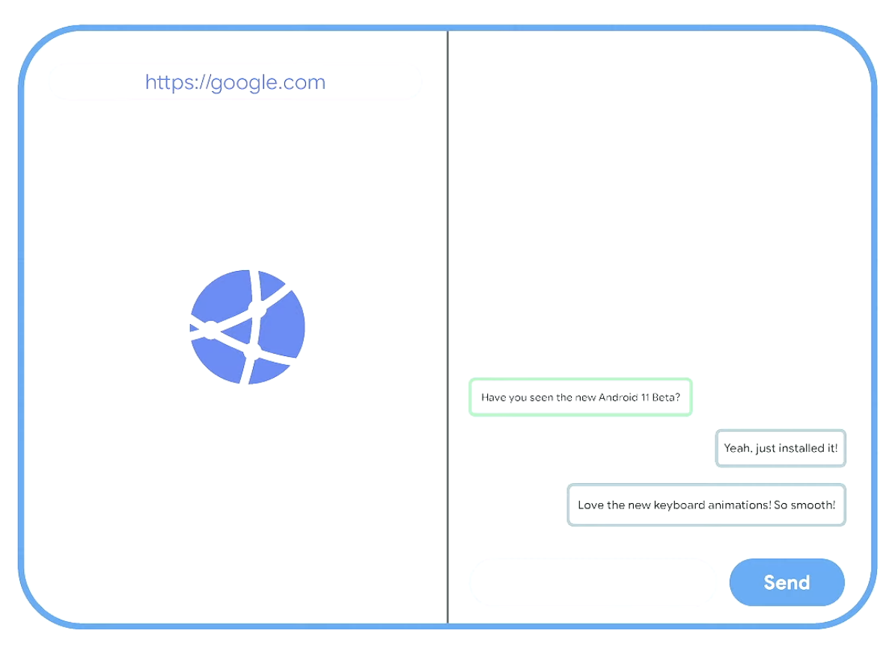

동시에 구동되는 앱의 다양한 인스턴스를 갖는 것

두 개의 문서 또는 여러 개의 이메일 창, 또는 여러 사람들과 메시지 앱으로 대화하는 경우 등등

- Application 클래스 인스턴스같이 비시각적인 것들은 단일 개체로 공유
- Actvity 같은 시각적 개체들은 앱의 각 창에 맞춰 생성

    → 다양한 크기, 위치 설정이 가능

    →  리소스 사용 및 레이아웃을 확장을 위한 올바른 시각적 내용을 사용해야 함.

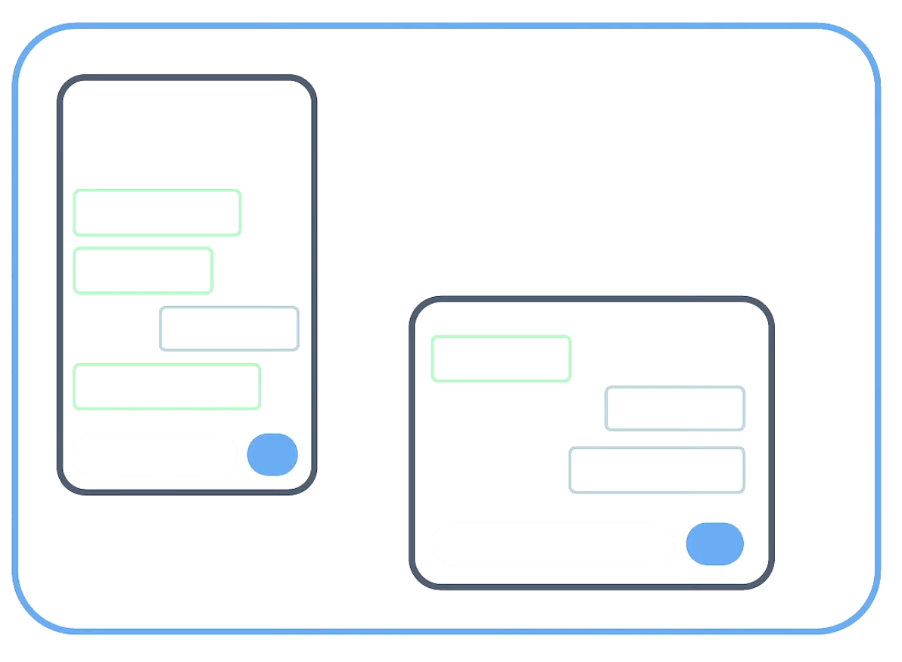


# Jetpack Window Manager

https://goo.gle/window-manager-blog

1. 경첩과 같이 창의 경계 내에서 다양한 디스플레이 기능의 레이아웃 정보 제공
2. 현재 경첩 상태에 대한 정보
3. 현재 접힌 위치와 각도의 상태
4. 사용자가 기기를 접거나 펼 때 알림을 받도록 리스너 구독
- Jetpack alpha 채널
- 에뮬레이터는 곧 지원 예정
- Jetpack 라이브러리에서 접을 수 있는 환경 설정 제공

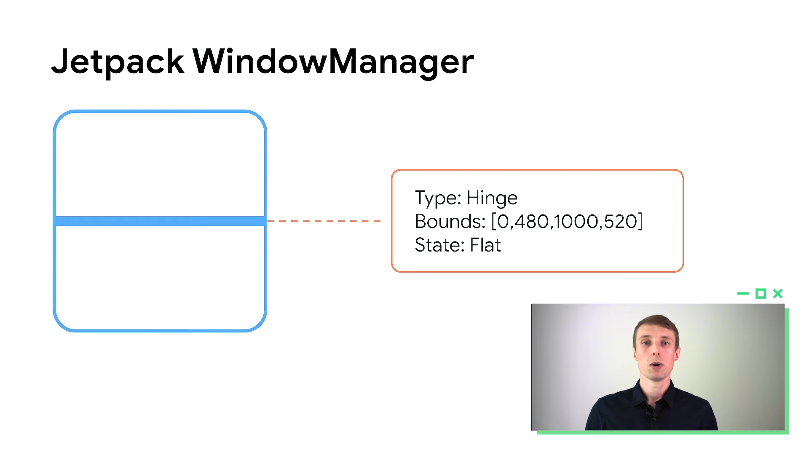


# Android CDD

https://source.android.com/compatibility/android-cdd

안드로이드 호환성 정의 문서

여러 창이 열린 상태에서 화면 크기, 창의 크기, 기기의 환경 설정에 대한 정보를 제공

사용자가 원하는 윈도우 크기 선택을 존중

- Smallest window size

    320dp fullscreen

    220dp in multi-window (분할 화면, 부동 윈도우 설정 모드)

- Smallest physical width : 2 inches

    대상 영역 터치와 내비게이션 하부의 충분한 공간을 확보할 수 있게

- Aspect ratio

    9:21 - 1:1 - 21:9
    

## 고정 사이즈 설정

Android manifast 플래그로 창의 가로세로 비율 및 크기 고정 가능

일부 기기의 뒤편에 추가된 아주 작은 화면 사이즈를 지원할 수 있음

```xml
<activity
	android:minAspectRatio=...
	android:maxAspectRatio=... >
	<layout
		android:minHeight=...
		android:minWidth=... />
</activity>
```

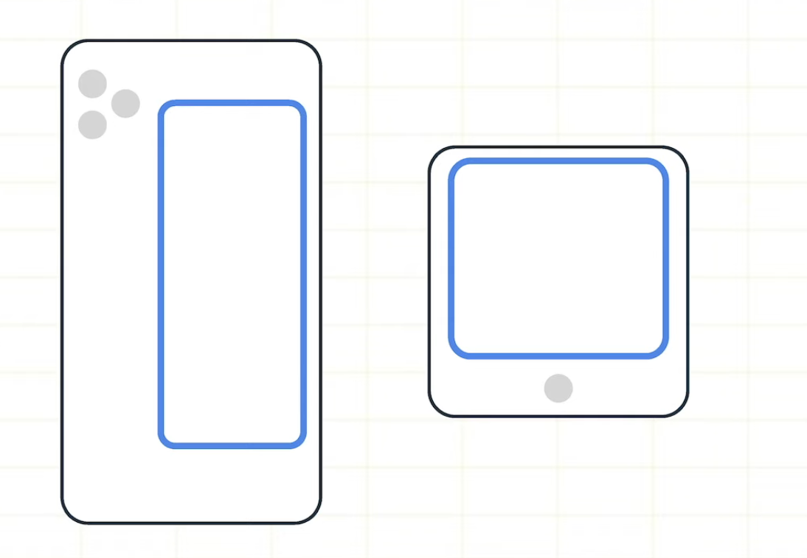


## Best practices

- Handle orientation and window size changes
- Test and declare support for resizable windows

→ foldable 뿐만 아니라 android, chrome OS에서 원활히 작동


# Testing

## Multi-Display

안정적인 Android Studio 에뮬레이터

WindowManager API  사용 시, 다양한 화면 크기 설정, 런타임 시에 변경 사항에 대한 테스트 가능

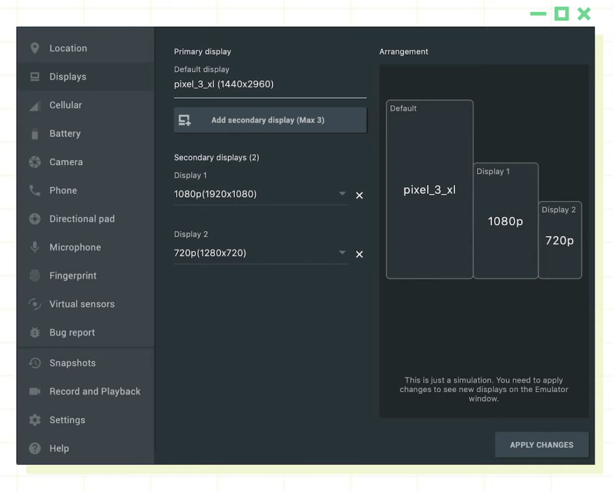


## Freeform

에뮬레이터 윈도우 설정 환경에 네이티브 자유 방식 타깃 모드 추가

자유롭게 창 크기 조절, 위치 변경 가능, 다양한 창 설정 및 런타임 크기 변경

앱 테스트를 위해 chromebook이 필요 없음

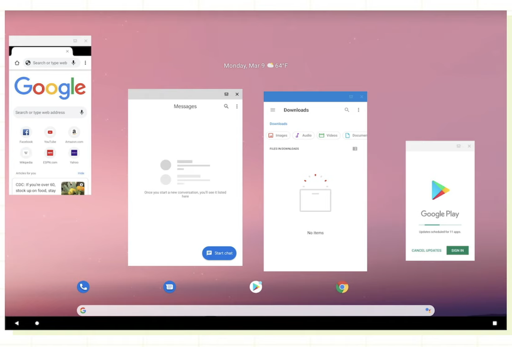


## Foldables

Hinge 센서 API와 통합하여 Jetpack Window Manager 기능을 지원 예정

- 경첩 상태를 통제
- 앱의 업데이트
- 동시에 구부러지는 화면 상에서 구현될 모습 재현

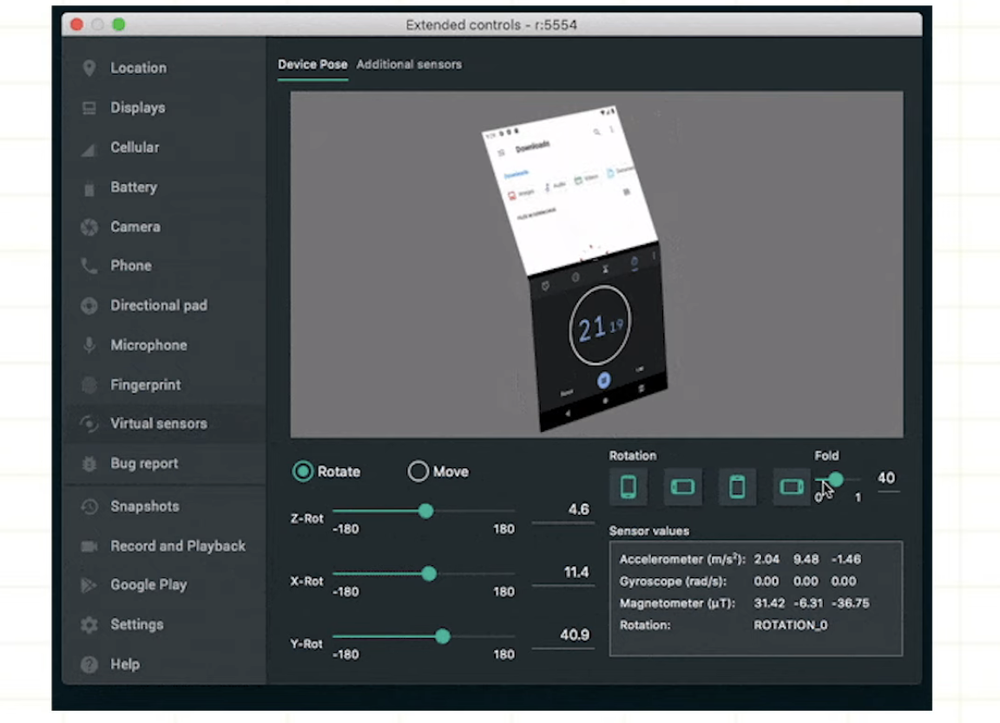


# APIs

## Deprecated APIs

→ 화면 크기보다 창의 크기가 더 중요해짐

- Display#getSize()
- Display#getWitdh()
- Display#getHeight()
- Display#getRectSize()
- Display#getMetrics()
- WindowManager#getDefaultDisplay()
    - 초기 android에서 단일 화면 기기의 크기를 제대로 조정하지 못했고 호환성을 위해 현재 창의 크기에 맞는 조정된 값을 되돌려 보냈기 때문


## New APIs

- Context#getDisplay()
    - Context에서 직접 설정
    - 호출하면 현재 보이는 화면상의 디스플레이 리턴
    - 비시각적 컨텍스트에 이를 호출하면 불가능 및 예외 발생
- Context#createWindowContext()
    - 비활동성 창의 경우에 관심 있는 창의 유형에 맞는 컨텍스트를 생성
- WindowMetrics
    - 원하는 창의 크기 반환
    - Rect getBounds() {...}

        화면 상의 창의 크기, 위치 정보

    - WindowInsets getWindowInsets() {...}

        시스템 창, 꾸미기 또는 오려내기 같은 실제 화면 속성으로부터 현재 적용된 inset 정보

    - activity.getWindowManager().getCurrentWindowMetrics()

        컨텍스트와 관련

        인스턴스를 얻으려면 현재 activity와 같은 올바른 시각적 context를 사용 

    - WindowManager#getCurrentWindowMetrics()

        현재 시스템과 창의 상태에 따라 값을 리턴

    - WindowManager#getMaximumWindowMetrics()

        창이 차지할 수 있는 가장 넓은 잠재적 공간의 크기를 리턴

        멀티 창 모드에서 사용자가 현재 창을 전체 화면을 아우르는 작업으로 확장할 때 예상되는 경계

- 일부 다른 Window Manager API에 맞는 컨텍스트의 잠재적인 오용에 대해 Lint와 StrictMode에 새로운 경고 사항을 추가 중


## Hinge sensor

기기가 열리거나 닫힐 때 사용자 지정 애니메이션을 사용할 수 있다.

- 센서를 지속적으로 읽으면 배터리 용량에 부담 가능성
- 기기마다 정확도 상이
- 값의 범위가 기기마다 다를 수 있음 0~180도, 0 ~ 360도

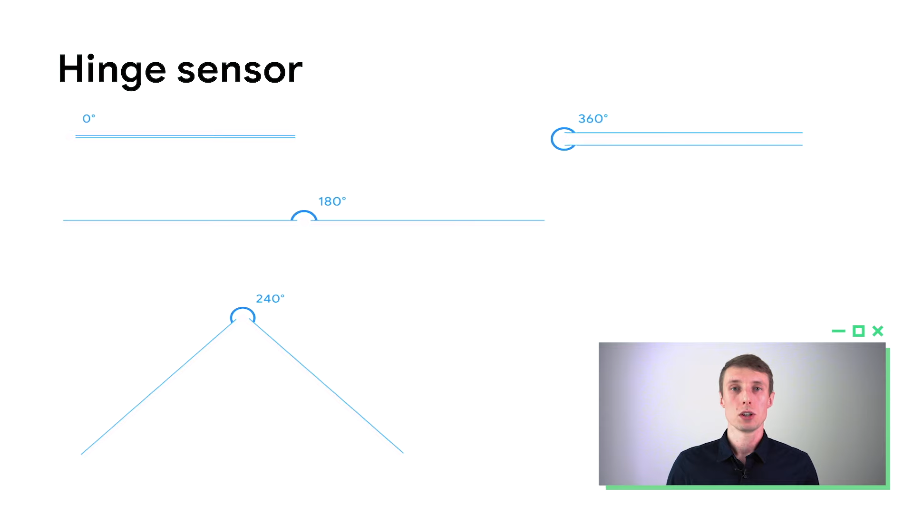


# Recap

- 다양한 형태의 화면과 창 설정
- Design challenges and Oppertunities
- Jetpack WindowManager
- New Developer tools
