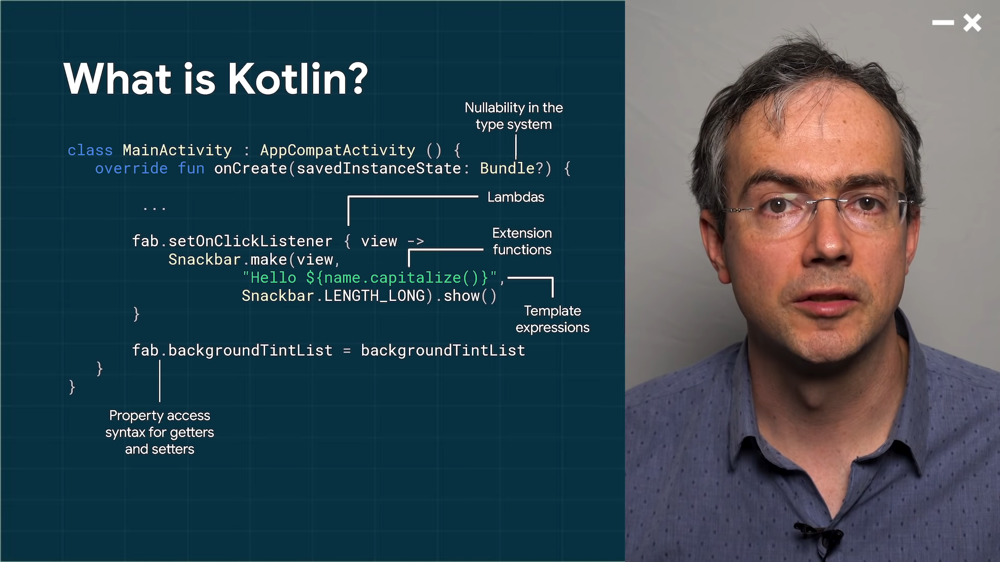
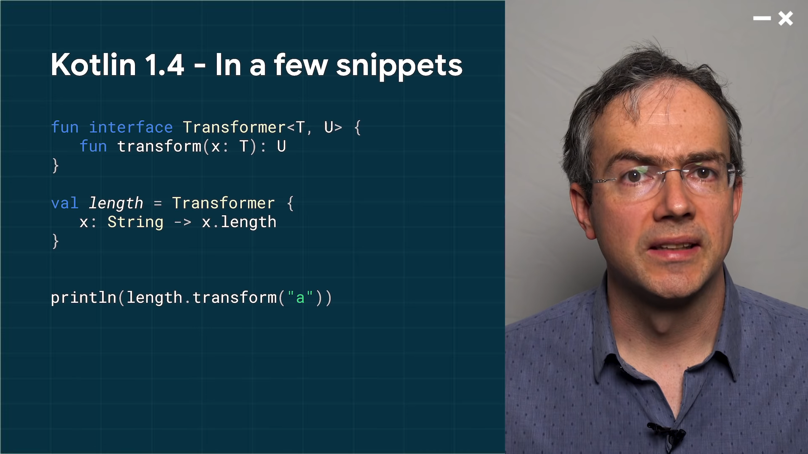
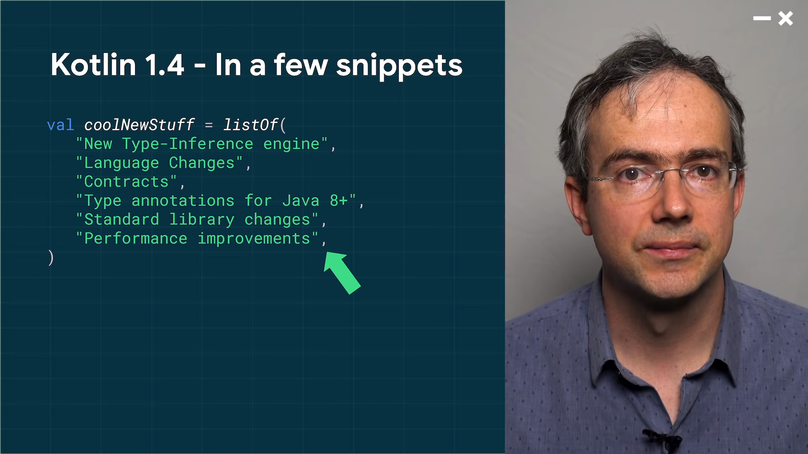
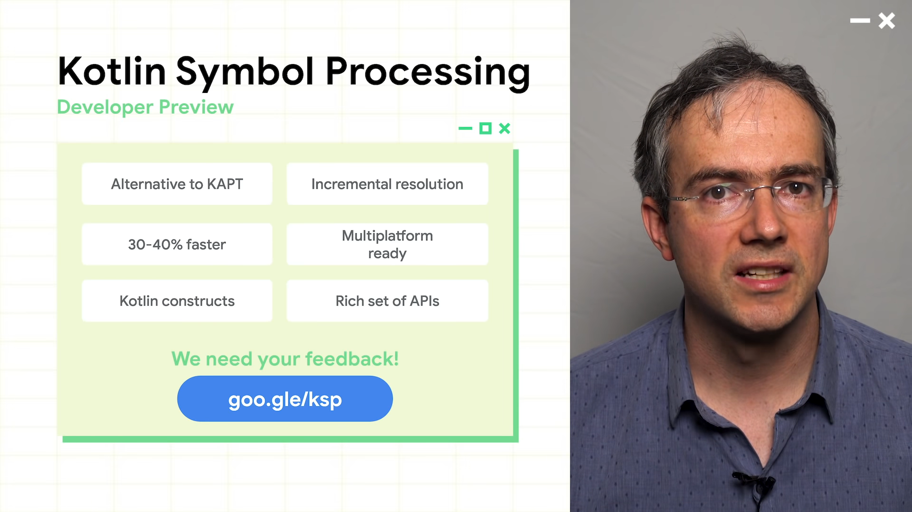
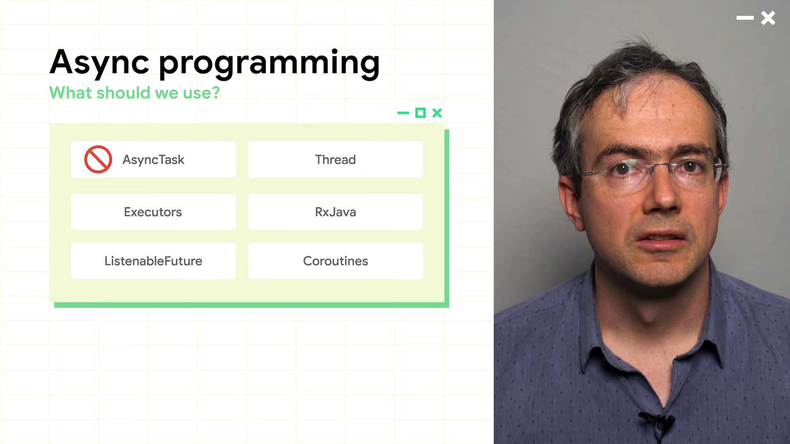
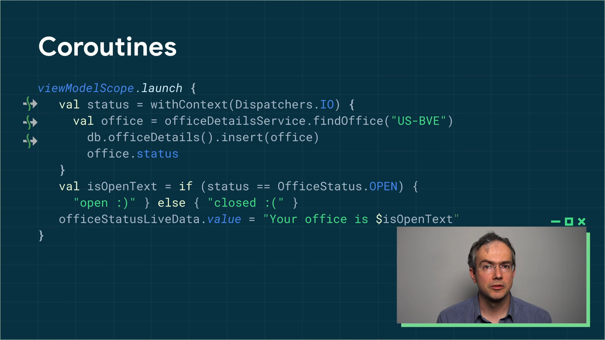
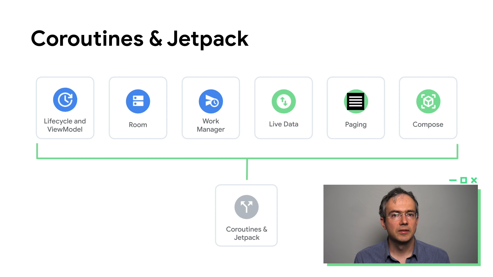
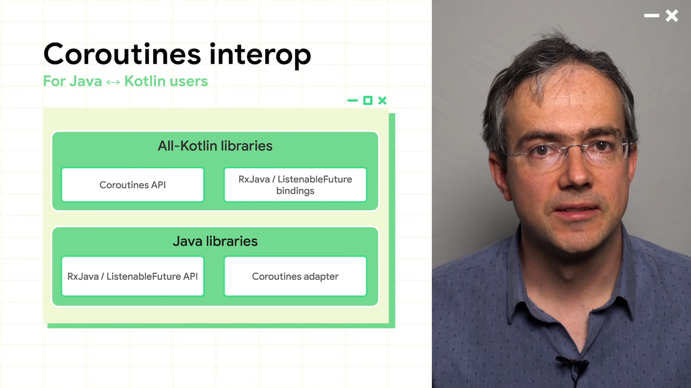

[**YouTube Link**](https://youtu.be/AgPj1Q6D--c)    

# What is Kotlin?
</img> 
런타임 시에 NullPointerException을 피하기 위한 Nullability 지원

Lambdas을 통한 더 짧은 구문 형식은 콜백 코드를 보다 간결하고 가독성이 좋도록 도와줌

Extension 기능은 보조 코드를 더욱 쉽게 찾고 util.로 인해 코드가 오염되지 않도록 하는 기능

포맷을 배치하기 위한 템플릿 표현

설정자와 접근자에 대한 추출

# Why Android loves Kotlin?
언어가 다양한 bolierplate 한 코드를 관리 해준다.

Kotlin의 strong-typed 시스템은 런타임 오류를 방지해준다.

자바와의 호환성

Coroutines는 비동기 프로그래밍을 스파게티 코드를 방지 하면서 가능하게 해준다.

# Kotlin on Android in 2020
Kotlin을 사용하는 개발자는 언어에 대해 매우 만족할 가능성이 50%이상.

안드로이드 개발자 60%가 코틀린 사용

GooglePlay에 등록 된 상위 1천개의 앱중 70%가 코틀린 사용

# Google's contributions to Kotlin
JetBrains와 함께 Kotlin을 위한 재단 설립

Kotlin 컴파일러에 기여

Kotlin과 관련 된 Tool 구축

Paging 3.0, JetPack, Compose → Kotlin first
Play Core, GoogleMap → Kotlin Extensions 추가
Added more nullness annotations to Android 11 for safe api call.
내장형 Kotlin 템플릿 추가.
Kotlin 전용 린트 추가 → 자바를 코틀린으로 변경할 때 유용
R8(code shrinker tool)에 코틀린 최적화 기능 추가
유투브에 코틀린 교육 영상 업로드
deveoloper.android.com 등에 Kotlin 관련 코드랩,문서 업데이트
KotlinEverywhere 행사 개최
# Java Programming Language
안드로이드에서 계속 지원 예정

Android Studio 4.2 부터 자바8 desugaring을 기본적으로 지원.

Android 11 Core 에 desugaring으로 stream, time 라이브러리 지원

# Kotlin at Google
구글앱중 55개 이상이 코틀린 사용

대부분의 프로젝트를 코틀린 베이스로

서버사이드에도 코틀린 사용

gRPC, ProtoBuf같은 라이브러리에도 Kotlin 지원

# Kotlin 1.4 preview
language additions, type inference improvements, Java8+ byte 코드 생성

common reflection api for Kotlin reflection

위의 내용으로 전반적 성능 개선

fun interface
</img> 

trailing comma 허용
</img> 

코드에 균형이 생기고, 코드 리뷰때 혼란을 줄여준다.

# Kotlin Tooling Perfomance 
Kotlin Gradle plugin to make annotation processors more incremental

IDE 성능 개선시도 → Kotlin 1.3.60에서 개선 달성

Gradle.inc 와 Instant Execution 프로젝트 협업 → 30% 성능 향상

Kotlin annotation processors로 인해 성능 하락 → Kotlin Symbol Processing(KSP)을 통해 해결 중

# Kotlin Symbol Processing
</img> 

# Async programming on Android 11
</img> 

# Coroutines
</img> 
Kotlin 1.3 버전부터 지원, Kotlin용 비동기 프로그래밍 처리 방법

Coroutines 코드는 Scope에서 실행.

Dispatchers.IO는 네트워크,DB 접근 같은 IO환경 제공

UI thread를 block하지 않고 실행.

# Why Coroutines?
코드의 구조적 일치로 인해 개발자의 실수를 줄여준다.

callback-free

쉬운 취소, exception handling 지원

# Coroutines & Jetpack
</img> 

# Coroutines interop
</img> 