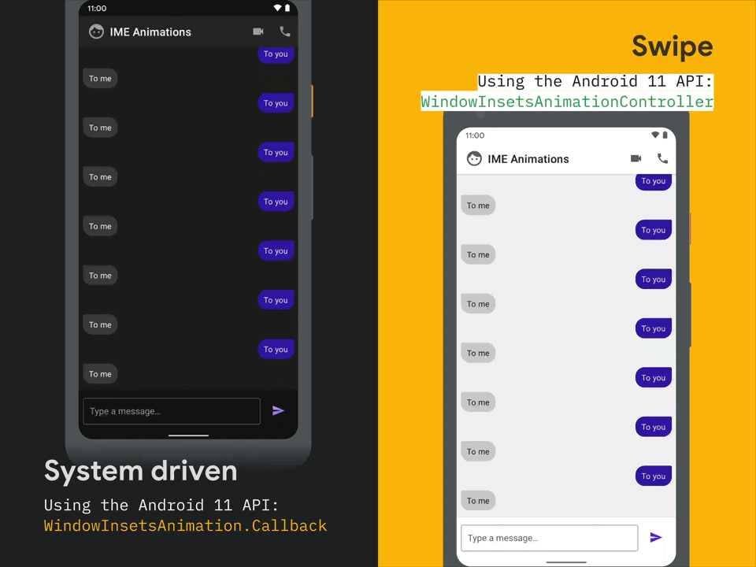

# What's new in Android 11

### UI

1. Window Insets - More information about the multiple types of content being displayed
   * Such as Informations about Status, Navigation, IME
   * Many methods in the WindowInsets deprecated, Window-type specific things are added.
   * Via listener, we can get the changes of status on insets.
2. IME Animations
   * Synchronize keyboard animations with app content changes
   * Listener for changes
   * Drive keyboard animation directly / or just leave it as system-driven
   * Due to the parameter we put into the windowInsetAnimation, we can see it works differently
     * Setting duration
     * LinearMotion (interpolator)
     * Cancellation allowed
     * Animation control listener
     * `editText.setWindowInsetsAnimationCallback(WindowInsetsAnimation.Callback)`

3. Conversations
   * One of system UI area / one of way to interact with users
   * Via existing notification mechanism
   * Bubble upcoming next is a way to converse. 
   * We can change the priority of the conversations and choose how the system should notify us.
   * Person, ShortcutInfo and Notification
4. Bubbles
   * Like a facebook chat icon on the home screen
   * If an user taps that bubble then it will show a mini activity
   * Notifications that can also show as bubbles
   * In Android 10: Developer option
   * Better than the System Alert window.
   * Created with Notification API with more metadata and dedicated activity
   * Activity corresponding to this bubble should be declared in `Androidmanifest.xml`
   * Notification.BubbleMetaData, shortcut Id

### Privacy

1. Data Access Auditing
   * When app code accesses private data
   * Code in a third party or external library accesses private data
   * Registering callback, and this callback is triggered when it occurs
   * `AppOpsManager`, `AppOpsManager.OnOpNotedCallback`

2. One-Time Permissions
   * The permission that the user only can be granted at that time.
3. Background Location
   * More restrictive in Android 11
   * At first request foreground permission
   * Then request background permission -> Take user to Settings and let him/her trigger the permission manually

4. Foreground Services
   * Location in Android 10
   * Camera, Microphone in Android 11
   * Declaring attributes in `AndroidManifest.xml `

5. Package visibility restrictions
   * It’s not possible to query all of the packages installed on a device
   * Instead, we need to declare in the manifest what we want to access.
6. Scoped Storage
7. Auto-reset permissions
   * Dealing with the particular case that an user hasn’t used an app for a couple of years since he/she installed and ran the app, granted permission.
   * Then the system automatically reset the permission granted

### Developer Goodies

1. Wi-Fi Debugging - Android Studio 4.2 Canary
   * Manually enable that option, pair and connect with the device
2. Nullability Annotations - it has been added to platform APIs over the last couple of years
   * `@RecentlyNullable` , `@RecentlyNonNull`
     * It indicates that it has just added them recently, and when built it shows warning.
   * `@Nullable`, `@NonNull`
     * Errors - when passing null to nonnull annotated parameter

3. Crash Reasons Reporting
   * API to query why your app crashed.
   * Crash Reasons Querying - with `getHistoricalProcessExitReasons()` in activityManager which returns List of  `ApplicationExitInfo`
4. GWP-ASan
   * For native code/libraries
   * Android 10: HWASan
   * Catches memory issues
   * On user devices in the field
   * Low overhead (runtime and memory)
   * Reports uploaded to Play dashboard
   * Declaring in `androidManifest.xml`
5. ADB Incremental
   * For huge APKs (like Game)
   * Faster installs via command-line (up to 10x faster)
   * First: sign APK, create APK signature scheme v4 file
   * `adb install --incremental`
6. Behavior Changes
   * Most changes only take effect on targetSDK R
   * We can test changes with behaviour toggles when we want to target, if we want to do.
   * Command Line vs UI which is newly exposed

### Graphics

1. NDK Image Decoders
   * All decoders are directly accessible to native code (JPEG, GIF, PNG, WEBP...)
   * No more JNI up-calling and down-calling to Android SDK
   * No more Bundling decoder libraries
   * No more bulky apk by the bundles
2. Animated HEIF
   * We can load animated images from HEIF files as `AnimatedImageDrawables`, using `ImageDecoder`
   * Smaller than GIF
   * Should be performed off the main thread when decoding.
3. NDK: OpenSL ES (Deprecated)
   * Oboe for the win! (Open source)
   * CPP library providing high performance audio features
4. Variable Refresh Rate
   * With the rise of high refresh rate, `Surface.setFrameRate()` can enable us to set the frame rate, especially if we have our own rendering loop in the app.

### Furthermore

1. Neural Networks API
   * For ML stuff
   * C API for on-device ML with version 1.3 along with Android 11
2. 5G API
   * APIs to optimise 5G experiences
     * Metered network state
     * Bandwidth estimate
     * A callback is in `ConnectivityManager` , which returns the state of the network and lets the user cope with the changes.
3. Autofill / Keyboard Integration
   * Autofill content in keyboard, not drop-down
   * `InputMethodService`
   * Keyboards and Password apps

### Non-Platform

1. Jetpack

   * 70+ libraries, releases every two weeks
   * Hilt (DI built on the top of Dagger)
   * Paging 3.0 - All Kotlin with Coroutines
   * CameraX beta
   * Further discussion in the other session about Jetpack

2. Jetpack Compose

   * new UI toolkit for Android
   * More on the other session about Jetpack Compose

3. Android Studio

   * 4.0 stable
     * Motion Editor (for `MotionLayout`)
     * Layout Inspector
   * 4.1 beta
     * Database Inspector (Room. SQLite)
   * 4.2 Canary
     * Wireless debugging with Android 11
     * Jetpack Compose development
   * More on the other session about Dev tools and Design tools

   

### Google Play

1. New Play Console in beta
   * Complete redesign
   * Clearer and easier to use
   * What's new in Google Play

