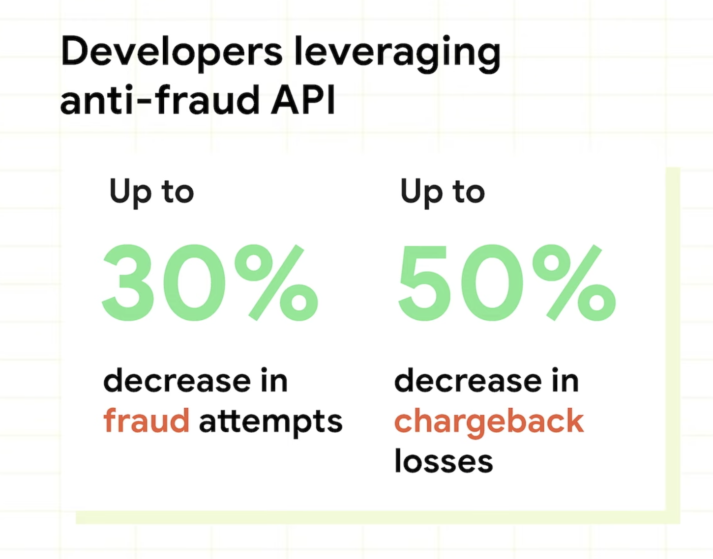
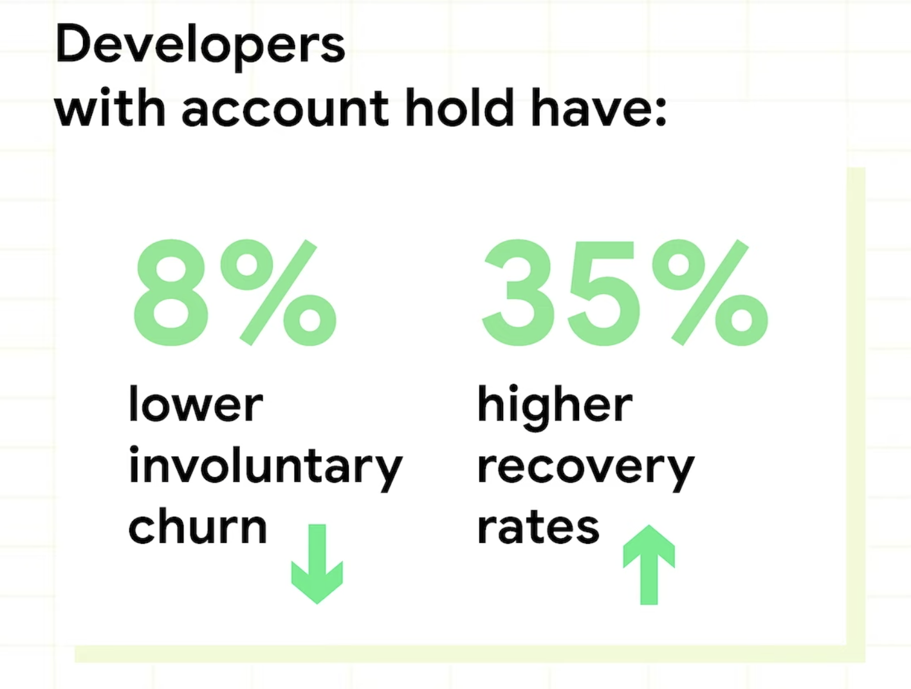
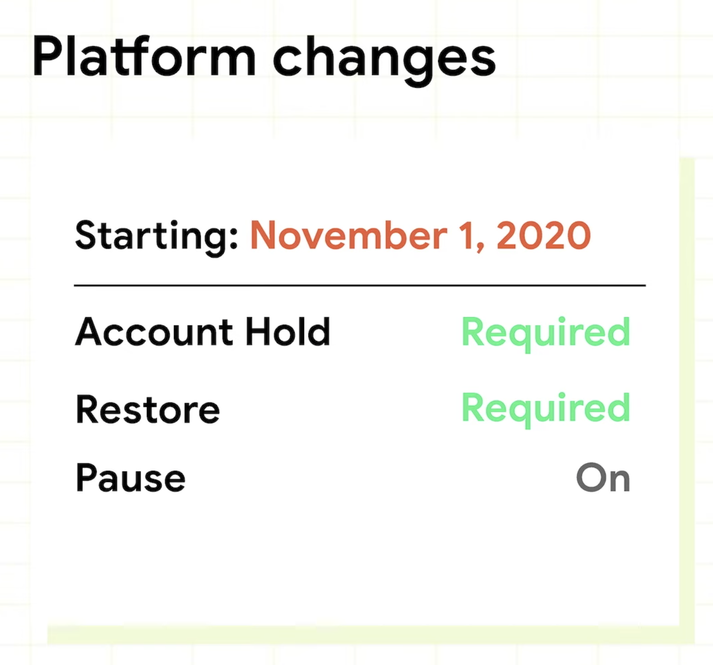
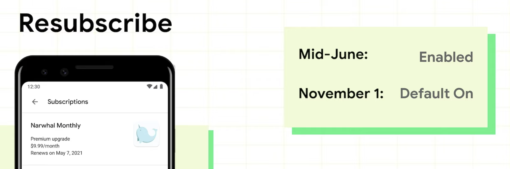
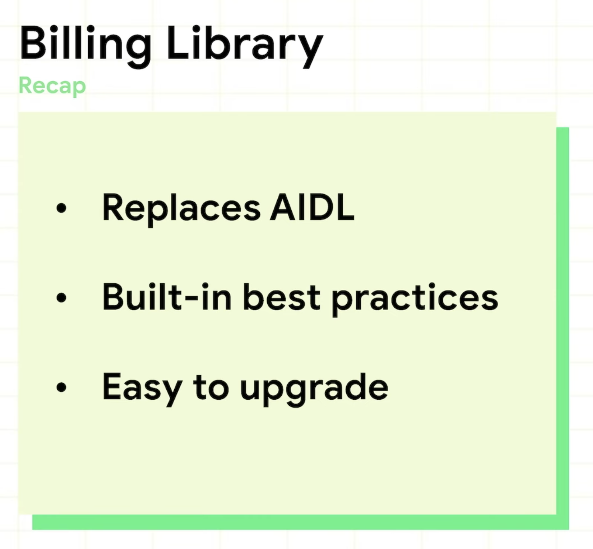

# What's new in Play Commerce

- 사실 물품이 오가고 하는 그런 커머스 시스템이 아닌 기존의 인앱 결제를 두고 하는 이야기

### 현재 Google Play 에서 주로 일어나고 있는 커머스 3대장

- 유료 앱 구매
- 인앱 구매
- Play Pass / 구독

## 1. 신뢰

Google 에서 중요시 여기고 있는 가치 중 하나로,
Google에서는 사용자와 개발자가 서로 믿을 수 있는 커머스 환경을 구축하고 유지 하는 것을 매우 중요시 여김.

#### 개발자가 사용자를 신뢰 할 수 있는 기능

- [사기 방지 API](https://developer.android.com/google/play/billing/security)

  - 사기 시도의 30% 방지

  - 입금 취소로 인한 손실 50% 방지

    

#### 사용자가 개발자를 신뢰 할 수 있는 기능

- 구독에 대한 신뢰
  - 이미 4월 정기 [결제 정책 업데이트](https://support.google.com/googleplay/android-developer/answer/9900533) 를 통해 여러 부분 조치가 완료 됨
  - 무료 체험판 및 신규 유저의 할인 혜택을 구입 화면에서 명시 할 것.
  - 가격 인상의 경우 유저에게 확실한 고지가 이루어 져야 할 것.
  - 정기 결제의 관리 및 취소에 대한 규정을 준수하고 그 과정이 단순 / 간편 해야 할 것.
- Google Play Platform Update
  - 현재 구독중인 App의 상황(체험 / 정기결제)을 볼 수 있음
  - 이메일 알림 세트를 통한 구독 리마인더 제공
  - 삭제 시, 구독 중인 경우에 대한 알림 제공
  - Play 구독 센터를 통해 언제든 구독 취소가 가능

## 2. 성장

#### 전 세계 고객들의 접근성을 높이는 작업 (Access / Optimize)

인도의 UPI / 인도네시아의 GoPay / 태국의 TrueMoney 등의 다양한 나라의 결제 방식을 적용하여 고객의 결제 접근 성을 더욱 높이고 있음.
또한 일본, 멕시코, 인도네시아, 말레이시아 등 여러 지역에서 인앱 결제 시 현금을 사용 하는 방법에 대해서도 지원 예정.

#### 수익을 정산하는 방법에 대한 선택 (Choice)

- Google Play Console 에서의 Promo codes 발급 부분에 대한 개선

  - One-time codes
  - Custom code

  (Billing lib ver2 이상이 필요)

#### Google Play Pass

- 2019 가을에 출시 된 Google Play의 번들형 상품으로,
  현재 500여개 이상의 앱과 게임이 서비스 되고 있음.
- 단순 홍보인듯 하여 PASS...

#### 고객 이탈의 방지

- 구독 고객의 계정 정지 / 유예 기간을 두는 시스템의 적용
  - 8% 낮은 비자발적인 이탈 / 35% 더 높은 재 결재 비율을 보임.
  - 
- 당장 올 해 11월 부터 계정 정지 / 복구가 필수 사항으로 변경 됨.

- Subscription benefits

  유저 이탈을 줄이고자 구독 취소 시점에 구독에 대한 혜택 사항을 다시 한 번 리마인드 할 수 있도록 별도의 팝업을 제공
  (흔히 스트리밍 뮤직 서비스인 멜론과 지니 등에서 이용권 해지 시 자주 볼 수 있었던 '그 것'.)

(반복적으로 Billing Lib ver 2를 사용하기 위해선 ACK API를 구현 하여야 한다는데, 해당 내용에 대해서 찾을 수가...)

#### Google Play Points

#### Billing Library

