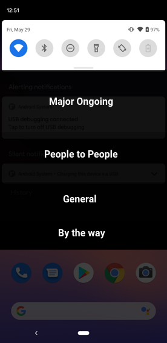

Android 11은 사람 중식점이고 표현력 있게 대화 방식을 재구성 중.

- 대화 알림은 top of the shade 공간에 나타남 
- Bubble로 대화 열기
- 홈스크린에서 대화 바로가기(shortcut)


### What is a notification?

뉴스, 메시지, 이벤트 등에 대한 알림


### People notification

사람간의 메시지를 말함.

Android 8(Oreo) 부터, People notification은 ongoing or critical / major 알림 이후에 보여진다.

People Context와 URI가 지정되어 있는 알림이 People notification내에서 알림 순위가 높아진다.



<Notification drawer visual hierarchy>


### Notification ranking

알림의 정렬, 순서, 우선순위 또는 순위에 대한 정보를 알고 싶은 경우 [Notification Record](https://android.googlesource.com/platform/frameworks/base/+/master/services/core/java/com/android/server/notification/NotificationRecord.java) 를 참고.

→ 알림 순위를 정하는데 사용되는 순위와 순위 계산이 수행되는 모든 정보를 포함

- channel settings (8.0 미만에서는 사전 채널의 우선순위)
- noisiness
- freshness
- context

랭킹 기준은 [NotificationSignalExtractor](https://android.googlesource.com/platform/frameworks/base/+/refs/heads/master/services/core/java/com/android/server/notification/NotificationSignalExtractor.java) 참고


People notification 순위는 [ValidateNotificationPeople](https://android.googlesource.com/platform/frameworks/base/+/master/services/core/java/com/android/server/notification/ValidateNotificationPeople.java) 를 참고.

fun validatePeople(...) 메서드로 중요도별로 알림을 정렬하는 선호도(affinity bits) 를 설정

```java
private RankingReconsideration validatePeople(Context context, final NotificationRecord record) {
		...
    final PeopleRankingReconsideration rr = validatePeople(context, key, extras, record.getPeopleOverride(), affinityOut);
  	final float affinity = affinityOut[0];
  	record.setContactAffinity(affinity);
  	...return rr;
}
```

유효한 연락처이거나, 사용자의 연락처에서 왔거나, 별표나 즐겨찾기가 있는 경우 선호도가 증가


### Android 11 and Conversations

Android11 에서 사람 관련 기능의 중요성을 강조하는 변경 사항이 있다.

이제, [Messaging style notifications](https://developer.android.com/reference/androidx/core/app/NotificationCompat.MessagingStyle#NotificationCompat.MessagingStyle(java.lang.CharSequence))은 drawer/shade 섹션이 있다.

추가된 새로운 대화 공간과 floating overlay로 뜨는 [Bubbles](https://developer.android.com/guide/topics/ui/bubbles) 로 대화에 쉽게 연결할 수 있다.


[Conversation APIs](https://developer.android.com/preview/features/conversations) 의 the publishing of shortcuts 을 보면, 특정 가이드라이에 따라 다양한 스크린에서 대화가 표시될수 있다. 상황에 맞는 사람과 공유하고 특정 행동을 허용한다.


### People first


### Relevant Information

[Conversations](https://developer.android.com/preview/features/conversations)

[Android notifications](https://material.io/design/platform-guidance/android-notifications.html)


참고 : https://medium.com/androiddevelopers/people-notifications-2a2e4fb6ee96