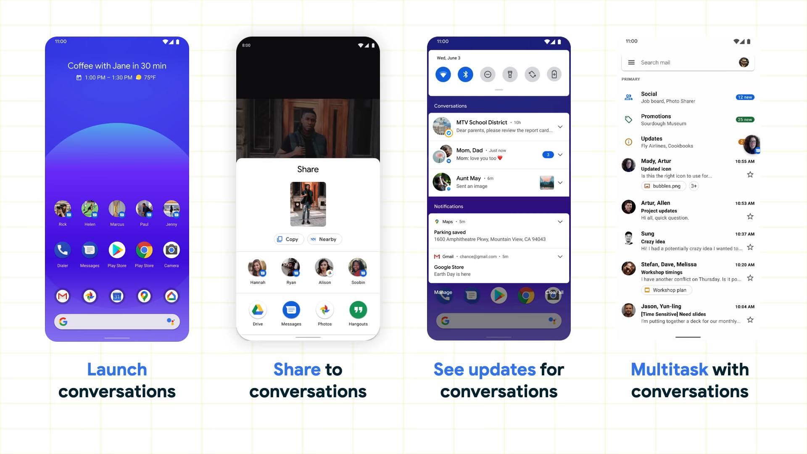
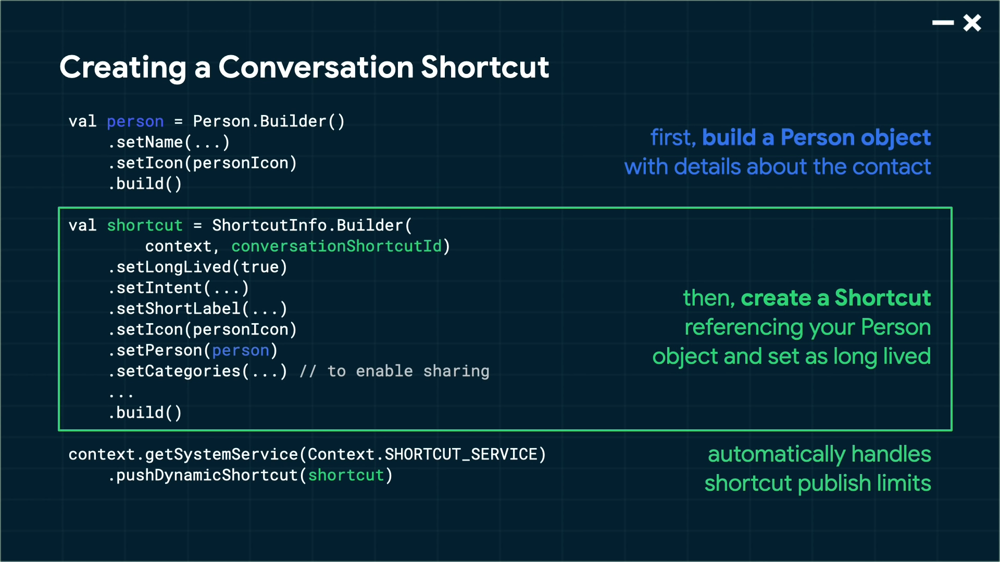
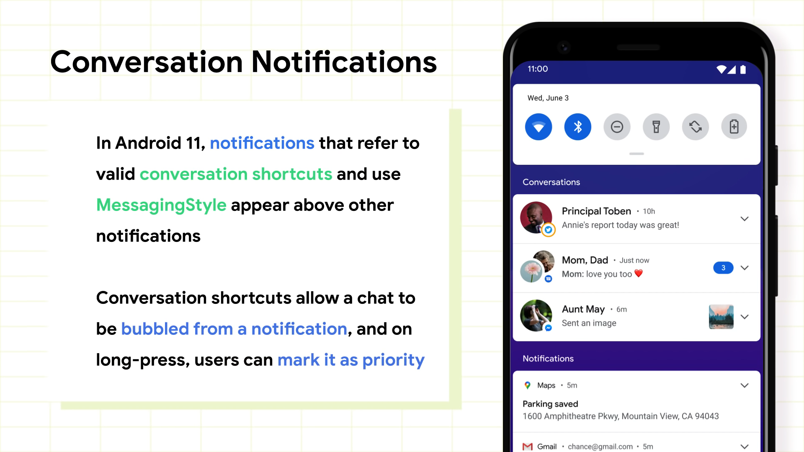
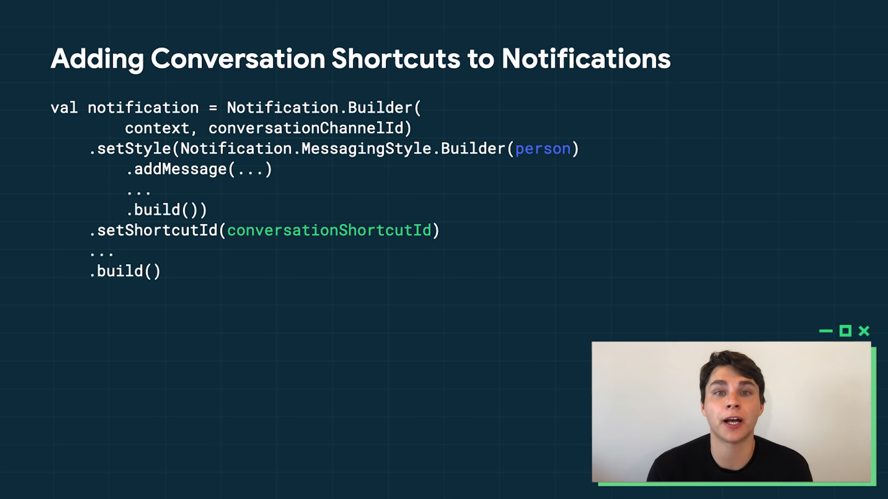
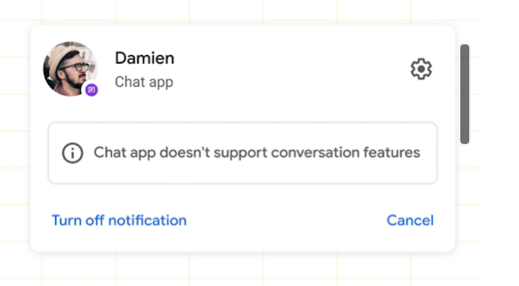
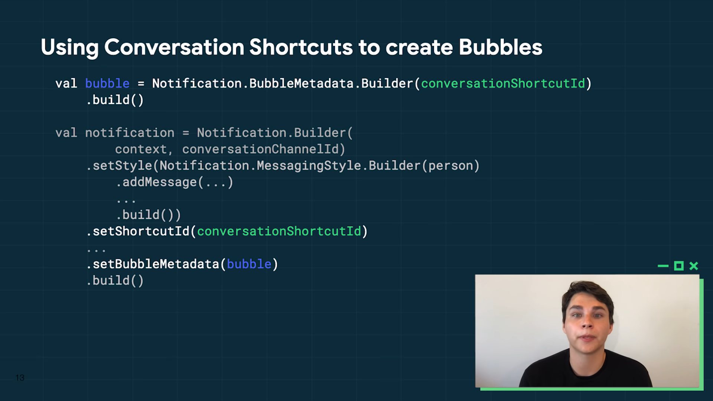

# Conversation notifications: New features Best practices

Links: https://youtu.be/CKlVSvFyt3s

# Goal

The people in your life feel like they're right there with you

1. 고정 가능한 대화 바로 가기 shortcut을 통해 새 대화를 시작할 수 있음
2. 런처, 공유 메뉴의 conversation suggestion을 통해 대화를 나눔
3. 알림 위에 표시되는 대화 업데이트 확인
4. 버블을 통해 앱을 전환하지 않고도 대화 지속

# Conversation Shortcuts

Publish a shortcut and set as longLived to use across OS features

Meant for real-time conversations with real people

Avoid for bots, post updates, and one-way announcements

아이콘, 이름 및 인텐트와 같은 필수 세부 정보, 운영 체제에서 추적할 수 있도록 오래 지속 되도록 설정

대화 바로 가기는 봇 또는 알림과 같이 사용자가 응답할 수 없는 메시지를 위한 것이 아님 업데이트나 게시물에 실시간으로 응답하지 않음.

1. Build a Person object with details about the contact
    - 대화와 관련된 대화 상대, 세부 정보를 정의
    - OS에 대화에 대한 더 많은 컨텍스트를 제공하고 도움이 되므로 권장
    - 다른 API 에서 재 사용하여 더 쉽고 빠르게 통합 가능
2. Create a shortcut referencing your Person object and set as long lived
    - 바로 가기에 대한 ID 정의 : 앱에 따라 다르고, 각 바로 가기마다 고유하게
    - Long-Lived  = true
    - ShortLabel 사용
    - 바로 가기 아이콘 : Person 아이콘 속성 재사용
    - 바로 가기 정의 : Person 객체 참조
    - 사용자가 콘텐츠를 공유하려고 할때 바로가기가 받을 수 있는 데이터에 대해 설명하는 바로 가기 카테고리 지정
3. pushDynamicShortcut method
    - 운영체제는 앱이 한 번에 10개의 바로 가기만 게시하도록 제한, 관련 로직을 자동으로 처리
    - 바로 가기를 오래 지속하도록 설정하면 자동으로 캐시

# Managing Shortcuts

By default, conversation shortcuts are automatically cached by the system.

Developers can remove these using removeLoginLivedShortcuts()

- Shortcut Manager

Cached shortcuts should only be removed if users can no longer access these conversations in your app 

# Conversation Notifications

유효한 대화 shortcut을 참조하는 MessagingStyle 알림을 푸시하는 앱은, 고정 가능하고 공유 메뉴에서 우선 순위를 지정하지 않아도 Android 11 알림 창에서 전용 공간으로 대화 업데이트 표시

발신자의 아바타, 이름 및 메시지를 보다 쉽게 볼 수 있음

사용자는 대화를 선택적으로 버블링하거나 팝업하여 앱을 전환하지 않고 빠르게 엑세스

대화를 길게 눌러 우선 순위 지정

기본 설정의 빠른 설정을 제공하여 가장 중요한 대화를 더 잘 보이고 OS 전체에 쉽게 접근할 수 있도록 하는 것

대화 섹션과 발신자의 아바타가 있으면 Always on 디스플레이, 잠근 화면 및 상태 표시줄에 노출

Conversation Shortcut에서 conversationShortcutID 를 설정

MessagingStyle 알림 구성할 때 Person object 재사용

이 알림을 사용하면 대화 섹션에 표시됨

## Conversation Notifications without Shortcuts

Until app target Android 11, Messaging Style Notifications that do not refer to a conversation shortcut will still appear above other notifications

However, users won't be able to bubble these or mark them as priority

# Bubbles and Conversations

Bubbles make it easy to get back to conversations without switching apps

Users can select conversations to bubble right from the notification

Apps can reuse your conversation shortcut to construct bubble metadata

1. Conversation Shortcut 인텐트 재사용하여 BubbleMetadata 생성
2. Notification에 BubbleMetadata 추가하여 버블 생성

    별도의 인텐트 또는 Conversation Shortcut 에서 인텐트 재사용

3. conversationShortcutId 참조, 해당 shortcut 참조 
4. 방금 정의한 BubbleMetadata를 사용하는 알림을 생성

## Bubbles Permissions

버블 생성 두 가지 방법

1. 특정 대화 : 알림 오른쪽 하단에 있는 Bubble 버튼을 탭하여 설정

    버블이 사라진 후 새 메시지가 표시되면 다시 버블이 노출됨

    버블로 업데이트를 받지 않으려면 알림에서 버블 아이콘을 다시 누르거나 확장된 버블 창의 왼쪽 하단에 있는 관리 버튼 탭

2. 모든 대화 : 앱에서 모든 대화를 설정하려면 앱의 알림 설정에서 설정 앱을 통해 수행

    사용자가 버블 링 대상을 이해하고 이러한 대화를 버블로 사용하는 것이 유용하다는 것을 이해하는 경우에만 작업 수행 권장

Conversation Notification에 BubbleMetadata 제공 해야 동작

대화 버블을 만들면 중요하고 빠르고 쉽게 액세스 하기를 원하므로 실시간 및 실제 사람들과의 적절한 대화 옵션만 제공 하는 것을 권장

## Tips for Bubble Activities

1. 버블이 떠 있는 창에 들어 있기 때문에 크기에 맞게 조절 가능해야 함
2. 버블은 Single task 에 집중 

    버블 안에서 응용 프로그램 내 다른 부분으로의 탐색 최소화

    사용자는 버블에서 다른 채팅으로 이동할 수 없어야 함 : 채팅 창이 전체 화면 일 때는 이해할 수 있지만, 거품에서는 혼동할 수 있기 때문

3. Actions which result in creating a new task will collapse the bubble window and redirect to a full screen experience. 

    → 웹 사이트에서 링크를 여는 것

    버블 창을 축소하고 전체 화면 환경으로 리다이렉션 시킴.
