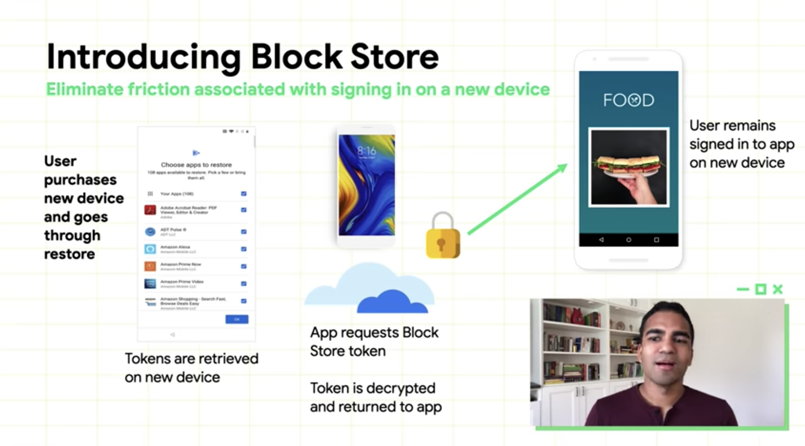
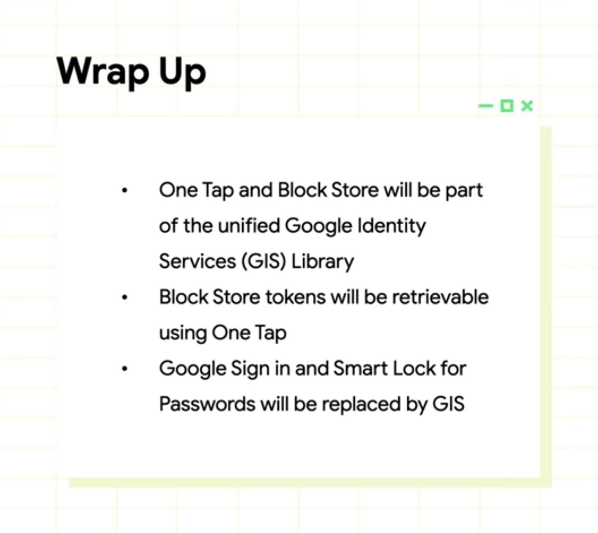

# New APIs for user login and authentication

Link: https://youtu.be/KFGthqwDmc0

### Existing way for users to sign-in or sign-up

1. Email and Password

2. Sign-in with Google Account

   * It allows us to use Google Account for sign-in and sign-up

3. Smart Lock (to save and retrieve passwords) -> Credential API

   * https://developers.google.com/identity/smartlock-passwords/android
   * Frictionless way for sign-in between app and chrome

4. Android Autofill

   * https://developer.android.com/guide/topics/text/autofill

   * Available from Android Oreo

   * Low touch way to remember and fill in passwords

   * Users should go to setting and enable it

     

### Two Key Challenges

1. Developer complexity vs. User complexity
   * What to implement and how to make it simple? - developers’ viewpoint
   * Users still use conventional ways, but there are many reasons.

### Google’s effort to make it reliable and trustable

**One tap and Block Store**

1. One tap

   * **Cross-Platform Sign-In** for web and Android, supporting and streamlining multiple types of credentials
   * New users can sign up with one tap -> and they get a secured token.
   * Sign up once, and sign in everywhere using his or her Google Account.
   * All of the interfaces are the same in every frontend, to reduce friction and confusion for users.

2. Block Store

   * **New token-based sign-in mechanism** built on top of backup and restore
   * Background
     * Users have to sign in to a multitude of apps on first day
     * And they also have to remember the password. (not having the password stored… maybe they just don’t trust the platform?)
   * Once users sign up, the app stores the user token to the Block Store, with no consent required.
   * Token is encrypted and stored locally on the device.
   * If users enable cloud backup, token is end-to-end encrypted and stored in the cloud.
   * For new phone purchase, his or her device retrieves the stored token.
   * The app requests the Block Store token, and password is decrypted and returned to the app. -> Users don’t need to sign in again on the new device.

3. How to bring it together?

   

4. Wrap Up

   