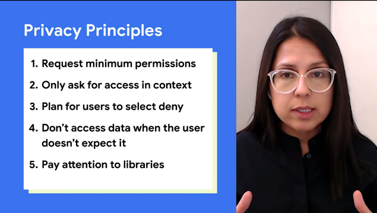
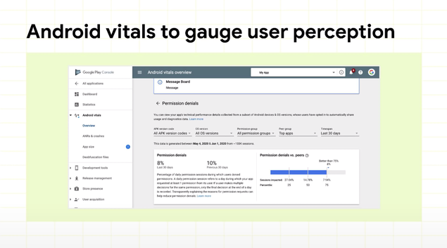
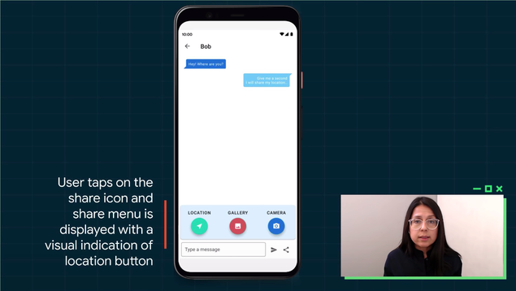
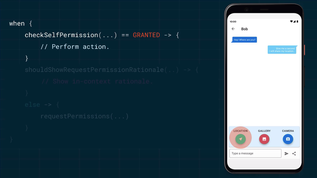
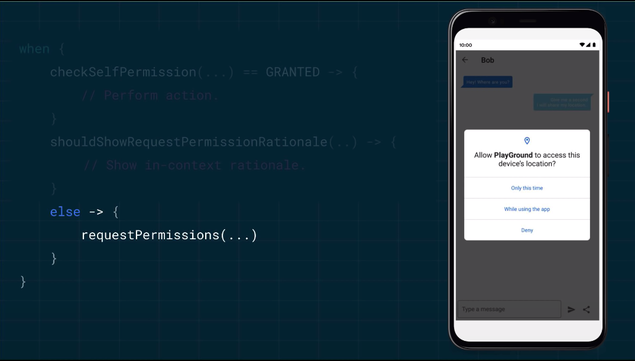
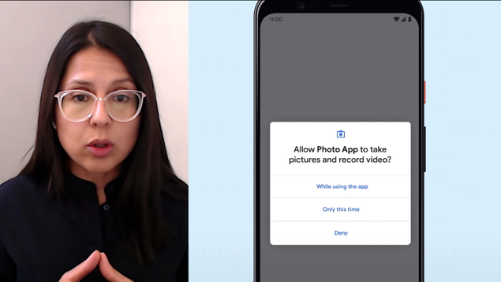
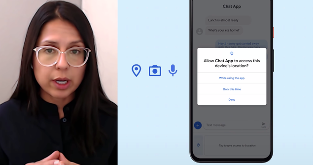
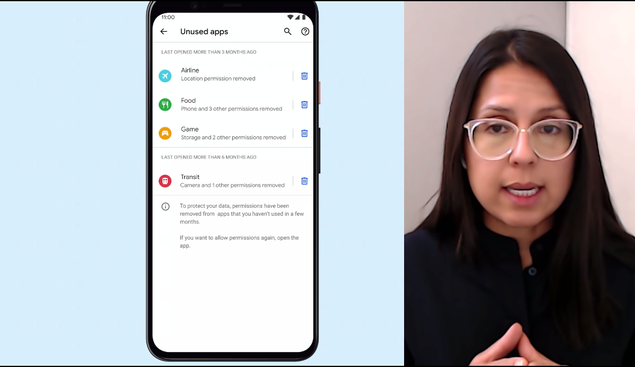
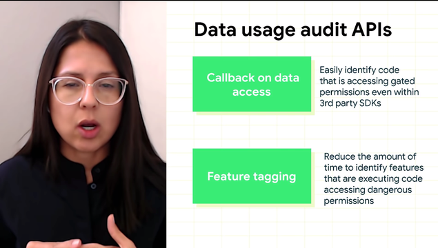

### 제품 개발시 개인 정보 보호 5가지 원칙 

1. 최소한의 권한 요청
2. 필요한 기능과 관련한 권한만 요청
3. 사용자가 권한을 거부할수 있고, 그에 따른 대응
4. 사용자가 예상할때만 데이터에 액세스
5. 라이브러리에서의 권한에 주의

 

### 최소한의 권한 요청

- 사용자에게 권한을 요청하는건 사용자의 부담을 증가 시키므로 최소한으로 요청
- 앱에 절대 권한이 필요한 경우 사용자가 압도되지 않도록 증분으로 요청

거부율을 인지하여, 사용여부를 파악하고 대체방법을 찾아야 한다.

 

### 필요한 기능과 관련한 권한만 요청

필요한 기능과 관련된 권한만 요청하고 액세스 하는 것에 대해 투명성을 유지해라.

Ex) 메시지 앱

Share Icon > 사용자가 자신의 위치를 다른 사용자와 공유

- 사용자가 ‘공유’를 누를때까지 위치 데이터를 엑세스 하지말고, 권한 요청을 기다려라.
- 다른 버튼이 눌려 불필요한 권한을 요청하지 않게 버튼간에 충분한 공간을 확보해라.

 

유저가 클릭하면,

1.권한 부여 되었는지 확인

2.권한이 거부 되면 Dialog에 권한을 수락하도록 상세 설명을 추가하여 권한 요청하며 거부 할수 있는 선택도 주어야한다. 

3. 런타임 프롬프트는 사용자의 결정을 캡처하는데 사용,

개인 데이터에 대한 액세스 권한을 제공

 

### 권한 ‘거부’에 대한 사용자 또는 시스템을 계획하라

Android 11의 달라진 점

1. 사용자에게 더 이상 보지 않기 거부 옵션이 표시되지 않는다. 

2. 위치, 마이크, 카메라는 이번에만 허용이라는 권한 옵션을 도입

사용자가 백그라운드로 짧은 시간 후 자동으로 취소

이후에는 다시 권한 프롬프트로 요청

3. 오랜기간 앱을 사용하지 않으면 자동으로 권한 취소

 

Handling “Deny” 

1. 사용자가 권한 요청을 거부를 막지 말아라
2. 영구적 거부에 대해 사용자를 설정으로 이동하게 강요하지 말아라 → 필요한 기능에 필요한 권한을 요청해라
3. shouldShowRequestPermissionRationale 를 사용하여 사용자에게 이유를 설명해라

 

### 사용자가 예상하지 않는 개인 데이터 접근은 하지 않는다.

마이크 및  카메라 액세스를 위해 항상 지속적인 표시를 제공해야 한다.

첫번째인  Callback으로 어떤 코드에서 데이터에 접근하는지 알 수 있다.빈도와 타이밍을 추적할 수 있다.

두번째는 Tagging으로 어떤 기능이 데이터에 접근하는지 알 수 있다.

 

### 라이브러리에서 데이터 접근을 주의

앞서 말한 스택추적으로 라이브러리의 데이터 접근을 통제 할 수 있다.