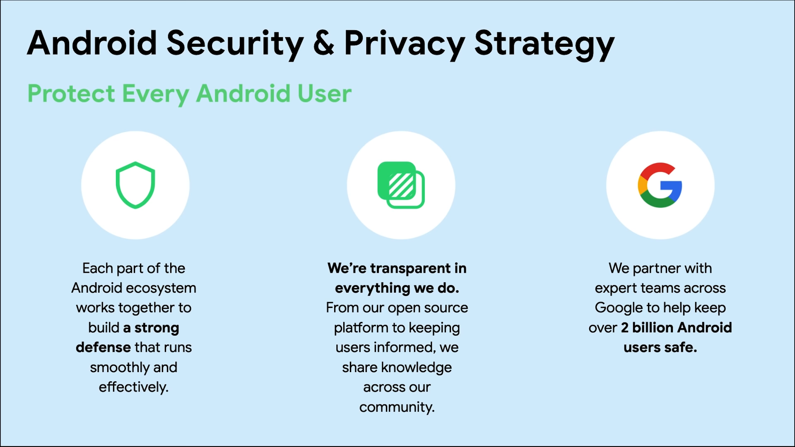
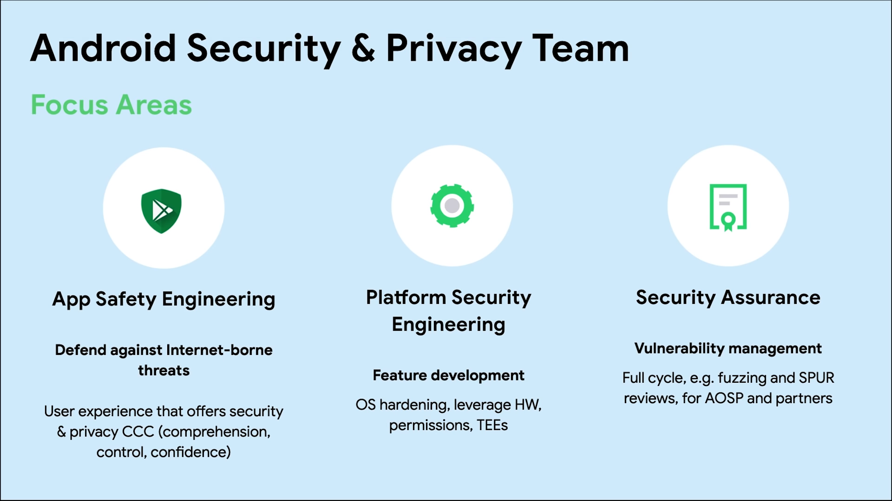
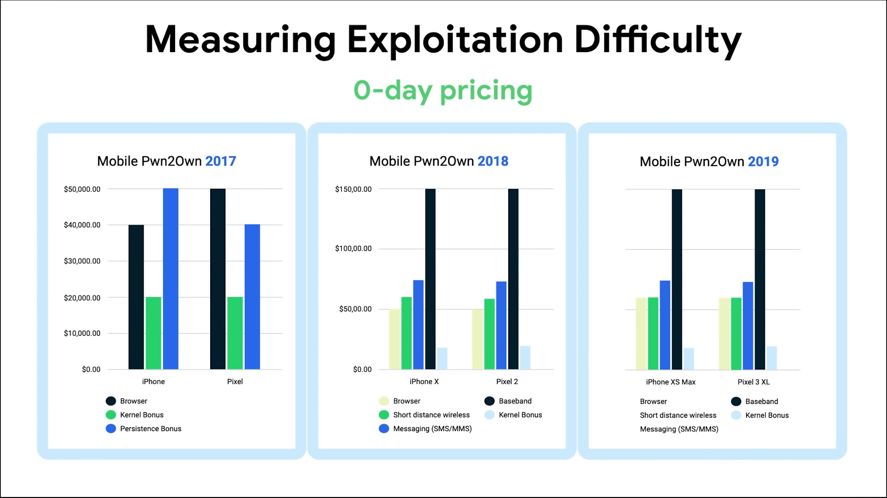
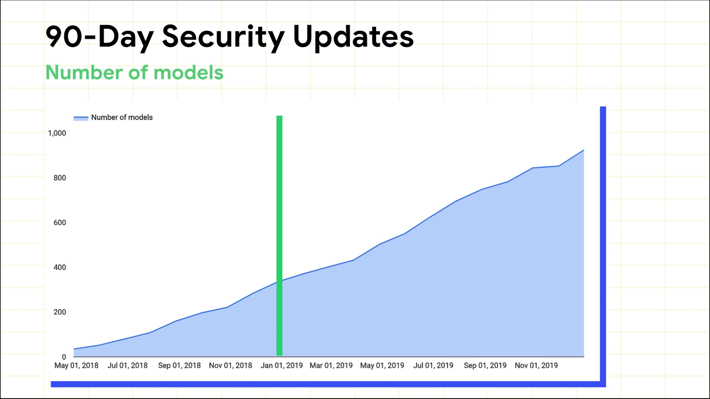
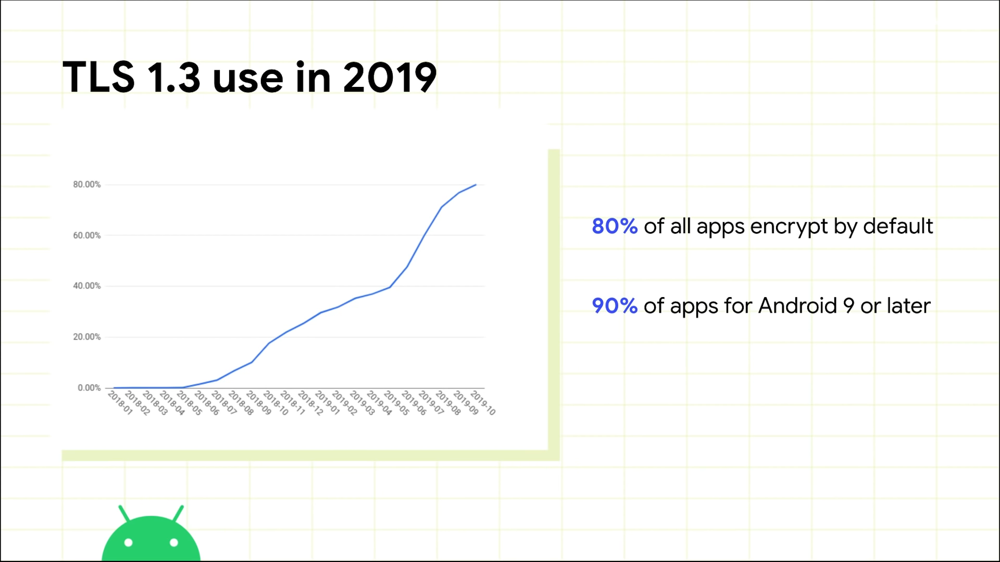
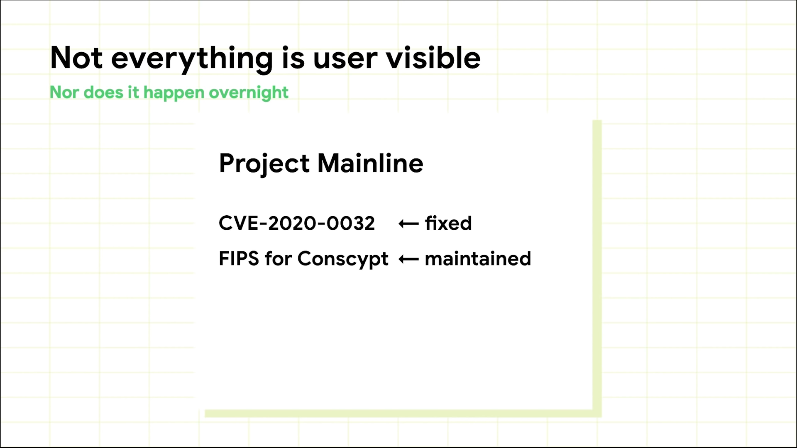
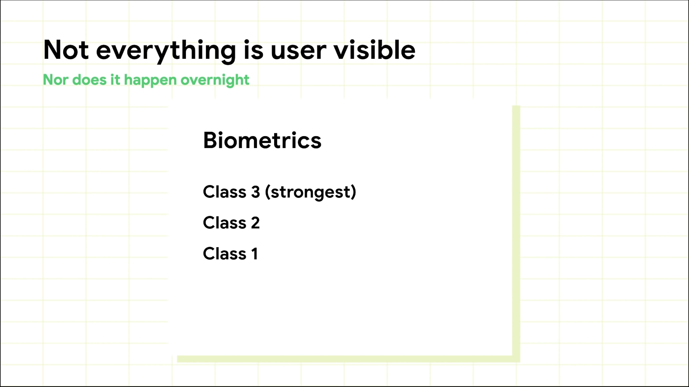

# 2020 Android security update
[**YouTube Link**](https://www.youtube.com/watch?v=bsdtRZusbpI)

</img> 

단말기사양, 버전 얽매이지 않고, 안드로이드의 다양한 Security 기능을 제공 
기술, 정보를 공유해서 투명성을 보장 
다른 구글 Security팀과 협업 중  

</img> 

앱 레벨에서 위협을 방어 
Android infrastructure를 안전하게 유지 
안드로이드의 취약점 보상 프로그램 운영 

## VRP(Vulnerability Rewards Program) reward in 2019

2019년 동안 총 보상액이 $6.5 million (약 78억) 
2018년 보다 약 2배 증가 
2019년 안드로이드 분야는 $1.9 million 
안드로이드 11 DP1 버전에서 첫번째로 취약점을 찾은 사람은 50% 추가 보너스 
지속적으로 보상 프로그램을 운영할 예정  

</img> 

시스템의 취약성은 경제적 측면에서 보는것이 좋다 
공격자의 비용을 증가시키는 방향으로 생각 
MobilePwn2Own 매년 4 분기에 개최 아이폰이랑 픽셀이랑 거의 비슷  

</img> 

플랫폼 보안의 중요한 부분중 하나는 장치들이 얼마나 최신의 보안 업데이트를 하고 있는가? 
최신의 보안 업데이트를 탑재한 단말기 모델이 924개로 증가  

</img> 

2019년 말 기준 Android앱의 80%가 기본적으로 네트워크 트래픽을 암호화하고 있었음 
Android9 이상 Target 앱만 계산하면 수치가 90%로 증가 

## Android 11

</img> 

Android 10부터 Mainline 프로젝트 -> 안드로이드의 모듈화, 세분화 
해당 모듈에 취약점이 있어서 수정  

</img> 

3단계로 Biometric 단계 세분화.