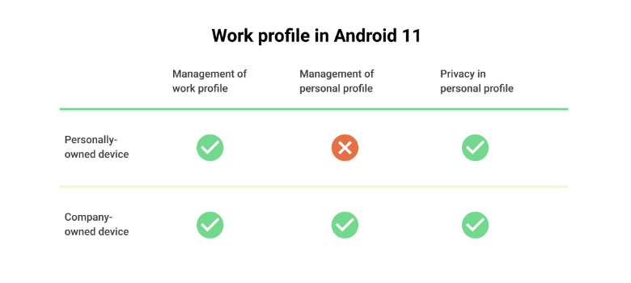

# Work profile: the new standard for employee privacy

Links: https://blog.google/products/android-enterprise/work-profile-new-standard-employee-privacy/

# Android Enterprise

직원들은 회사 소유 장치에서도 개인정보 보호를 요구함.

개인 정보는 항상 개인 정보(private)를 유지해야 한다. 

업무용 프로필(Work Profile)을 배포하여 개인 또는 회사 소유의 여부에 관계없이 직원 전체의 개인 정보를 보호할 수 있다.

## 업무용 프로필 올바른 개인정보 보호 수준의 관리

- 장치를 분실하거나 도난당한 경우에도 자산 관리 보호
- 회사 정책을 준수하는 장치 사용을 유지하기 위해 직원이 사용할 수있는 앱 제한과 같은 개인 사용 정책
- Bluetooth, 카메라 및 이동식 저장소와 같은 기능의 구성을 제한하거나 방지하기위한 하드웨어 관리

## 업무 프로필 이상의 Management 확장

기기 소유자에 따라 관리 기능을 조정하는 동시에 모든 시나리오에서 동일한 개인 정보 보호 기능을 제공

- 내 기기 일 경우

    IT는 핵심 보안 기능만 관리 (알 수 없는 출처에서 앱을 설치 못하게 하는 것)

- 회사 기기 일 경우

    IT는 유저가 전체 장치와 상호 작용하는 방식을 관리할 수 있음

## Android Management API

Android 8 디바이스도 지원 - 대부분의 경우 단일 솔루션 배포 가능

## 프라이버시 우선 순위

[https://blog.google/products/android-enterprise/](https://blog.google/products/android-enterprise/)
