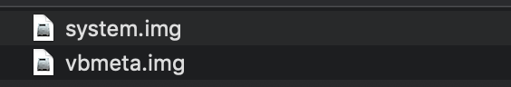

# GSI for testing on more devices

Links: https://developer.android.com/codelabs/using-android-q-gsi?return=https%3A%2F%2Fdeveloper.android.com%2Fcourses%2Fpathways%2Fandroid-week4-compatibility%23codelab-https%3A%2F%2Fdeveloper.android.com%2Fcodelabs%2Fusing-android-q-gsi#0


### GSI

Generic System Image

### Project Treble

[https://android-developers.googleblog.com/2017/05/here-comes-treble-modular-base-for.html](https://android-developers.googleblog.com/2017/05/here-comes-treble-modular-base-for.html)

Android 기존 기기를 새로운 버전의 Android로 업데이트하는 데 시간이 많이 걸리고 비용이 많이 든다. 안드로이드 Treble은 안드로이드 자체를 모듈화 시켜서 업데이트 과정을 축소, 보다 빠르게 할 수 있도록 지원.

### 사전 조건

- a device is fully Treble compliant (Treble support is mandatory for devices launched with Android 9 or later).
- the device's bootloader could be unlocked.
    - Enable OEM unlocking with "**Settings**" app: **Developer options** > **OEM unlocking**
    - Reboot to bootloader by holding down **Power** + **Volume Down** button, or with adb:

    ```
    adb reboot bootloader
    fastboot flashing unlock
    ```

- the tools and procedures to update OS for the device.

### GSI download

[https://developer.android.com/topic/generic-system-image/releases](https://developer.android.com/topic/generic-system-image/releases)

### 설치 과정

1. Zip 파일 해제 후 압축 푼 디렉토리로 이동

    

2. 장치에 설치

    ```
    fastboot flash system system.img
    ```

3. 설치 후 GSI를 부팅 할 수 있도록 AVB (Android Verify Boot) 비활성화

    ```
    fastboot flash --disable-verification vbmeta vbmeta.img
    ```