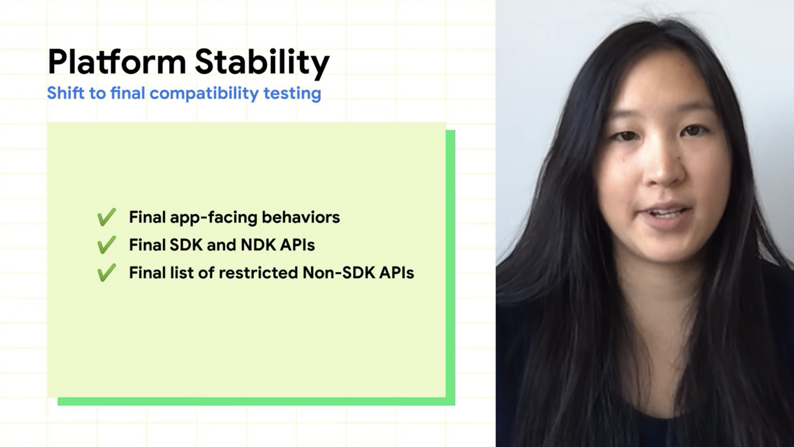
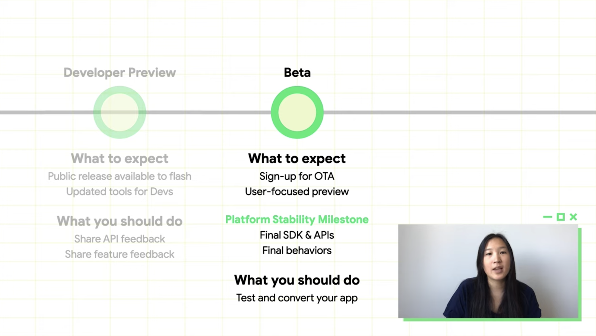
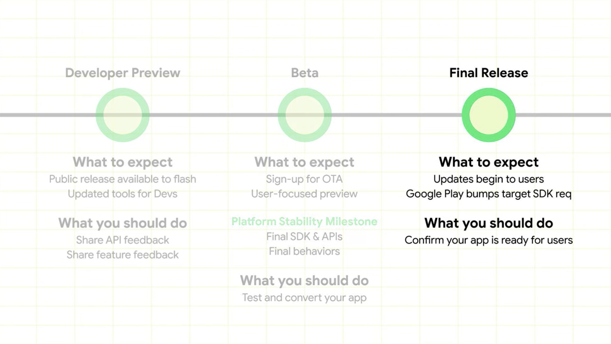
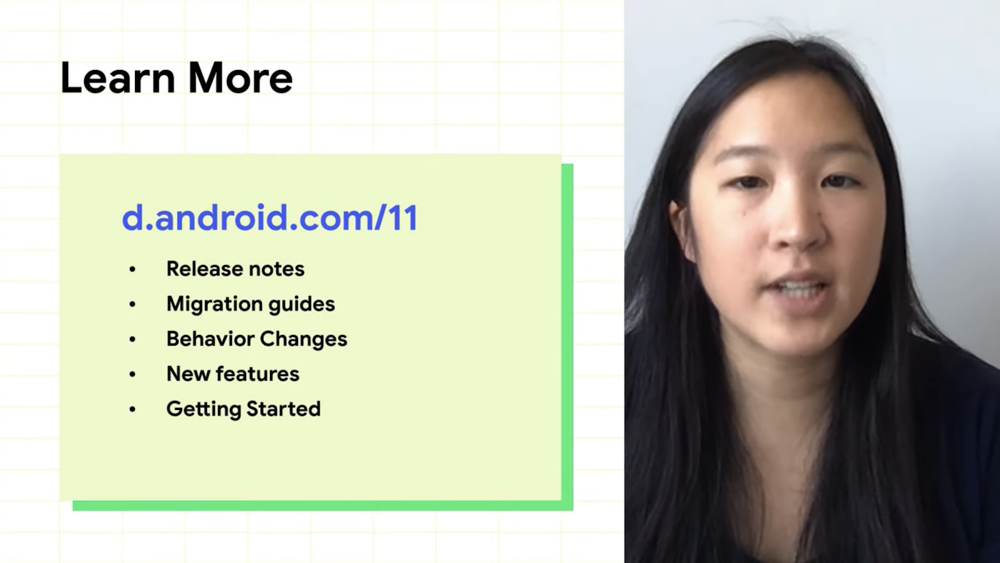

# The Android 11 release timeline for developers

1. Android 11 has been reached at platform stability Beta 2

    

2. Google encourages developers to use the **Platform Stability milestone as a target for final compatibility testing and public release**

   

3. It gives us **enough time to test and debug features on the Android 11** before the OS is open to the public. (especially testing on new Android 11 is critical to the SDK developers)

   

4. Once 11 is released, the required targetSDK version is 10. (n-1), as Google would like to give maximum time to adapt apps.

   

5. We can find how to support android 11 on apps from d.android.com/11. It provides us with useful information.