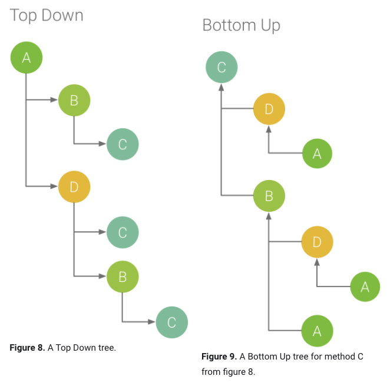

# Inspect CPU activity with CPU Profiler


앱을 동작 중 CPU 사용량, 스레드 활동을 실시간으로 검사, 메소드(Java) 추적, 함수(C/C++) 추적  및 시스템 추적에서 세부 정보를 검사할 수 있다.

- 시스템 추적 : 앱 - 시스템 리소스 간의 상호 작용하는 방식을 검사할수 있도록 세부 정보를 캡처한다.

- 메소드 및 함수 추적 

  - 프로세스의 각 스레드에 대해 일정 시간 동안 실행되는 메소드, 함수가 소비하는 CPU 자원을 찾을 수 있다. 
  - 메소드 및 함수(이하 메소드로 통칭) 추적을 사용하여 발신자(다른 메소드 또는 함수 호출하는 메소드)와 수신자(다른 메소드에 의해 호출되는 메소드)를 식별 할 수 있다.

  => 코드 최적화 가능

  

메서드 트레이스를 기록할 때 샘플 녹음, 계측 녹음을 선택할 수 있다. 함수 트레이스를 기록할 땐 샘플링 된 기록만 사용할수 있다.


## CPU 프로파일러 개요

---

프로파일러 열기

1. 프로파일러 시작
   1. View > Tool Windows > Profile
   2.  in Toolbar
2. CPU 타임라인 어디든 클릭

## 

[그림1. CPU 프로파일러의 타임라인]

**(1) 이벤트 타임 라인** 
수명주기에서 다양한 상태를 전환 할 때 앱의 활동을 표시하고 화면 회전 이벤트를 포함하여 장치와 사용자의 상호 작용을 나타낸다. Android 7.1 (API 25) 이하를 실행하는 디바이스에서 이벤트 타임 라인을 사용하는 방법에 대한 정보는 [링크][https://developer.android.com/studio/profile/android-profiler#advanced-profiling] 참조.

**(2) CPU 타임 라인**
사용 가능한 총 CPU 시간의 백분율로 앱의 실시간 CPU 사용량과 앱이 사용중인 총 스레드 수를 표시한다. 타임 라인에는 다른 프로세스 (ex: 시스템 프로세스, 다른 앱)의 CPU 사용량도 표시되어 앱 사용량과 비교할수 있다. 타임 라인의 가로 축을 따라 마우스를 움직이면 과거 CPU 사용량도 볼수 있다.

**(3) 스레드 활동 타임 라인**
앱 프로세스에 속하는 각 스레드를 나열하고 하기의 색상을 사용하여 각 스레드의 활동을 나타낸다. 추적을 기록한 후 타임 라인에서 스레드를 선택하여 추적 분할 창에서 데이터를 검사 할 수 있다.

- 녹색 : 스레드 활성화 또는 CPU 사용할 준비가 됨 > 실행 중이거나 실행 가능한 상태
- 노란색 : 스레드는 활성화 되어 있지만 IO (디스크 또는 네트워크) 작업을 기다리고 있는 상태
- 회색 :  스레드가 대기 중이며 CPU 시간을 소비하지 않음. 스레드가 아직 사용할 수 없는 리소스에 엑세스 해야하는 경우 종종 발생. 스레드가 자발적 절전 모드로 전환하거나 커널이 필요한 리소스를 사용할 수 있을때까지 절전모드로 전환한다.

CPU 프로파일러는 `JDWP`, `Profile Saver`, `Studio:VMStats`, `Studio:Perfa`, and `Studio:Heartbeat` (스레드 활동 타임라인에 표시되는 정확한 이름은 다를수 있다.) 등 Android Studio와 Android Platform이 앱 프로세스에 추가하는 스레드의 CPU 사용량을 보고한다. Android Studio는 실제로 앱 코드에 의해 스레드 활동 및 CPU 사용이 발생하는 시기를 식별할 수 있도록 데이터를 보고한다.


## 트레이스 기록

---

시작 하기

- CPU 프로파일로 상단의 드롭다운 메뉴 > 기록 구성 선택 > **Recode** 클릭


[그림2. CPU 프로파일러에는 진행 중인 기록의 상태, 기간, 유형이 표시됨]

앱 상호작용 완료시 **Stop** 을 클릭하면 아래와 같이 표시된다.


[그림3. 메소드 트레이스를 기록한 후의 CPU 프로파일러]

**(1) 선택된 기간**
기록된 시간 중 트레이스 창에서 검사할 부분을 선택한다. 처음으로 트레이스를 기록하는 경우 CPU 프로파일러가 CPU 타임 라인에서 기록의 전체 길이를 자동으로 선택한다. 일부 구간만 데이터 검색시 구간을 드래그 하여 선택한다.

**(2) 상호작용 구간**
사용자 상호작용과 앱 라이프 사이클 이벤트를 보여준다.

**(3) 스레드 구간**
스레드의 실행중, 슬립중 등과 같이 활동 상태를 보여준다. 그리고 모든 스레드 Call Chart (or trace event chart in System Trace) 도 보여준다.

- 타임라인으로 네비게이션을 위해 마우스와 키보드 단축키 사용
- 스레드가 선택된 상태일때 엔터를 누르거나 스레드 이름을 더블클릭하여 스레드를 펼치거나 접는다.
- 분석 창에서 추가 정보를 보기 위해 스레드를 선택한다. 여러 스레드를 선택시 쉬프트나 컨트롤 (맥에서는 커맨드)을 누르고 있는다.
- 분석 창에서 추가 정보를 보기 위해 메소드 콜(또는 시스템 트레이스의 트레이스 이벤트)을 선택한다

**(4) 트레이스 창**
선택한 기간 및 스레드에 관한 트레이스 데이터를 표시. 이 창은 트레이스를 하나 이상 기록한 후에만 표시된다. 이 창에서 각 스택 추적을 보는 방법(분석 탭 사용), 실행 시간을 측정하는 방법(시간 참조 드롭다운 메뉴 사용)을 선택할 수 있다.

**(5) 트레이스 창 탭**
트레이스 세부정보를 표시하는 방법을 선택한다. 자세한 사항은 #{트레이스 검사} 참조

**(6) 시간 참조 메뉴**
하기 항목 중 하나를 선택하여 각 호출의 타이밍 정보가 측정되는 방법을 결정한다.

- Wall clock time : 타이밍 정보가 실제 경과 시간을 나타낸다.
- Thread time : 타이밍 정보가 실제 경과 시간에서 스레드가 CPU 시간을 소비하지 않은 시간을 뺀 시간을 나타낸다. 그러므로 항상 실제 경과시간보다 작거나 같다. 이 옵션으로 실제 CPU 사용량을 더 효과적으로 파악할 수 있다.

**(7) 필터**
함수, 메소드, 클래스, 패키지 이름을 기준으로 트레이스 데이터를 필터링 한다. 검색 필드로 연관된 특정한 호출을 빠르게 검색할 수 있다. Flame chart 탭에서 검색어와 일치하는 호출, 패키지, 클래스가 포함된 호출 스택이 강조된다. Top down과 Bootom up 탭에서 이러한 호출 스택은 다른 트레이스 결과보다 우선한다. 검색 필드 다음의 체크박스로 하기 옵션을 설정할 수 있다.

- Regex : 검색에 정규 표현식을 포함할지 여부
- Match case: 검색에 대소문자를 구분할지 여부


### 기록 구성 선택

트레이스 정보 기록을 시작하려면 캡처할 프로파일링 정보에 기록 구성을 선택해야 한다.

- **자바 메소드 샘플링 (Sample Java Methods)**
  자바 기반 코드가 실행되는 동안 앱의 호출 스택을 빈번하게 캡처 한다. 프로파일러는 캡처된 데이터 세트를 비교하여 앱의 자바 기반 코드 실행에 관한 타이밍 및 리소스 사용 정보를 얻는다.

  내제 된 이슈 : 수명 주기가 짧은 메소드 (호출 스택의 캡처 후 메소드를 시작하고 다음 캡처 전 메소드를 종료하는 경우) 는 기록이 안되며 추적하고 싶은 경우 계측된 추적을 사용

- **자바 메소드 추적 (Trace Java Methods)**
  각 메소드 호출의 시작과 끝에서 타임스탬프를 기록하기 위해 런타임에 앱을 계측한다. 타이밍 정보와 CPU 사용량 등 메소드 추적 데이터를 생성하기 위해 타임스탬프가 수집, 비교 된다.

  내제된 이슈 : 각 메소드의 계측과 관련한 오버헤드가 런타임 성능에 영향을 미치며 프로파일링 데이터에 영향을 미칠수 있다. 수명주기가 상대적으로 짧은 메소드에서 훨씬 두드러지게 나타난다. 또한, 앱에서 단기간 동안 많은 수의 메소드를 실행하는 경우 프로파일러가 빠르게 파일 크기 한도를 초과하여 기록하지 못할 수 있다.
  
- **C/C++ 함수 샘플링 (Sample C/C++ Functions)**
  앱의 네이티브 스레드의 샘플링된 트레이스를 캡처한다. 이 구성을 사용하려면 Android 8.0(API 26) 이상을 실행하는 기기에 앱을 배포해야 한다.

  내부적으로 이 구성은 ```simpleperf```를 사용하여 앱의 네이티브 코드를 트레이스 한다. 특정 기기 CPU를 샘플링 하거나 샘플링 기간을 매우 정확하게 지정하는 등 추가 옵션은 커멘드라인으로 ```simpleperf``` 를 사용하면 된다.
  
- **시스템 호출 추적(Trace System Calls)**
  앱과 시스템 리소스간 상호작용하는 방법을 검사할 수 있도록 세부정보를 캡처한다. 스레드 상태의 정확한 타이밍과 기간을 검사하고, 모든 코어에서 CPU 병목 현상의 위치를 시각화하고, 분석할 맞춤 트레이스 이벤트를 추가할 수 있다. **성능 문제를 해결하는 경우 이 정보가 중요할 수 있다.** 이 구성을 사용하려면 Android 7.0 (API 24) 이상을 실행하는 기기에 앱을 배포 해야한다.

  이 트레이스 구성을 사용 중에 코드를 계측하여 프로파일러 타임라인에서 중요한 코드 루틴을 시작적으로 표시할 수 있다. C/C++ 코드를 계측하려면 ```trace.h``` 에서 제공하는 네이티브 추적 API를 사용한다. 자바 코드를 계측하려면 ```Trace``` 클래스를 사용한다. 자세한 내용은 앱 코드 계측을 참조.

  이 트레이스 구성은 ```systrace```를 기반으로 구축된다. ```systrace``` 커멘드라인 유틸을 사용하여 CPU 프로파일러에 제공되는 것 외의 옵션을 지정할 수 있다. 여기서 제공되는 추가 시스템 레벨 데이터는 네이티브 시스템 프로세스를 검사하고 삭제되거나 지연된 프레임 문제를 해결하는데 도움이 된다.

> Android 9 이상을 실행하는 기기에서는 시스템 추적이라는 시스템 앱을 사용하여 기기에서 시스템 트레이스를 기록할 수 있다.


### 기록 구성 생성 | 수정 | 보기

CPU 프로파일러 상단의 기록 구성 드롭다운 메뉴에서 Edit configurations를 선택하여 열리는 CPU Recording Configurations 대화상자에서 기록 구성을 만들고 수정하고 확인할 수 있다.

기존 기록 구성의 설정을 보려면 CPU Recording Configurations 대화상자의 왼쪽 창에서 선택

새로운 기록 구성 만들기

1. 대화상자의 왼쪽 상단에서 **Add** 를 클릭하면 기본 설정을 사용하여 새로운 구성이 만들어진다.

2. 구성의 이름 지정.

3. Trace Technology 선택

4. 샘플링된 기록 구성의 경우 샘플링 간격을 마이크로초(μs) 단위로 지정합니다. 이 값은 앱의 각 호출 스택 샘플 사이의 시간을 나타낸다. 더 짧은 간격을 지정할수록 기록된 데이터의 파일 크기 한도에 더 빨리 도달한다.

5. 연결된 기기에 기록되는 데이터의 파일 크기 한도를 메가바이트(MB) 단위로 지정한다. 기록을 중지하면 Android 스튜디오가 이 데이터를 파싱하여 프로파일러 창에 표시한다. 따라서, 한도를 늘리고 많은 양의 데이터를 기록하면 Android 스튜디오가 파일을 파싱하는 데 훨씬 더 오래 걸리고 응답하지 못하게 될 수 있다.

   **참고:** Android 8.0(API 레벨 26) 이상을 실행하는 연결된 기기를 사용하는 경우 트레이스 데이터의 파일 크기에 제한이 없으며 이 값이 무시됨. 하지만 각 기록 후 기기에서 수집하는 데이터의 양에 주의한다. Android 스튜디오가 큰 트레이스 파일을 파싱하는 데 어려움이 발생할 수 있다. 예를 들어, 앱에서 단기간에 많은 메서드를 호출하는 동안 샘플링 간격이 짧은 샘플링된 트레이스 또는 계측된 트레이스를 기록하는 경우 큰 트레이스 파일이 신속하게 생성된다.

6. 변경사항을 수락하고 계속해서 다른 구성을 변경하려면 Apply를 클릭. 적용된 변경사항을 모두 수락하고 대화상자를 닫으려면 OK를 클릭.


### Debug API를 사용하여 CPU 활동 기록

앱에서 [Debug API](https://developer.android.com/reference/android/os/Debug) 를 사용하여 CPU 활동 기록을 시작하고 중지 할수 있다.

앱에서 [`startMethodTracing(String tracePath`](https://developer.android.com/reference/android/os/Debug#startMethodTracing(java.lang.String))을 호출하면 CPU 프로파일러가 기록을 시작하고 [`stopMethodTracing()`](https://developer.android.com/reference/android/os/Debug#stopMethodTracing())을 호출하면 기록을 중지한다. 이 API를 사용하여 트리거된 CPU 활동을 기록하는 동안, CPU 프로파일러는 Debug API를 활성하여 CPU 기록 구성으로 보여준다.

`Debug API`를 사용하여 CPU 활동 기록을 관리하려면 Android 8.0(API 수준 26) 이상을 실행하는 기기에 앱을 배포해야 한다.

**중요:** `Debug` API는 CPU 프로파일러 그래픽 사용자 인터페이스의 버튼, 앱 시작 시 자동 기록을 위한 기록 구성의 설정 등 CPU 활동 기록을 시작하고 중지하기 위한 다른 수단과 별개이다.


### 앱이 시작하는 동안 CPU 활동 기록

1. Run > Edit Configurations 선택
2. Profiling 탭에서 Start recording a method trace on startup 옆의 체크박스 선택
3. 메뉴에서 CPU 기록 구성을 선택
4. Apply 클릭
5. Run > Profile 선택. Android 8.0(API 레벨 26) 이상을 실행하는 기기에 앱을 배포


## 트레이스 내보내기

---

CPU 프로파일러를 사용하여 CPU 활동을 기록한 데이터를 `.trace` 파일로 내보낼 수 있다.

타임라인에서 파일 내보내기

1. CPU 타임라인에서 내보내려는 기록된 메서드 트레이스 또는 시스템 트레이스를 마우스 오른쪽 버튼으로 클릭.
2. 메뉴에서 Export trace 선택.
3. 저장 위치에 파일 이름 지정하여 OK 클릭.

Sessions 창에서 파일 내보내기

1. Sessions 창에서 내보내려는 기록된 트레이스를 마우스 오른쪽 버튼으로 클릭.
2. 세션 항목의 오른쪽에 있는 Export method trace 또는 Export system trace 버튼을 클릭.
3. 저장 위치에 파일 이름 지정하여 OK 클릭.


## 트레이스 가져오기

---

`Debug API` 또는 CPU 프로파일러로 만든 `.trace` 파일을 가져오기

1. 프로파일러의 Sessions 창에서 Start new profiler session 을 클릭. 
2. Load from file을 선택
3. 가져올 트레이스 파일을 선택.

CPU 프로파일러에 가져온 트레이스도 CPU 프로파일러에서 직접 캡처한 트레이스와 마찬가지로 검사할 수 있다. 

**예외 사항**

- CPU 활동은 CPU 타임라인을 따라 표시되지 않는다.
- 스레드 활동 타임라인은 각 스레드에서 트레이스 데이터를 사용할 수 있는 위치만 나타내며 실제 스레드 상태(예: 실행 중, 대기 중, 일시중지 중)를 나타내지 않는다.


## 트레이스 검사

---

CPU 프로파일러의 트레이스 창에서 기록한 트레이스 정보를 보는 방법을 선택할 수 있는 탭이 있다.

메서드/함수 트레이스는 스레드 타임라인에 Call Chart에서 볼수 있다. 그리고 분석 창의 Flame Chart, Top Down, Bottom Up 탭에서도 볼 수 있다. 시스템 트레이스의 경우스 스레드 타임라인에 Trace Events에서 볼수 있다. 그리고 분석 창의 Flame Chart, Top Down, Bottom Up 탭에서도 볼수 있다.

마우스와 키보드 바로가기로 Call charts or Trace Events 에 쉽게 이동할 수 있다.


### Call Chart 를 사용한 트레이스 검사

Call Chart 탭에는 메서드/함수 트레이스가 그래픽으로 표시된다. 가로축에는 호출의 기간과 타이밍이 표시되고 세로축에는 수신자가 표시된다. 

- 주황색 : 시스템 API 호출
- 녹색 : 앱 자체 메서드 호출
- 파란색 : 타사 API(자바 언어 API 포함) 호출. 

그림 4는 Call Chart의 예를 보여준다. 그리고 주어진 메서드 또는 함수의 Self Time, Children Time, Total Time의 개념을 설명한다. [Top Down 및 Bottom Up을 사용한 트레이스 검사 자세히 보기](https://developer.android.com/studio/profile/cpu-profiler#top_down_bottom_up)


[그림4. 메소드 D에 대한 self, children and total time을 설명하는 Call Chart]

**Tip:** 메소드/함수 소스코드로 이동하려면 해당하는것을 우클릭하고 Jump to Source를 선택한다. 이 작업은 분석탭 어디서나 할수 있다.


### Flame Chart 탭을 사용하여 트레이스 검사

Flame Chart 탭에는 동일한 호출 스택을 집계하는 반전 호출 스택이 표시된다. 즉, 같은 호출자 순서를 공유하는 동일한 메서드/함수가 수집되어 Flame Chart에 긴 막대 하나로 표시된다.(호출 차트에 표시된 것처럼 짧은 막대 여러 개가 아니라) 이것은 어느 메서드/함수가 가장 많은 시간을 소비하는지 더 쉽게 확인 할 수 있다. 하지만, 가로축은 타임라인을 표시하지 않으며, 대신 각 메서드/함수가 실행하는 데 걸리는 상대적인 시간을 나타낸다.

이 개념을 설명하려면 그림 5의 호출 차트를 확인한다. 
중요한 것은 메서드 D는 B를 여러 번 호출하며(B1, B2, B3) 그중 일부는 C를 호출한다.(C1 및 C3)


[그림5. 여러 메서드 호출에서 공통된 호출자 순서를 공유하는 호출 차트]

B1, B2, B3은 동일한 호출자 순서(A → D → B)를 공유하므로 그림 6과 같이 집계된다. 유사하게 C1, C3도 동일한 호출자 순서(A → D → B → C)를 공유하므로 집계된다. 중요한 것은 C2는 호출자 순서(A → D → C)가 다르기 때문에 포함되지 않습니다.


[그림6. 같은 호출 스택을 공유하는 동일한 메서드 집계]

집계된 호출은 그림 7과 같은 Flame Chart를 만들기 위해 사용된다. 중요한 것은 Flame Chart의 각 호출에 관해 CPU 시간을 가장 많이 소비하는 수신자가 먼저 표시된다.


[그림7. 그림 5에 표시된 호출 차트를 표시하는 플레임 차트]


### Top down 과 Bottom Up을 사용한 트레이스 검사

Top Down 탭에는 메서드/함수 노드를 확장하면 수신자가 표시되는 호출 목록이 나타난다. 그림 8은 그림 4의 호출 차트에 관한 Top down 그래프를 보여준다. 그래프의 각 화살표는 호출자에서 수신자를 가리킨다.

그림 8과 같이 Top Down 탭에서 메소드 A의 노드를 확장하면 수신자인 메소드 B와 D가 표시된다. 그런 다음 메소드 D의 노드를 확장하면 수신자인 메서드 B와 C가 보인다. Flame chart 탭과 마찬가지로 Top down 트리는 같은 호출 스택을 공유하는 동일한 메서드의 트레이스 정보를 집계한다. 즉, Flame chart은 Top down 탭이 그래픽으로 표시된다.

Top Down 탭에는 각 호출에 사용된 CPU 시간을 설명하는 데 도움이 되는 하기의 정보가 표시된다. (시간은 선택된 범위에 관한 스레드의 총 시간의 비율로도 표시된다)

- **Self:** 그림 4에 메서드 D에 관해 표시된 대로, 메소드/함수 호출에서 수신자의 코드가 아니라 자체 코드를 실행하는 데 사용한 시간.
- **Children:** 그림 4에 메서드 D에 관해 표시된 대로, 메소드/함수 호출에서 자체 코드가 아니라 수신자를 실행하는 데 사용한 시간.
- **Total:** 메서드의 **Self** 및 **Children** 시간의 합. 그림 4에 메소드 D에 관해 표시된 대로, 앱에서 호출을 실행하는 데 사용된 총 시간.



Bottom Up 탭에는 메소드/함수 노드를 확장하면 호출자가 표시되는 호출 목록이 표시된다. 그림 8의 트레이스 예를 사용하여 그림 9는 메서드 C의 Bottom Up Tree 를 제공한다. 

Bottom Up 탭은 CPU 시간을 가장 많이 또는 가장 적게 소비하는 메소드/함수를 정렬하는 데 유용하다. 각 노드를 검사하여 어느 호출자가 해당 메서드/함수를 호출하기 위해 CPU 시간을 가장 많이 사용하는지 확인할 수 있다. Top Down Tree와 비교하여, Bottom Up Tree에 있는 각 메소드/함수의 타이밍 정보는 각 트리의 상단에 있는 메소드(최상위 노드)에 관한 것이다. CPU 시간은 해당 기록 중 스레드의 총 시간의 비율로도 표시된다. 다음 표에서는 최상위 노드 및 그 호출자(하위 노드)의 타이밍 정보를 해석하는 방법을 설명합니다.


참고 : Profiler가 기록시 파일 한도에 도달하면 Android Studio에서 새로운 데이터 수집을 중지한다. (기록은 중단되지 않음). 계측된 트레이스가 샘플링 된 트레이스보다 짧은 기간 더 많은 데이터를 수집하므로 이런 일이 더 빈번하게 발생한다. 이런 경우 한도 시간 후의 데이터는 없으므로 프레이스 창에서 한도 후 타이밍 데이터를 볼 수 없다. 사용 가능한 데이터가 없는 기록 부분만 선택하는 경우 트레이스 창에 타이밍 정보로 NaN이 표시된다. 


### Trace Evets 탭을 사용한 트레이스 검사

시스템 트레이스를 검사할 때 각 스레드에서 발생한 이벤트의 세부정보를 확인하기 위해 스레드 타임라인의 Trace Events를 사용한다. 이벤트 이름과 각 상태에 대한 소요 시간을 보려면 마우스 포인트를 이벤트 위로 위치하라. 분석 창에서 이벤트를 클릭하면 더 많은 정보를 볼수 있다.

그림 10에서 보여주는 CPU Cores 탭은 모든 코어에서 스케쥴된 스레드 활동을 보여준다. 마우스 포인터를 스레드 활동으로 위치하면 특정 시간에 이 코어가 실행중인 스레드를 볼 수 있다.


[**그림 10.** 렌더 스레드의 CPU 활동과 트레이스 이벤트 보기]

시스템 트레이스 정보 검사에 관한 자세한 내용 `systrace` 문서의 [UI 성능 문제 조사](https://developer.android.com/studio/command-line/systrace#analysis) 섹션 참조


### 프레임 렌더링 데이터 검사

앱이 기본 스레드와 `RenderThread` 에서 각 프레임을 렌더링하는 데 걸리는 시간을 검사하여 UI 버벅거림과 프레임 속도 저하를 유발하는 병목 현상을 조사할 수 있다..

프레임 렌더링 데이터를 보려면, 시스템 호출 추적을 허용하는 구성을 사용하여 [트레이스를 기록](https://developer.android.com/studio/profile/cpu-profiler#method_traces 해라. 기록 후, 그림 11과 같이 Display 섹션의 Frames 타임라인에서 각 프레임에 관한 정보를 찾는다.


[**그림 11.** 16ms보다 오래 걸리는 각 프레임은 빨간색으로 표시됨]
