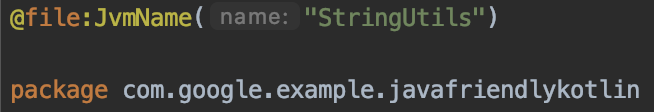

##### Android 11 Weeks 5 Weeks - Codelbas

# Language: Java-friendly Kotlin

[코드랩 링크](https://developer.android.com/codelabs/java-friendly-kotlin?return=https%3A%2F%2Fdeveloper.android.com%2Fcourses%2Fpathways%2Fandroid-week5-languages%23codelab-https%3A%2F%2Fdeveloper.android.com%2Fcodelabs%2Fjava-friendly-kotlin#0)

### Calling Kotlin Code from Java

#### Objectives

- How to make use of `@JvmField`, `@JvmStatic`, and other annotations.
- Limitations with accessing certain Kotlin language features form Java code.

우선 코드랩을 시작 직 후에 직면하는 수 많은 에러가 발생하나,
이번 코드랩에서는 해당 에러들을 수정하는 것이 가장 큰 목표!

### 1. @JvmStatic

@JvmStatic 은 static get/set 함수를 자동으로 만들어 내는 의미로,
마치 Java Lombok과 유사한 Annotation.

- 기존에 에러가 발생하던 코드

- JvmStatic 을 입력하여 get 함수를 자동으로 생성하여 예외를 해결 할 수 있음.

### 2. String Extensions / @JvmName

@JvmName은 Java에서 Kotlin Code를 호출 할 때의 이름을 정해주는 역할을 합니다.

기존 코드 내에서는 StringUtils 라는 이름의 Class나 Functiondmf 찾지 못하여 예외가 발생

위의 내용 대로 해당 파일 전체를 @JvmName을 이용해 StringUtils 라는 이름으로 Java 내에서 호출 할 수 있도록 수정

### 3. @JvmOverloads

@JvmOverloads는 Kotlin 생성자 Overloading Methods를 생성 해 주는 Annotation입니다.

예시의 User 클래스의 경우 생성자의 Params가 4개로 고정 되어있어서 3개의 Params를 입력 할 경우 위의 예시처럼 예외가 발생

User Class 내에서 생성자라는 의미의 constructor를 입력 후, 해당 생성자들의 Overloading Method를 자동으로 생성 하기 위해 @ JvMOverloads를 입력.
추가로 각각의 Field들의 get / set을 자동으로 생성하기 위해 @JvmField를 추가 입력.

### 4. @JvmName at Class

예제 코드 내에는 User class 내에 hasSystemAccess 라는 이름의 Method가 없어 예외가 발생함.

해당 Annotation을 통해 hasSystemAccess 라는 이름으로 hasSystemAccess 라는 변수의 get Method를 부여하여 사용할 수 있게 함.

### 5. @JvmField / const

@JvmField는 @JvmStatic과 유사하나, get / set Method를 만들지 말라는 지시자이며, 사용예시는 3번 항목에 포함 되어 있습니다.

추가로 const 형태의 상수값을 선언 할 때에도 사용 됩니다.

예시 코드 내에서 BACKUP_PATH에 대한 상수값이 선언되어있지 않는 것으로 인식되어 해당 상수 사용 부분에서 예외가 발생

@JvmField Annotation으로 BACKUP_PATH에 대한 상수 처리를 통해 위의 예외를 해소시킴.

### 6. @Throws

Kotlin에는 Java의 throws 역할을 하는 코드가 없는데,
Java 에서 해당 코드를 활용 할 때, 예외처리를 위해 사용하는 Annotation

해당 코드 내에 IOException 이 발생하는 코드가 없기 때문에 IOException catch절에서 예외가 발생.

@Throws Annotation을 통해 해당 Function내에서 IOException에 대한 처리가 필요하다는 부분을 추가 후에는 Java에서도 해당 코드의 IOException에 대한 예외처리를 할 수 있게 됨.

[Fork Repository](https://github.com/CuroGom/java-friendly-kotlin)