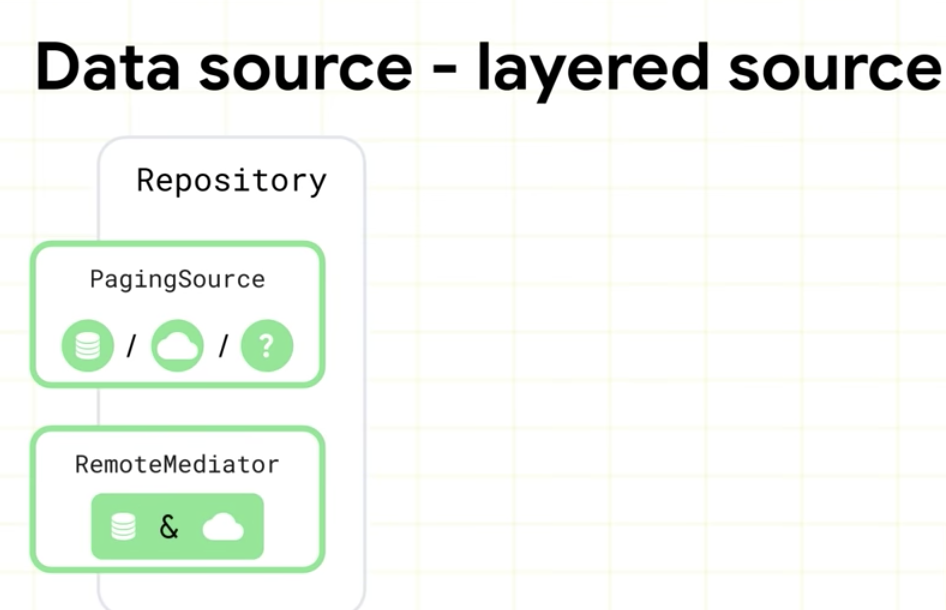
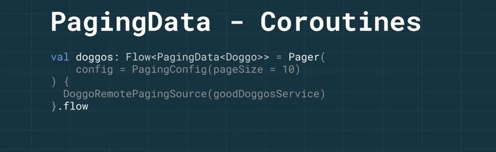
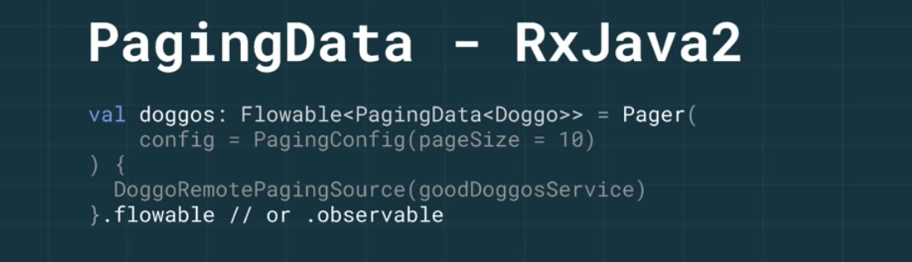
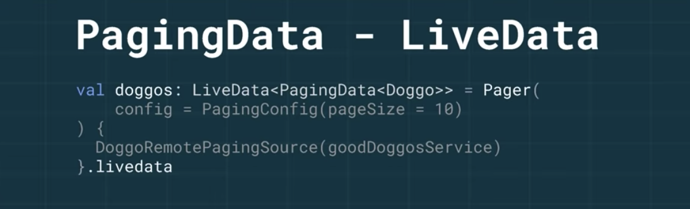
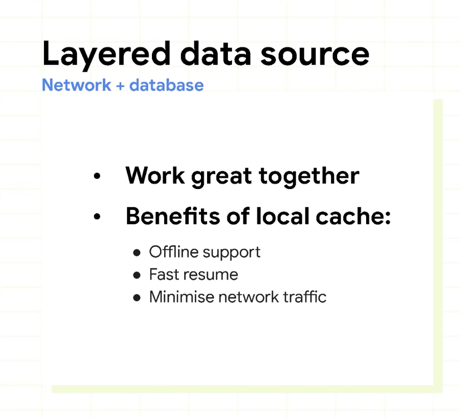
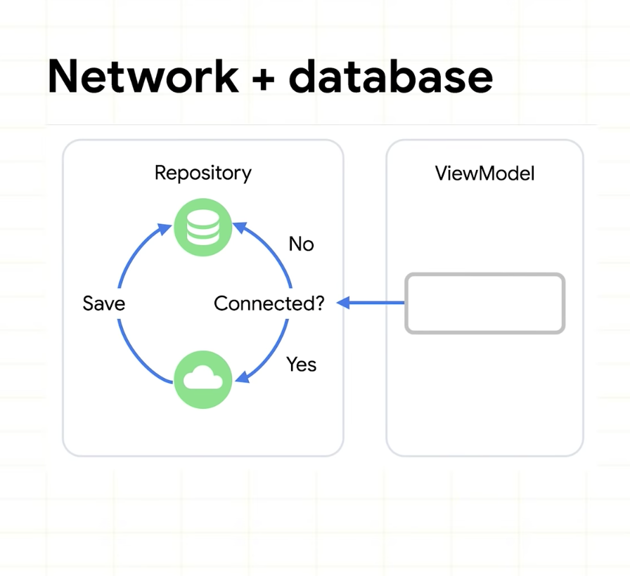
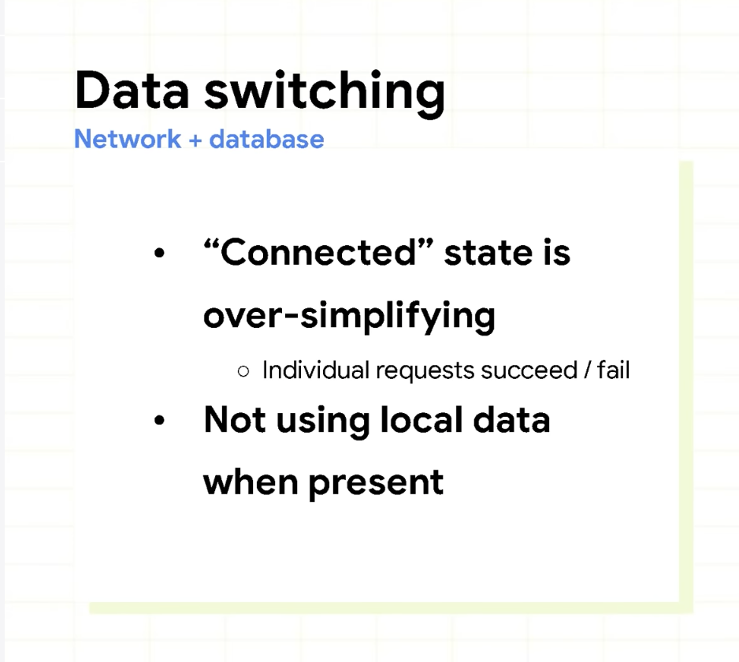
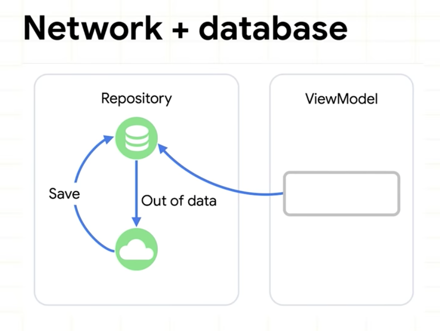

# Getting on the same page with Paging 3

Paging 2에 비교

- 코루틴 사용 ( Java 사용자도 여전히 지원한다. )
- 더 쉬운 오류 처리
- Map or Filter로 유연한 변경
- List separators, headers, and footers 지원
- 요청한 기능 제공

 현재 Alpha02


## Paging 3 Highlights

페이지에서 데이터를 로드 할때 직접 구현해야하는 아래의 공통 기능을 지원

- 다음 및 이전 페이지를 검색하는데 사용하는 키를 추적
- 사용자가 로드 된 데이터의 끝으로 스크롤 할 때 올바른 다음 페이지를 자동으로 요청
- 여러 요청이 동시에 트러기 되지 않도록 함
- 로딩 상태를 추적하고, RecyclerView 아이템이나 UI의 다른 위치에 표시 할 수 있으며, 실패한 로드에 대한 간편한 재시도 기능을 제공
-  `Flow`, `LiveData`, `RxJava` `Flowable`, `Observable` 사용과 관계 없이, 보여줄 아이템에 `map` 과 `filter` 와 같은 일반적인 동작이 가능하다.
- 리스트 항목 구분을 쉽게 구현하는 방법을 제공.
- 데이터 캐싱을 단순화하여, 모든 구성 변경시 데이터 변환을 실행하지 않도록 함.

또한, 일부 Paging 3 구성 요소를 이전 버전인 Paging 2.0와 호환하도록 만듦으로써 이미 Paging을 사용하는 앱이라면 점진적으로 [마이그레이션이](https://developer.android.com/topic/libraries/architecture/paging/v3-migration) 가능


## Adopting Paging 3 in your app

앱에 모든 Good doggos를 적용하는 예시.
인덱스 기반 페이지네이션을 지원 하는 `GoodDoggos API` 에서 doggos 획득. 
구현해야하는 Paging 구성 요소와 이러한 구성 요소가 앱 아키텍처에 어떻게 적용되는지 살펴 본다. 
다음 예제는 Kotlin으로 작성되었으며 coroutines 사용한다. LiveData / RxJava를 사용하는 Java 프로그래밍 언어의 예제는 [이곳 참조](https://developer.android.com/topic/libraries/architecture/paging/v3-overview) 

Paging 라이브러리는 권장하는 구조인 Android App Architecture의 각 계층에 직접 통합된다.


*페이징 컴포넌트와 앱 아키택처의 통합* 


#### 데이터 소스 정의

데이터를 로드하는 위치에 따라, `PagingSource` 만 구현할지   `PagingSource` 와 `RemoteMediator` 로 구현할지가 나뉜다.

- 네트워크, 로컬 데이터베이스, 파일 등과 같은 단일 소스 에서 데이터를 로드하는 경우  `PagingSource` 를 구현한다. (`Room`을 사용하는 경우 `Room 2.3.0-alpha`에서 시작하는  `PagingSource` 를 구현한다)
- 로컬 데이터베이스 캐시가 있는 네트워크 데이터 소스와 같이 계층화 된 소스(layered source) 에서 데이터를 로드하는 경우 `RemoteMediator` 를 구현하여 두 소스를 병합하고 `PagingSource` 는 로컬 데이터베이스 캐시에 대해 구현한다.



[Paging Data source]

#### Single Data Source - PagingSource

 **`PagingSource` 는 단일 위치(Network, DB, File)에서 데이터를 어떻게 가져올지에 대해 정의**한다.  PagingSource 는 저장소 계층의 일부일 것이다. 데이터 소스에서 페이징 된 데이터를 얻고, 로드된 데이터를 다음/이전 키에 대한 정보와 함께 반환하도록 `load()` 구현 한다. 이것은 `suspend` 함수이므로 네트워크 호출과 같은 다른 `suspend`  함수를 호출 할 수 있다.

```kotlin
class DoggosRemotePagingSource(
    val backend: GoodDoggosService
): PagingSource<Int, Dog>() {
  override suspend fun load(params: LoadParams<Int>): LoadResult<Int, Dog> {
    try {
      // Load page 1 if undefined.
      val nextPageNumber = params.key ?: 1
      val response = backend.getDoggos(nextPageNumber)
      return LoadResult.Page(
        data = response.doggos,
        prevKey = null, // Only paging forward.
        nextKey = response.nextPageNumber + 1
      )
    } catch (e: Exception) {
        // Handle errors in this block
        return LoadResult.Error(exception)
    }
  }
}
```

#### PagingData and Pager

페이지를 매긴 데이터의 컨테이너를 `PagingData` 라고 한다. 데이터를 갱신할때 `PagingData` 의 새 인스턴스가 생성된다. `PagingData` 스트림을 빌드하려면 `PagingConfig` 구성 개체와 `Pager`에` PagingSource` 구현의 인스턴스를 가져 오는 방법을 알려주는 함수를 사용하여 `Pager` 인스턴스를 만듭니다.

당신의 `ViewModel`에서 `Pager` 객체를 구성하고 `Flow<PagingData>` 로 UI에 노출 한다. `Flow<PagingData>` 는  `cachedIn()` 이라는 편리한 함수를 가지고있다. 이 함수는 데이터 스트림을 공유할 수 있게 만들고, `CoroutineScope` 에서  `Flow<PagingData>` 내용을 캐시 할 수 있다.  이렇게 하면 데이터 스트림에 변환을 구현하는 경우, Activity 재생성 후 흐름을 수집할 때마다 다시 트리거 되지 않는다. 캐싱은 가능한 한 UI 계층에 가깝게 수행해야하지만 구성 변경 이후에도 지속되도록 하려면 UI 계층이 아닌 계층에서 수행해야한다. 이를 위한 가장 좋은 장소는 `viewModelScope` 를 사용하는 `ViewModel` 이다.

```kotlin
val doggosPagingFlow = Pager(PagingConfig(pageSize = 10)) {
  DogRemotePagingSource(goodDoggosService)
}.flow.cachedIn(viewModelScope)
```







#### PagingDataAdapter

 `PagingData`를 `RecyclerView` 에 연결하려면 `PagingDataAdapter` 를 구현한다.

```kotlin
class DogAdapter(diffCallback: DiffUtil.ItemCallback<Dog>) :
  PagingDataAdapter<Dog, DogViewHolder>(diffCallback) {
  override fun onCreateViewHolder(
    parent: ViewGroup,
    viewType: Int
  ): DogViewHolder {
    return DogViewHolder(parent)
  }

  override fun onBindViewHolder(holder: DogViewHolder, position: Int) {
    val item = getItem(position)
    if(item == null) {
      holder.bindPlaceholder()
    } else {
      holder.bind(item)
    }
  }
```

그 후,  `Activity/Fragment` 에서  `Flow<PagingData>` 수집한다. 그리고  `PagingDataAdapter` 에 데이터를 submit한다. 이 `Activity onCreate()` 에서의 이 구현은 다음과 같다.

```kotlin
val viewModel by viewModels<DoggosViewModel>()

val pagingAdapter = DogAdapter(DogComparator)
val recyclerView = findViewById<RecyclerView>(R.id.recycler_view)
recyclerView.adapter = pagingAdapter

lifecycleScope.launch {
  viewModel.doggosPagingFlow.collectLatest { pagingData ->
    pagingAdapter.submitData(pagingData)
  }
}
```


### Paged data transformations


*Displaying a filtered list*

`PagingData`스트림 변환은 다른 데이터 스트림과 매우 유사하다. 예를 들어, `Flow<PagingData<Dog>>` 에서 장난기 넘치는 doggos 만 표시하려면 `Flow`객체를 매핑(map) 한 다음  `PagingData` 에  `filter` 를 수행한다.

```kotlin
doggosPagingFlow.map { pagingData ->
        pagingData.filter { dog -> dog.isPlayful }
    }
```


*List with separators*

리스트 구분 기호를 추가하는 것은 `PagingData`를 변환하여 구분 객체를 목록에 삽입하는 페이지 된 데이터 변환이다. 예를 들어 doggos의 이름에 문자 구분 기호를 삽입 할 수 있다. 구분 기호를 사용할 때 새 구분 기호 항목을 지원하는 고유 한 UI 모델 클래스를 구현해야 한다. `PagingData`를 수정하여 구분 기호를 추가하려면 `insertSeparators`  변환을 사용합니다.

```kotlin
pager.flow.map { pagingData: PagingData<Dog> ->
  pagingData.map { doggo ->
    // Convert items in stream to UiModel.DogModel.
    UiModel.DogModel(doggo)
  }
  .insertSeparators<UiModel.DogModel, UiModel> { before: Dog, after: Dog ->
      return if(after == null) {
          // we're at the end of the list
          null
      } else if (before == null || before.breed != after.breed) {
          // breed above and below different, show separator
          UiModel.SeparatorItem(after.breed)
      } else {
          // no separator
          null
      }
    }
  }
}.cachedIn(viewModelScope)
```

이전과 마찬가지로 `cachedIn` 을 UI 레이어 바로 전에 사용한다. 이로 인해 로드된 데이터와 변환 결과가 구성 변경 후 캐시되고 재사용 될 수 있다.


#### Advanced Paging work with RemoteMediator

계층화 된 소스에서 데이터를 페이징 하는 경우 `RemoteMediator` 를 사용한다. 예를 들어, 이 클래스의 구현에서 네트워크에서 데이터를 요청하고 데이터베이스에 저장해야한다면,  `load()` 메소드는 표시 할 데이터가  데이터베이스에 없을 때마다 트리거된다. `PagingState` 와  `LoadType` 을 기반으로 다음 요청을 구성한다.

### Layered Data Source



[Layered Data Source 사용 이유]



[네트워크 + 데이터베이스 사용 구조]



[위 구조의 문제점]



[Paging 이 지원하는 아키텍처]

Paging 라이브러리는 API 형태를 알지 못하므로 이전/다음 원격 페이지 키가 어떻게 구성되고 유지되는지 정의하는 것은 개발자의 책임이다. 예를 들어, 원격 키를 네트워크에서 받은 모든 항목에 연결하고 데이터베이스에 저장할 수 있다.

```kotlin
//DoggosRemoteMediator.kt
override suspend fun load(loadType: LoadType, state: PagingState<Int, Dog>): MediatorResult {

   val page = ... // computed based on loadType and state

   try {
       val doggos = backend.getDoggos(page)
       doggosDatabase.doggosDao().insertAll(doggos)
       
       val endOfPaginationReached = emails.isEmpty()
       return MediatorResult.Success(endOfPaginationReached = endOfPaginationReached)
   } catch (exception: Exception) {
       return MediatorResult.Error(exception)
   } 
}
```

네트워크에서 데이터를 로드하여 데이터베이스에 저장할 때 데이터베이스는 화면에 표시되는 데이터에 대한 진짜 소스이다. 즉, UI가 데이터베이스의 데이터를 표시하므로, 데이터베이스에 대한 `PagingSource` 구현을 해야한다. Room을 사용하는 경우 `PagingSource` 를 반환하는 새 쿼리를 DAO에 추가하기 한다.

```kotlin
@Query("SELECT * FROM doggos")
fun getDoggos(): PagingSource<Int, Dog>
```

이 경우에는 `RemoteMediator` 인스턴스도 전달해야 하므로 `Pager` 구현이 약간 변경된다.

```kotlin
val pagingSourceFactory = { database.doggosDao().getDoggos() }

return Pager(
     config = PagingConfig(pageSize = NETWORK_PAGE_SIZE),
     remoteMediator = DoggosRemoteMediator(service, database),
     pagingSourceFactory = pagingSourceFactory
).flow
```

더 자세히는 코드랩을 참조


Paging의 간단하고 복잡한 사용을 모두 수용 할 수 있도록 Paging 3 라이브러리를 설계했다. 

- 네트워크, 데이터베이스, 인 메모리 캐시 또는 이러한 소스의 일부 조합에서 로드되는 대규모 데이터 세트로 작업하기가 더 쉽다. 
- 라이브러리는 코루틴 과 `Flow` 기반으로 만들어져 일시 중단 함수를 쉽게 호출하고 데이터 스트림으로 작업 할 수 있다.


[원문]: https://android-developers.googleblog.com/2020/07/getting-on-same-page-with-paging-3.html

