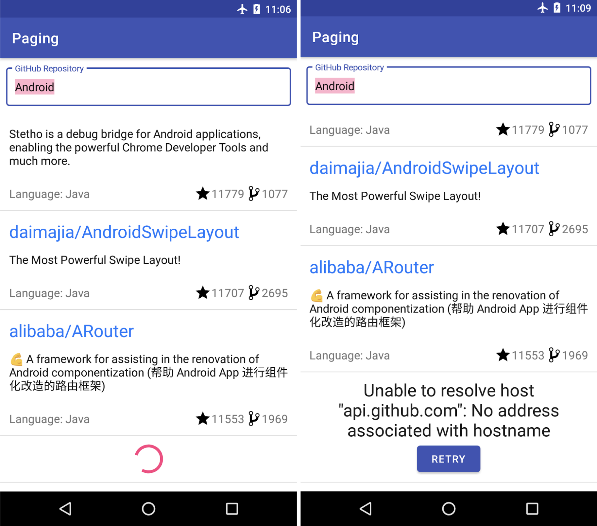
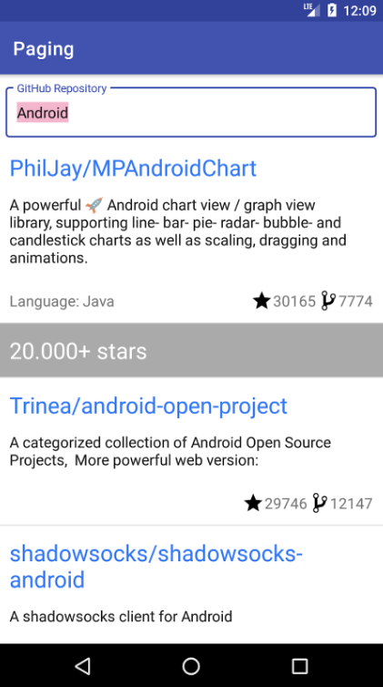

# Android Paging CodeLab
[**CodeLab**](https://developer.android.com/codelabs/android-paging?authuser=1&return=https%3A%2F%2Fdeveloper.android.com%2Fcourses%2Fpathways%2Fandroid-week6-jetpack%3Fauthuser%3D1%23codelab-https%3A%2F%2Fdeveloper.android.com%2Fcodelabs%2Fandroid-paging#0)<br/>
[**GitHub**](https://github.com/googlecodelabs/android-paging)<br/>
[**Coroutine Channel**](https://skasha.tistory.com/78)
## Requirement
`Android Studio 3.6 or higher`.<br/>
Familiarity with the following Architecture Components: `LiveData`, `ViewModel`, `View Binding`.<br/>
Familiarity with `coroutines` and `Kotlin Flow`.<br/><br/>

## AS-IS
</img><br/>

* We have the following issues
  - The user has no information on the `list loading state`
  - The user can't `retry a failed query`
  - The list `grows unbounded in memory`, wasting memory as the user scrolls
  - We have to convert our results from `Flow` to `LiveData` to cache them, `increasing the complexity` of our code.
  - If our app `needed to show multiple lists`, we'd see that there is a lot of `boilerplate` to write for each list

## TO-BE
</img><br/>


## Project overview

`api` - Github API calls, using `Retrofit`.<br/>
`data` - the `repository class`, responsible for triggering API requests and caching the responses in memory.<br/>
`model` - the `Repo data model` and `RepoSearchResult`, a class that is used by the UI to observe both search results data and network errors.<br/>
`ui` - classes related to displaying an `Activity with a RecyclerView`.

* Basic flow
    - `GithubRepository` ->  `ConflatedBroadcastChannel` -> emit as `Flow`
    - `SearchRepositoriesViewModel` requests the data from `GithubRepository` exposes it to `SearchRepositoriesActivity`
  
## Paging library components

* Features
    - Keeps track of the `keys` to be used for retrieving the `next` and `previous` page.
    - `Automatically requests` the correct page when the user has scrolled to the end of the list.
    - Ensures that multiple requests `aren't triggered at the same time`.
    - Allows you to cache data: if you're using Kotlin, this is done in a CoroutineScope; if you're using Java, this can be done with LiveData.
    - `Tracks loading state` and allows you to display it in a RecyclerView list item or elsewhere in your UI, and `easily retry failed loads`.
    - Allows you to execute common operations like `map` or `filter` on the list that will be displayed, independently of whether you're using `Flow`, `LiveData`, or `RxJava Flowable` or `Observable`.
    - Provides an `easy way of implementing list separators`.

* Main components
  - `PagingData` - a container for paginated data.
  - `PagingSource` - a PagingSource is the base class for loading snapshots of data into a stream of `PagingData`.
  - `Pager.flow` - builds a `Flow<PagingData>`, based on a `PagingConfig` and a function that defines how to construct the implemented `PagingSource`
  - `PagingDataAdapter` - `RecyclerView.Adapter` that presents `PagingData` in a `RecyclerView`. can be connected to a `Kotlin Flow`, a `LiveData`, an `RxJava Flowable`, or an `RxJava Observable`. uses `DiffUtil` on a background thread. 

## Define the source of data
The `PagingSource` implementation defines the source of data and `how to retrieve data` from that source<br/>
```kotlin
private const val GITHUB_STARTING_PAGE_INDEX = 1

class GithubPagingSource(
        private val service: GithubService,
        private val query: String
) : PagingSource<Int, Repo>() {

    override suspend fun load(params: LoadParams<Int>): LoadResult<Int, Repo> {
        val position = params.key ?: GITHUB_STARTING_PAGE_INDEX
        val apiQuery = query + IN_QUALIFIER
        return try {
            val response = service.searchRepos(apiQuery, position, params.loadSize)
            val repos = response.items 
            LoadResult.Page(
                    data = repos,
                    prevKey = if (position == GITHUB_STARTING_PAGE_INDEX) null else position - 1,
                    nextKey = if (repos.isEmpty()) null else position + 1
            )
        } catch (exception: IOException) {
            return LoadResult.Error(exception)
        } catch (exception: HttpException) {
            return LoadResult.Error(exception)
        }
    }
}
```
`LoadResult.Page`, if the result was successful.<br/>
`LoadResult.Error`, in case of error.<br/>
`params.key` is currunt position or index<br/>
`params.loadSize` is number of data to be requested.

## Build and configure PagingData

use a `Flow<RepoSearchResult>` in the `GitHubRepository` to get the data from the network and pass it to the `ViewModel`. The ViewModel then transforms it into a `LiveData`.<br/>

To construct the `PagingData`, we first need to decide what API we want to use to pass the `PagingData` to other layers of our app:<br/>

- Kolin Flow - use `Pager.flow`.
- LiveData - use `Pager.liveData`.
- RxJava Flowable - use `Pager.flowable`.
- RxJava Observable - use `Pager.observable`.
```kotlin
class GithubRepository(private val service: GithubService) {

    fun getSearchResultStream(query: String): Flow<PagingData<Repo>> {
        return Pager(
                config = PagingConfig(pageSize = NETWORK_PAGE_SIZE),
                pagingSourceFactory = { GithubPagingSource(service, query) }
        ).flow
    }

    companion object {
        private const val NETWORK_PAGE_SIZE = 50
    }
}
```
## Request and cache PagingData in the ViewModel
```kotlin
class SearchRepositoriesViewModel(private val repository: GithubRepository) : ViewModel() {

    private var currentQueryValue: String? = null

    private var currentSearchResult: Flow<PagingData<Repo>>? = null

    fun searchRepo(queryString: String): Flow<PagingData<Repo>> {
        val lastResult = currentSearchResult
        if (queryString == currentQueryValue && lastResult != null) {
            return lastResult
        }
        currentQueryValue = queryString
        val newResult: Flow<PagingData<Repo>> = repository.getSearchResultStream(queryString)
                .cachedIn(viewModelScope)
        currentSearchResult = newResult
        return newResult
    }
}
```
## Make the Adapter work with PagingData
```kotlin
class ReposAdapter : PagingDataAdapter<Repo, RecyclerView.ViewHolder>(REPO_COMPARATOR)
```
Make it implement `PagingDataAdapter` instead
## Trigger network updates
```kotlin
class SearchRepositoriesActivity : AppCompatActivity() {

    private lateinit var binding: ActivitySearchRepositoriesBinding
    private lateinit var viewModel: SearchRepositoriesViewModel
    private val adapter = ReposAdapter()

    private var searchJob: Job? = null

    private fun search(query: String) {
        // Make sure we cancel the previous job before creating a new one
        searchJob?.cancel()
        searchJob = lifecycleScope.launch {
            viewModel.searchRepo(query).collect { pagingData<Repo> -> 
                adapter.submitData(it)
            }
        }
    }

    override fun onCreate(savedInstanceState: Bundle?) {
        super.onCreate(savedInstanceState)
        
        // skip 

        val query = savedInstanceState?.getString(LAST_SEARCH_QUERY) ?: DEFAULT_QUERY
        search(query)
    }
}
```
## Displaying the loading state in a footer
<br/></img><br/>

able to display a `footer based on the load status`: when the list `is loading`, we want to show a progress spinner. In `case of an error`, we want to show the `error and a retry button`.<br/><br/>

### Create the `view layout`
```xml
<?xml version="1.0" encoding="utf-8"?>
<LinearLayout xmlns:android="http://schemas.android.com/apk/res/android"
    android:layout_width="match_parent"
    android:layout_height="wrap_content"
    xmlns:tools="http://schemas.android.com/tools"
    android:orientation="vertical"
    android:padding="8dp">

    <TextView
        android:id="@+id/error_msg"
        android:textColor="?android:textColorPrimary"
        android:textSize="@dimen/error_text_size"
        android:layout_width="wrap_content"
        android:layout_height="wrap_content"
        android:layout_gravity="center"
        android:textAlignment="center"
        tools:text="Timeout"/>

    <ProgressBar
        android:id="@+id/progress_bar"
        style="?android:attr/progressBarStyle"
        android:layout_width="match_parent"
        android:layout_height="wrap_content"
        android:layout_gravity="center"/>

    <Button
        android:id="@+id/retry_button"
        android:layout_width="wrap_content"
        android:layout_height="wrap_content"
        android:layout_gravity="center"
        android:text="@string/retry"/>

</LinearLayout>
```
### Create the `ViewHolder`
```kotlin
class ReposLoadStateViewHolder(
        private val binding: ReposLoadStateFooterViewItemBinding,
        retry: () -> Unit
) : RecyclerView.ViewHolder(binding.root) {

    init {
        binding.retryButton.setOnClickListener { retry.invoke() }
    }

    fun bind(loadState: LoadState) {
        if (loadState is LoadState.Error) {
            binding.errorMsg.text = loadState.error.localizedMessage
        }
        binding.progressBar.visibility = toVisibility(loadState is LoadState.Loading)
        binding.retryButton.visibility = toVisibility(loadState !is LoadState.Loading)
        binding.errorMsg.visibility = toVisibility(loadState !is LoadState.Loading)
    }

    companion object {
        fun create(parent: ViewGroup, retry: () -> Unit): ReposLoadStateViewHolder {
            val view = LayoutInflater.from(parent.context)
                    .inflate(R.layout.repos_load_state_footer_view_item, parent, false)
            val binding = ReposLoadStateFooterViewItemBinding.bind(view)
            return ReposLoadStateViewHolder(binding, retry)
        }
    }
}
```
### Create the `LoadStateAdapter`
```kotlin
class ReposLoadStateAdapter(private val retry: () -> Unit) : LoadStateAdapter<ReposLoadStateViewHolder>() {
    override fun onBindViewHolder(holder: ReposLoadStateViewHolder, loadState: LoadState) {
        holder.bind(loadState)
    }

    override fun onCreateViewHolder(parent: ViewGroup, loadState: LoadState): ReposLoadStateViewHolder {
        return ReposLoadStateViewHolder.create(parent, retry)
    }
}
```

### Bind the footer adapter with the list
```kotlin
private fun initAdapter() {
    binding.list.adapter = adapter.withLoadStateHeaderAndFooter(
            header = ReposLoadStateAdapter { adapter.retry() },
            footer = ReposLoadStateAdapter { adapter.retry() }
    )
}
```
* `PagingDataAdapter` has 3 useful methods:
  - `withLoadStateHeader`: if we only want to display a header—this should be used when your list only supports adding items at the beginning of the list.
  - `withLoadStateFooter`: if we only want to display a footer—this should be used when your list only supports adding items at the end of the list.
  - `withLoadStateHeaderAndFooter`: if we want to display a header and a footer - if the list can be paged in both directions.

## Adding list separators

<br/></img><br/>

### Change the UI model

<br/>Add a layout and `ViewHolder` for separators.<br/>
Update `RepoAdapter` to support creating and binding both separators and repositories.<br/><br/>

```kotlin
sealed class UiModel {
    data class RepoItem(val repo: Repo) : UiModel()
    data class SeparatorItem(val description: String) : UiModel()
}
```
```kotlin
private val UiModel.RepoItem.roundedStarCount: Int
    get() = this.repo.stars / 10_000
```
### Insert separators
```kotlin
fun searchRepo(queryString: String): Flow<PagingData<UiModel>> {
    val lastResult = currentSearchResult
    if (queryString == currentQueryValue && lastResult != null) {
        return lastResult
    }
    currentQueryValue = queryString
    val newResult: Flow<PagingData<UiModel>> = repository.getSearchResultStream(queryString)
            .map { pagingData -> 
            pagingData.map { 
                UiModel.RepoItem(it) 
                } 
            }.map { uiModelRepoPagingData ->
                uiModelRepoPagingData.insertSeparators<UiModel.RepoItem, UiModel> { before, after ->
                    if (after == null) {
                        // we're at the end of the list
                        return@insertSeparators null
                    }

                    if (before == null) {
                        // we're at the beginning of the list
                        return@insertSeparators UiModel.SeparatorItem("${after.roundedStarCount}0.000+ stars")
                    }
                    // check between 2 items
                    if (before.roundedStarCount > after.roundedStarCount) {
                        if (after.roundedStarCount >= 1) {
                            UiModel.SeparatorItem("${after.roundedStarCount}0.000+ stars")
                        } else {
                            UiModel.SeparatorItem("< 10.000+ stars")
                        }
                    } else {
                        // no separator
                        null
                    }
                }
            }
            .cachedIn(viewModelScope)
    currentSearchResult = newResult
    return newResult
}
```

### Support multiple view types
```xml
<?xml version="1.0" encoding="utf-8"?>
<androidx.constraintlayout.widget.ConstraintLayout 
    xmlns:android="http://schemas.android.com/apk/res/android"
    xmlns:app="http://schemas.android.com/apk/res-auto"
    xmlns:tools="http://schemas.android.com/tools"
    android:layout_width="match_parent"
    android:layout_height="wrap_content"
    android:background="@color/separatorBackground">

    <TextView
        android:id="@+id/separator_description"
        android:layout_width="0dp"
        android:layout_height="wrap_content"
        android:padding="@dimen/row_item_margin_horizontal"
        android:textColor="@color/separatorText"
        android:textSize="@dimen/repo_name_size"
        app:layout_constraintEnd_toEndOf="parent"
        app:layout_constraintStart_toStartOf="parent"
        app:layout_constraintTop_toTopOf="parent"
        tools:text="10000+ stars" />
</androidx.constraintlayout.widget.ConstraintLayout>
```
```kotlin
class SeparatorViewHolder(view: View) : RecyclerView.ViewHolder(view) {
    private val description: TextView = view.findViewById(R.id.separator_description)

    fun bind(separatorText: String) {
        description.text = separatorText
    }

    companion object {
        fun create(parent: ViewGroup): SeparatorViewHolder {
            val view = LayoutInflater.from(parent.context)
                    .inflate(R.layout.separator_view_item, parent, false)
            return SeparatorViewHolder(view)
        }
    }
}
```
### update ReposAdapter
```kotlin
class ReposAdapter : PagingDataAdapter<UiModel, ViewHolder>(UIMODEL_COMPARATOR) {

    override fun onCreateViewHolder(parent: ViewGroup, viewType: Int): ViewHolder {
        return if (viewType == R.layout.repo_view_item) {
            RepoViewHolder.create(parent)
        } else {
            SeparatorViewHolder.create(parent)
        }
    }

    override fun getItemViewType(position: Int): Int {
        return when (getItem(position)) {
            is UiModel.RepoItem -> R.layout.repo_view_item
            is UiModel.SeparatorItem -> R.layout.separator_view_item
            null -> throw UnsupportedOperationException("Unknown view")
        }
    }

    override fun onBindViewHolder(holder: ViewHolder, position: Int) {
        val uiModel = getItem(position)
        uiModel.let {
            when (uiModel) {
                is UiModel.RepoItem -> (holder as RepoViewHolder).bind(uiModel.repo)
                is UiModel.SeparatorItem -> (holder as SeparatorViewHolder).bind(uiModel.description)
            }
        }
    }

    companion object {
        private val UIMODEL_COMPARATOR = object : DiffUtil.ItemCallback<UiModel>() {
            override fun areItemsTheSame(oldItem: UiModel, newItem: UiModel): Boolean {
                return (oldItem is UiModel.RepoItem && newItem is UiModel.RepoItem &&
                        oldItem.repo.fullName == newItem.repo.fullName) ||
                        (oldItem is UiModel.SeparatorItem && newItem is UiModel.SeparatorItem &&
                                oldItem.description == newItem.description)
            }

            override fun areContentsTheSame(oldItem: UiModel, newItem: UiModel): Boolean =
                    oldItem == newItem
        }
    }
}
```
