## Agenda

- What is System Trace
- Using System Trace in Android Studio
- Demo

## What is System Trace

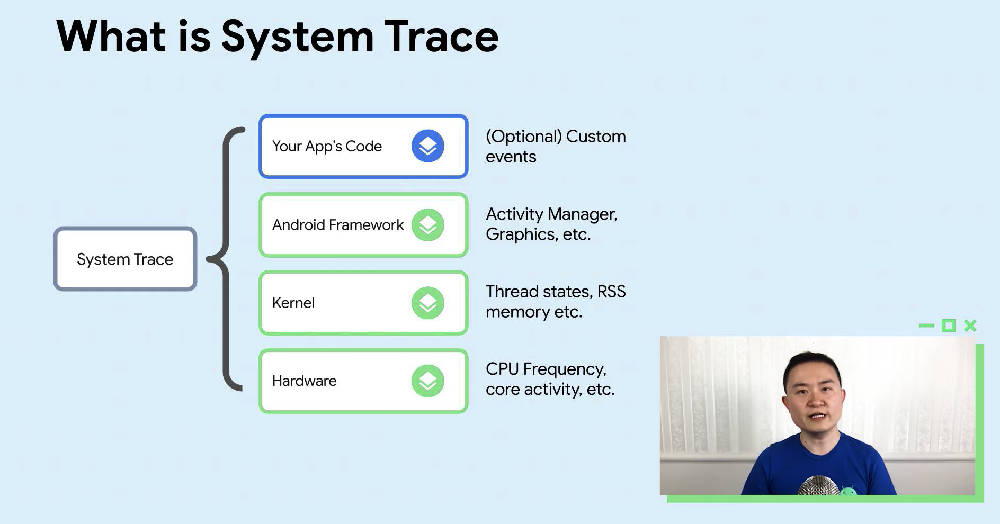

System Trace는 4개의 계층에서 성능 데이터를 캡쳐하여 런타임 성능을 전체적으로 파악하는데 도움이 된다.

- Hardware layer : CPU 주파수, CPU 코어 스케쥴링 등등
- Kernel layer : 스레드 상태, RSS 메모리 카운터 정보 등등
- Android Framework Layer : 엑티비티 매니저의 이벤트, 그래픽 파이프라인, 프레임 워크의 다른 측면 등등
- App Layer : 선택사항이며 다른 정보들과 함께 앱 데이터를 분석하기 사용자 지정 이벤트

**System Trace는 앱이 시스템 리소스와 함께 어떻게 상호작용하는지 검사할 수 있다.**

## Using System Trace in Android Studio

#### System Trace 방법

- 커맨드 라인 명령어
- CPU Profiler  (supports API 24+)
  - Android 3.2 부터 사용 가능
  - Android 4.0 에서 System Trace UI 개선
  - Android 4.1 에서 더 다듬어짐

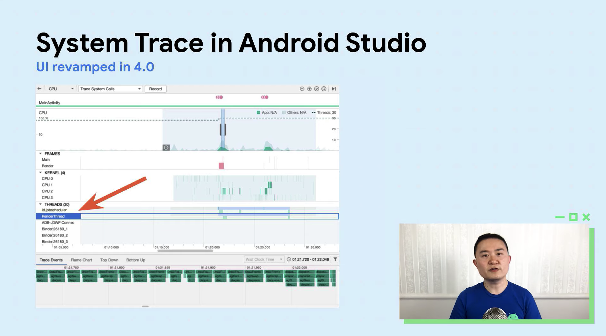

[System Trace in Android Studio 4.0]

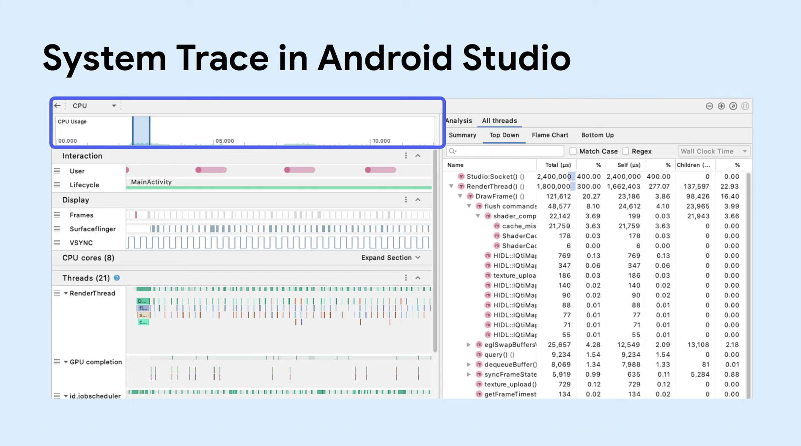

[System Trace in Android Studio 4.1]

- 파란 네모 : CPU 타임라인으로 CPU 사용량을 볼수 있으며 특정 영역 선택 및 확대, 축소가 가능
- 파란 네모 아래 : 상세 정보가 적혀있으며, 강조! **Threads 영역에서 한눈에 바쁜 스레드를 볼수 있다**.
- 파란 네모 우측 전부 : 모든 스레드에 대한 성능 분석 정보를 보여주며, 뷰잉 방식(Top-down, Flame-chart, Bottom-up) 변경이 가능하다.
  4.1 에서는 Summary 탭이 추가 되었다.

## Demo 

#### 준비물

- [Android Studio Beta 4.1](https://goo.gle/2WDUPtM)

- [IOSched app on Github](https://goo.gle/3jmdvrG)

#### 목표

데모 프로젝트에는 버그를 심어놓음

- Capture a System Trace
- Navigate the new UI
- Investigate app UI jank

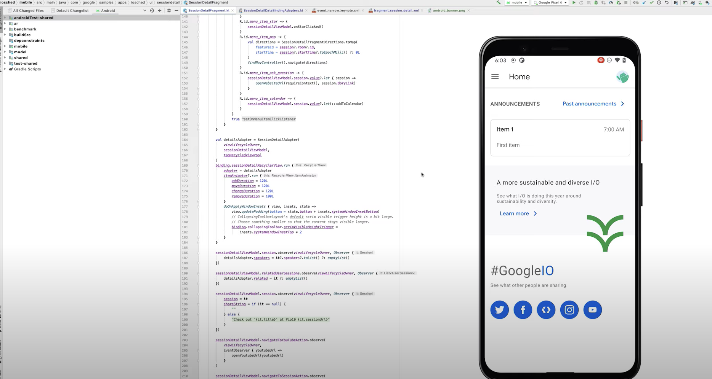

[앱 화면 1 - 메인화면]

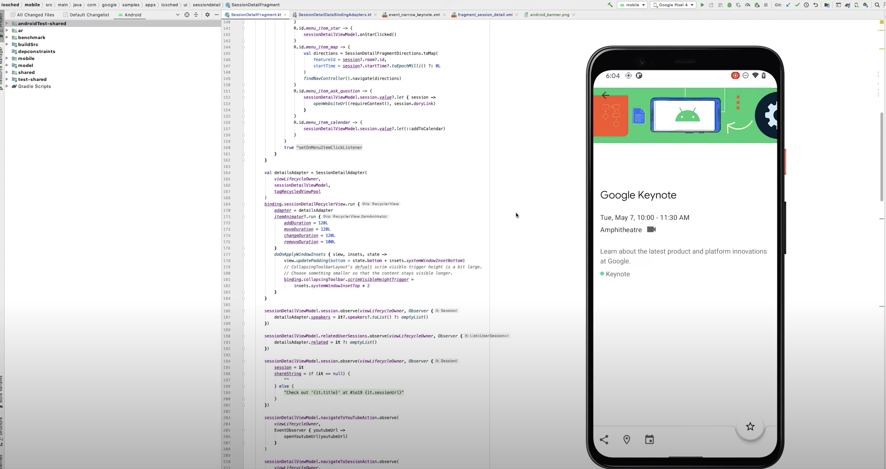

[앱 화면 2 - 키노트 상세화면]

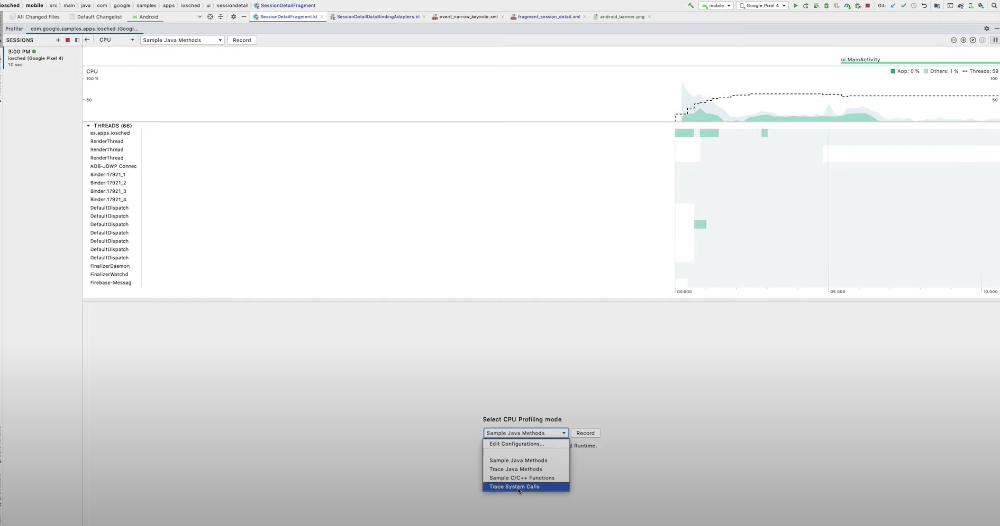

[Recode - Trace System Call]

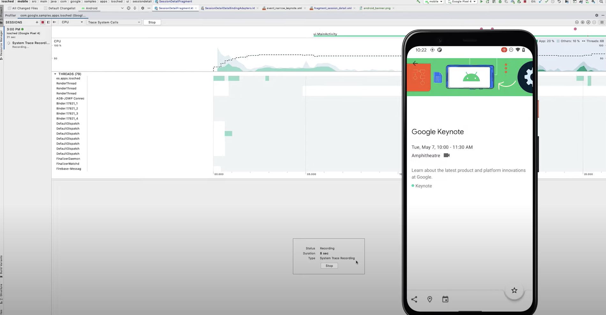

[Recode - 앱 메인 화면 > 키노트 상세 화면]

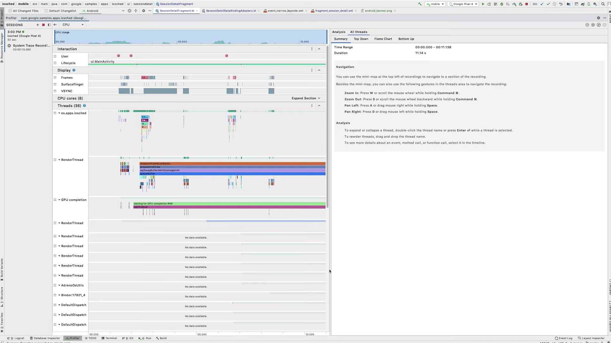

[Recode 결과]
CPU 타임라인에서 특정 영역을 선택해서 WASD 키보드 단축키로 이동할수 있다.

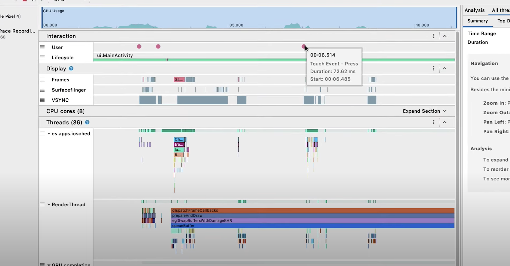

[성능이 느린 부분 - 사용자 이벤트로 위치 파악]

추적을 시작하기 좋은 위치가 Interaction 영역이다.

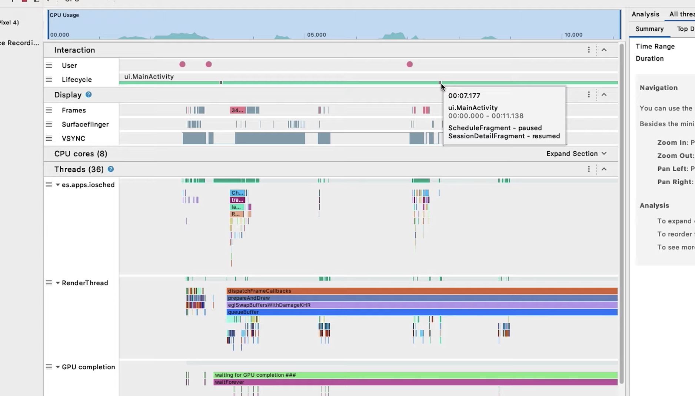

[화면 변경에 따른 Lifecycle 확인]

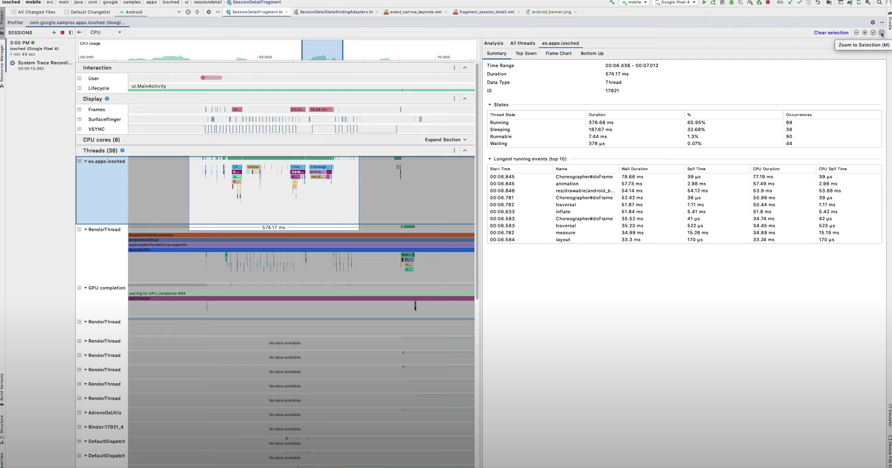

[Threads 사용량 확인]

선택 부분을 키보드 M 단축키를 누르면 선택 영역 중심으로 확장된다.

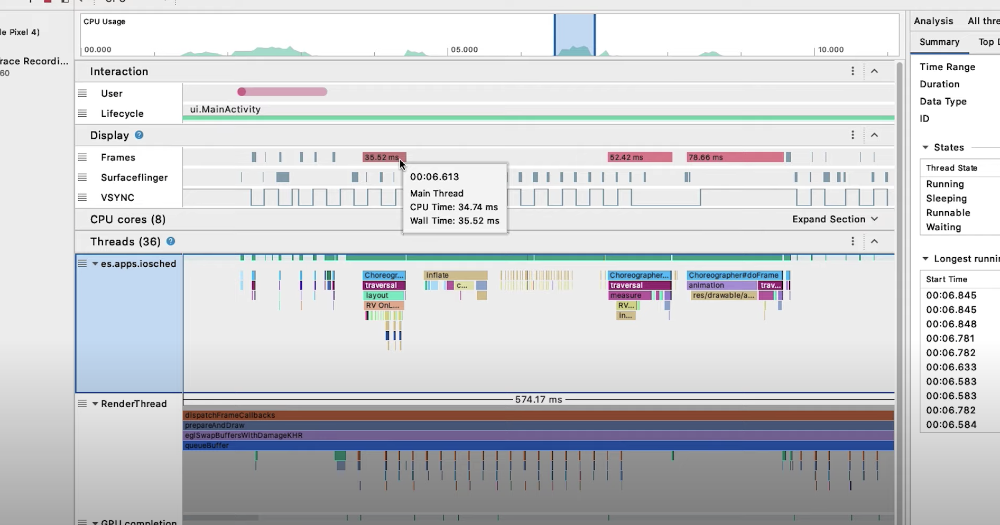

[화면에서 느린 프레임 확인]

- Frames : 각 프레임을 렌더링 하는데 걸리는 시간을 보여준다. 초당 60 frames 으로 표시가 안되는 긴 프레임은 빨간색으로 표시된다.
- SurfaceFlinger : Surface flinger 는 OS의 백그라운드로 실행중이다. 디스플레이 새로고침 사이에 버퍼를 담당하여 메모리 사용량을 최소화 시키고 화면 찢어짐 (screen tearing) 을 방지한다. 
  잠재적인 UI 랜더링 병목 현상을 발견하는데 도움이 된다.
- VSYNC (Android Studio 4.1에 추가) : 동기화 신호로 Surfacefligner 를 동기화 하여 사용자에게 부드러운(끊기지 않는) 화면 을 보여준다. 

현재 개발자 preview 버전인 Android Grapics Inspector 로 더욱 그래픽 표시에 전문적인 데이터를 볼수 있다. [링크](https://gpuinspector.dev/)

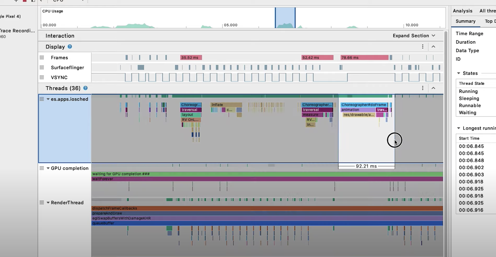

[Threads 영역 설명]

각 스레드는 두개의 부분으로 나뉜다.

- 상단 : 주어진 시간에 스레드의 실행중/수면중 상태 > 다중 스레드 문제를 디버깅 하는데 유용하다.
- 하단 : 모든 추적 이벤트를 트리 모양의 그래프로 보여준다. 이 추적 정보에는 사용자 정의 정보를 추가할수 있다. 

Threads 의 순서는 번호순대로 정렬되어서 사용자가 드래그&드랍으로 순서를 마음대로 변경할수 있다.

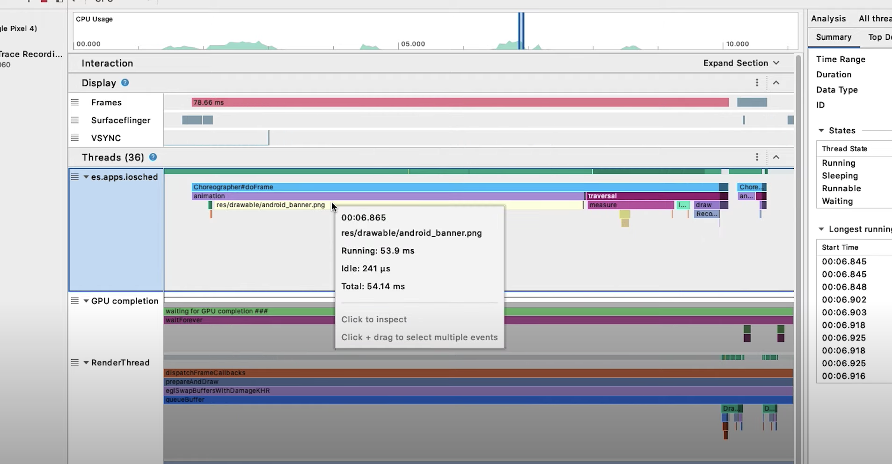

[문제점1. 오래 걸린 스레드 영역 상세 보기]

이미지 로드가 오래걸린것을 확인 할수 있다.

약 50ms 가 소요됨

버그 : 벡터 이미지 to 4000x1000 png

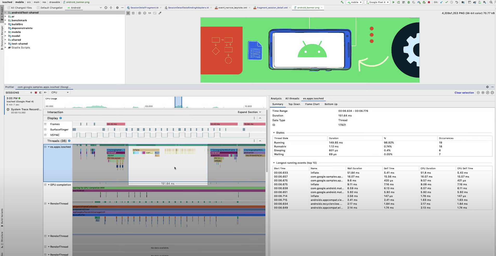

[문제점2. 프레임 사이에 큰 간격]

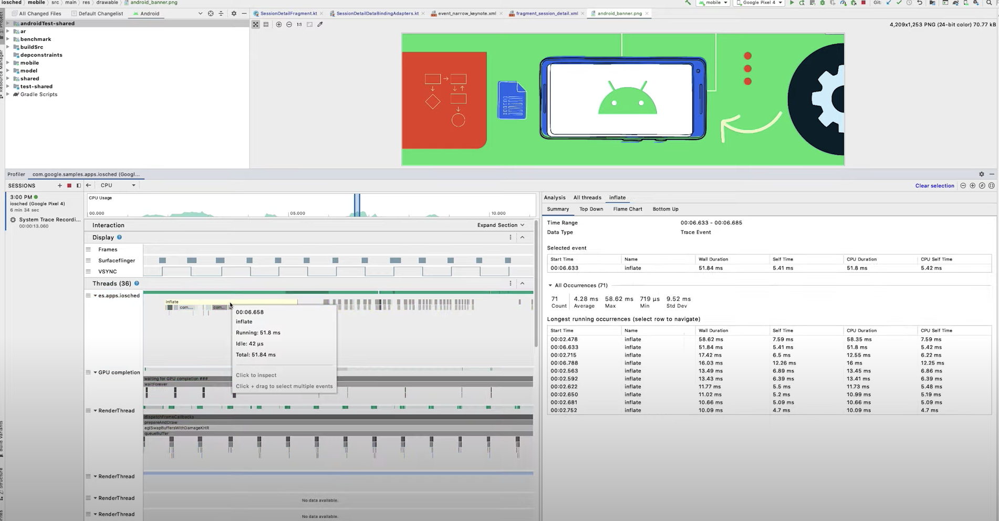

[문제점 파악을 위한 프레임 간격 영역 확대]

두번의 Inflate 를 볼수 있다.

그리고 우측 분석창에서 4.1에 새롭게 생긴 summary 탭으로 요약된 정보를 볼수 있다. 또한 Top-down ..  등으로 viewType을 변경해서 볼수 있다.

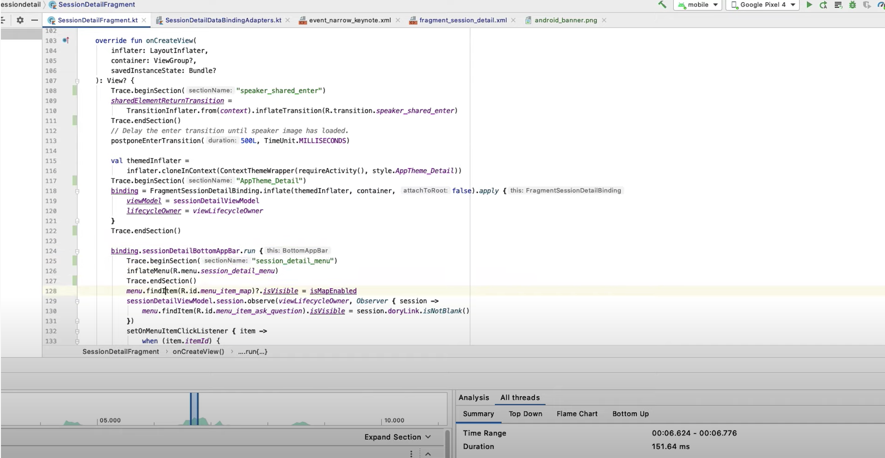

[System Trace에 사용자 정의 정보를 추가하는 방법]

- 추적 시작 : Trace.beginSection("추적 API에 표시될 이름")
- 추적 종료 : Trace.endSection()

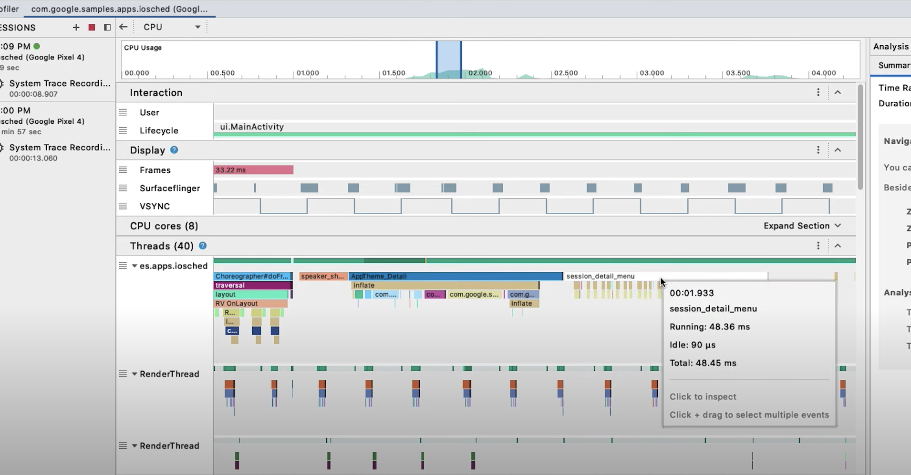

[System Trace에 기록된 사용자 정의 정보]

Trace API를 이용해서 내 코드와 안드로이드 프레임워크의 추적 코드를 연결할수 있다.

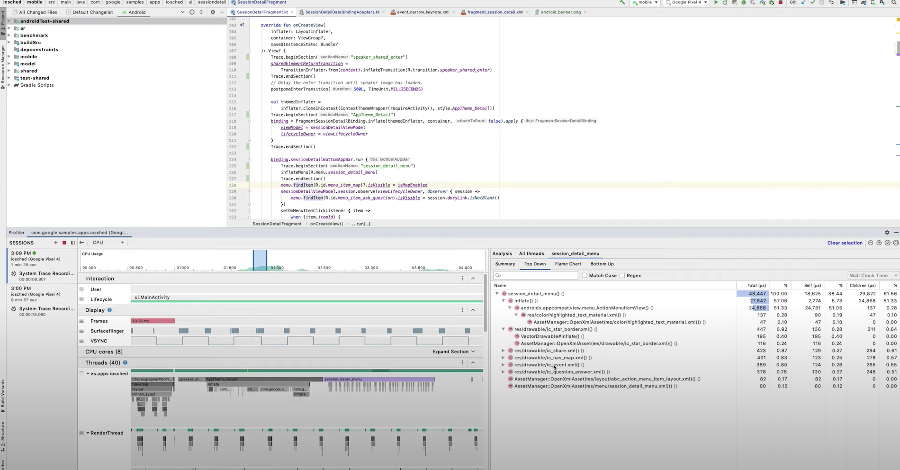

[분석 창 - 하향식트리에서 앱 성능 개선을 위한 데이터를 얻을 수 있다.]

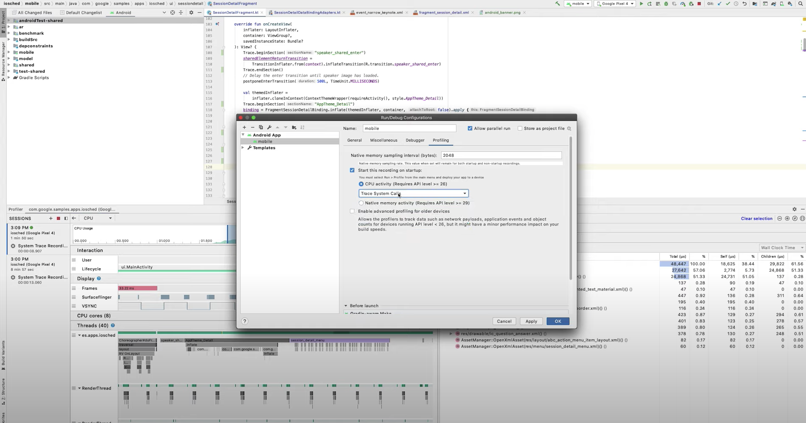

앱 시작시 Recode가 필요한 경우 Run/Debug 구성에서 설정할 수 있다.

출처 : https://youtu.be/EjmIit_amnE