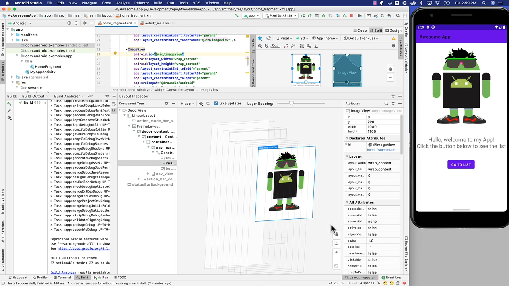
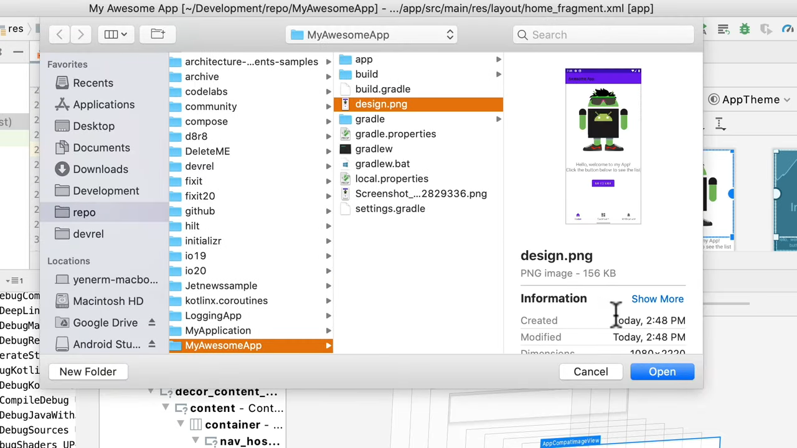
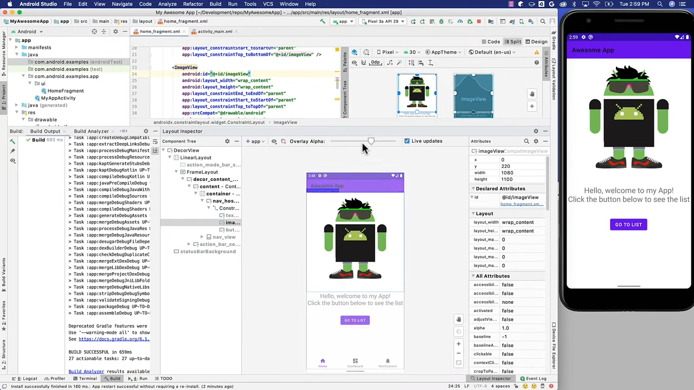
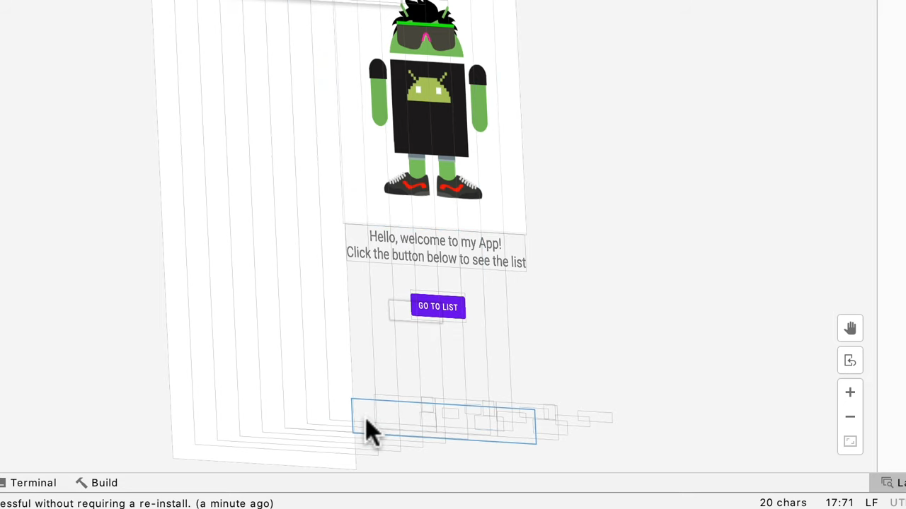

# Debugging UI issues with Layout Inspector

[**YouTube**](https://www.youtube.com/watch?v=jyMo18IERLc&feature=emb_logo) 

</img> 

can show the `view hierarchy in a 3D perspective` (need to device API level 29) 
shows all the `view's attributes` 
If you select the `Live Updates` option the snapshot is `dynamically updated` 
You can also `select the view and right click` to display `only its children` 
navigate to the `layout's corresponding XML` file by clicking the link below any `declared property`  

  

see the difference between the current layout and the design.

## How to debug UI with Layout Inspector

 </img> 

With the `Layout Inspector`, You can see that the bottom navigation bar is pushed down. 
Modify the `layout XML`