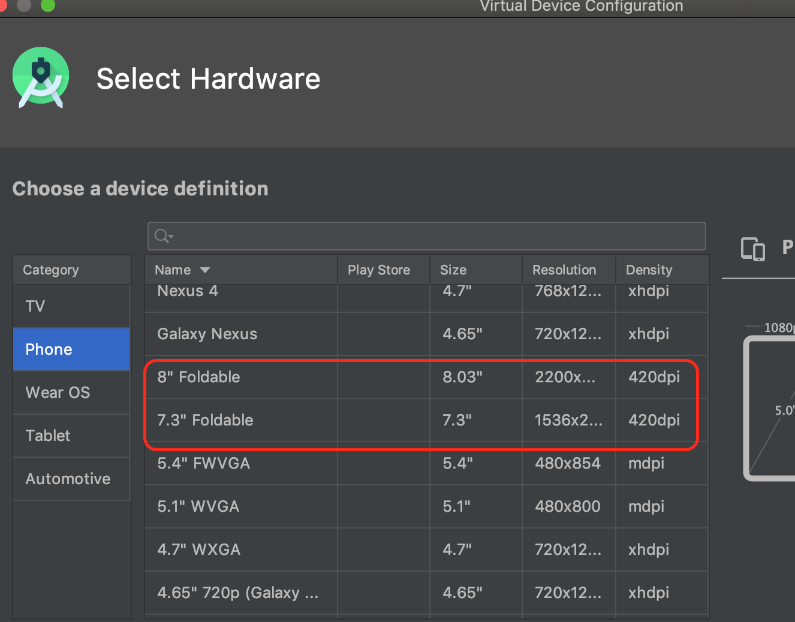
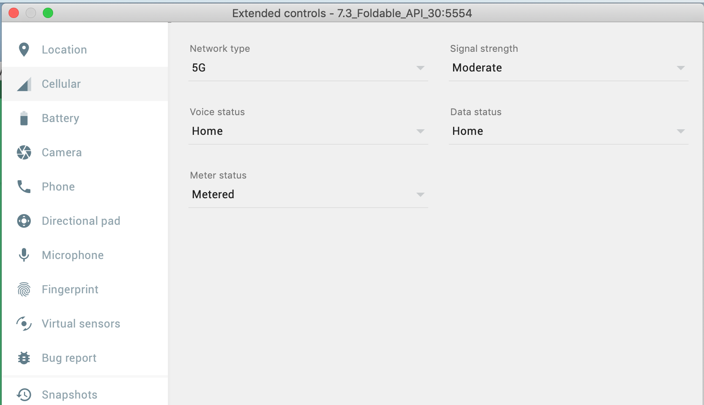

# Developing for Android 11 with the Android Emulator


### 1. Past

- `Extend controls` 를 통해 Location, Battery 등의 다양한 상황에 대해서 테스트를 할 수 있다.

    
    
### 2. Foldables and other form factors

- Android Emulator 30.0.23 이상에서 폴더블 렌더링과 폴더블 관련 컨트롤 옵션이 추가됨
   (but. 30.0.26 버전에서는 확인할수 없었음...)
   
   
   
   
- Android Jetpack에 추가된 WindowManager를 통해 Device State를 명시적으로 설정해서 폴더블 상태에 따라 앱의 반응을 테스트할 수 있음

    - WindowManager [https://developer.android.com/jetpack/androidx/releases/window](https://developer.android.com/jetpack/androidx/releases/window)
    - DeviceState [https://developer.android.com/reference/kotlin/androidx/window/DeviceState](https://developer.android.com/reference/kotlin/androidx/window/DeviceState)
    - Support new form factors with the new Jetpack WindowManager library [https://medium.com/androiddevelopers/support-new-form-factors-with-the-new-jetpack-windowmanager-library-4be98f5450da](https://medium.com/androiddevelopers/support-new-form-factors-with-the-new-jetpack-windowmanager-library-4be98f5450da)
       
- 현재 두개 폴더블 하드웨어 프로필이 있고 추후 확장 예정
    
    
- 폴더블 기기를 커스텀하게 지정하려는 경우
    1. AVD Manager -> 기기 우클릭 Show on Disk -> 기기 프로필.ini open
    2. 아래 코드 추가
    
    ```text
      hw.sensor.hinge = yes
      
      # Number of hinges
      hw.sensor.hinge.count = 1
      
      # 0 = horizontal, 1 = vertical
      hw.sensor.hinge.type = 0
      
      # Min and max angle of each hinge. Add a comma and repeat for additional hinges.
      hw.sensor.hinge.ranges = 0-180
      
      # The angle of each hinge at boot. Add a comma and repeat for additional hinges.
      hw.sensor.hinge.defaults = 180
      
      # Starting x, starting y, width, height. Add a comma and repeat for additional hinges.
      hw.sensor.hinge.areas = 0-1080-1080-1
      
      # 1 = closed, 2 = half-opened, 3 = opened, 4 = flipped
      hw.sensor.posture_list = 1,2,3
      
      # Assigning boundaries between the postures, usually implemented by OEMs
      # Add an & and an additional range when multiple hinges determine posture (0-30&0-30)
      hw.sensor.hinge_angles_posture_definitions = 0-30, 30-150, 150-180
    ```
  
  - 폴더블 이외에 다양한 폼펙터(Android Auto , Android TV 및 WearOS등)를 활용하여 개발할수 있다.
  
  


### 3. 5G

- 5g 테스트 지원



### 4. 결론

- 다양한 기기 폼펙터를 제공할 것이다.
