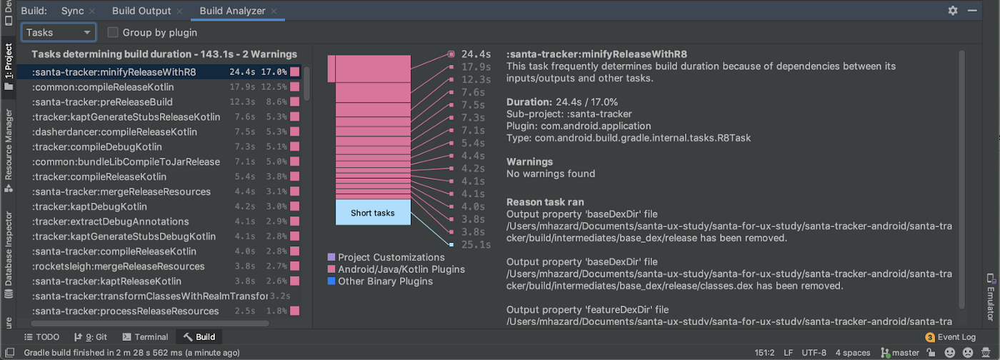

# Understanding your build with the Build Analyzer

Created By: PilJu BAE
Links: https://medium.com/androiddevelopers/understanding-your-build-with-the-build-analyzer-5c15688ec72e


안드로이드 개발자의 60프로는 빌드를 분석하지 않음.

프로젝트 복잡성이 계속 증가하므로 인해 생산성이 크게 저하됨

빌드 시간에 어떠한 요서들이 영향을 미치는지 분석할 수 있는 Build Analyzer 를 만들었음.

# Taking advantage of the Build Analyzer

앱을 빌드 할 때마다 안드로이드 스튜디오는 빌드 분석 보고서를 생성.

1. Gradle Plugin Version 4.0.0 higher
2. 프로젝트 빌드
3. View > Tool Windows > Build > Build Analyzer 




- Plugin with tasks determining this build's duration
- Tasks determining this build duration
- Warnings

## Tasks

These tasks belong to group of sequentially executed tasks that has the largest impact on this build's duration. Addressing this group provides the greatest likelihood of reducing the overall build duration.

### [빌드 시간을 결정하는 Task?](https://developer.android.com/studio/build/build-analyzer?utm_source=android-studio#critical-path)

Gradle은 task 의 상호 의존성, 프로젝트 구조 및 CPU 부하에 따라 순차적 또는 병렬로 실행 

Build Analyzer는 특정 빌드에 대해 현재 빌드의 시간에 영향을 미치는 순차적으로 실행되는 task 를 강조 표시

→ 강조된 Task의 비 효율성을 해결하는 것이 가장 좋은 출발점


- Project Customization : 프로젝트 로컬. 수정하기 가장 쉬움
- Android/Java/Kotlin Plugin : 코어 플러그인
- Other Plugin : 3rd-party 플러그인

## Plugin


- Task를 추가한 플러그인 별로 그룹화

이 플러그인 뷰는 플러그인을 추가하거나 업그레이드 하기 전과 후에 빌드 시간을 비교할 때 유용

빌드 시간에 미치는 영향을 파악할 수 있음

증분 빌드나 기타 사항으로 빌드 시간이 달라질 수 있으므로 몇 가지 빌드를 비교해서 보는 것이 좋음.

## Warnings

- 빌드 시간에 포함되지 않은 task 리스트를 경고로 보여줌
- 경고가 발생한 이유, 해결 방법에 대한 추천 및 task 의 세부 정보, 효율적으로 실행되도록 구성되지 않은 작업
- Generate Report : 플러그인 개발자에게 버그 정보를 쉽게 넣어줄 수 있음

# How the Build Analyzer works

Gradle Tooling API 

- ProgressListener 연결: 프로젝트 구성, task 실행, 어노테이션 프로세서 등의 정보를 제공

Android Gradle 플러그인

- task 이름과 task 클래스 이름 매핑 및 구성과 같은 항목에 대한 추가

Always-run 인 task 를 어떻게 찾는 지?

- 마지막 빌드 이후에 변경이 없는 최신 상태라면, 이전 아웃풋을 재사용
- task input/output 이 선언되어 있지 않은 경우는 최신 상태가 아니라고 판단
- Gradle Tooling API 에서 제공하는 task output 에 대한 정보를 사용해서, output을 선언하지 않거나 최신 상태를 오버라이드 해서 false 로 하는 모든 task 를 식별
- 문제가 있다면 자동으로 수행되는 이 task 를 통해 신속하게 해결하고 incremental build 속도를 높일 수 있음

analyzer 종류

- 어노테이션 프로세서 식별 ( incremental build 가 아닌 )
- 서로의 아웃풋을 덮어쓰는 task 를 식별

# Next

### [Gradle Scan](https://guides.gradle.org/creating-build-scans/)

Gradle 4.3 부터 빌드 스크립트에서 추가 구성 없이 빌드 스캔을 활성화 할 수 있음. 

필요한 빌드 스캔 플러그인이 자동으로 적용.

아래는 임의의 일회선 빌드 스캔을 생성하는 방법

```
$ ./gradlew build --scan
> Task :compileJava
> Task :processResources NO-SOURCE
> Task :classes
> Task :jar
> Task :assemble
> Task :compileTestJava
> Task :processTestResources NO-SOURCE
> Task :testClasses
> Task :test
> Task :check
> Task :build

BUILD SUCCESSFUL
4 actionable tasks: 4 executed

Publishing a build scan to scans.gradle.com requires accepting the Gradle Terms of Service defined at https://gradle.com/terms-of-service. Do you accept these terms? [yes, no] yes

Gradle Terms of Service accepted.

Publishing build scan...
https://gradle.com/s/czajmbyg73t62
```

task 실행하는데 걸리는 시간, 빌드 각 단계 시간, 테스트 결과 및 사용된 플러그인, 기타 디펜던시, 스위치 된 command-line 등 빌드 정보를 볼 수 있다.


### [Build Cache](https://docs.gradle.org/current/userguide/build_cache.html)

command line : --build-cache

gradle.properties : org.gradle.caching=true

- 명시적으로 비활성화 하지 않는 한 true 가 기본 옵션
