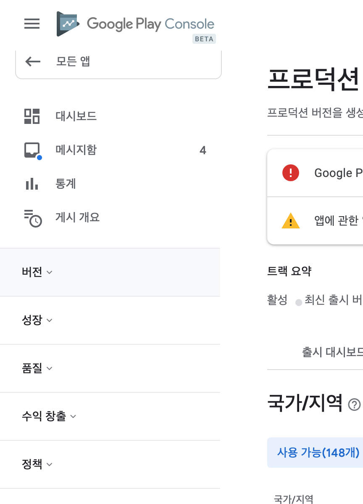

# Introducing the new Google Play Console beta

## 1. Clearer and easier to use (더 명확하고 더 쉬운 사용)

- Google Material Design 사용
- 반응형 디자인으로 모바일에서 사용 가능
- 아랍, 히브리어 등 오른쪽에서 왼쪽으로 읽는 언어 지원

### 1.1 New Navigation (새로운 네비게이션)

- 새로운 navigation

    - 현 콘솔
    
    {: width="10%" height="10%"}
    
    - 베타 콘솔
    
    {: width="70%"}
    
- navigation 그룹은 달성하려는 기능을 기반으로 관련 기능을 그룹화
    - ex 획득 설정,보고 및 최적화 도구가 이제 단일 "성장"섹션에 수집
    
    - ex 프로덕션, 공개, 비공개, 내부를 명확하게 구분
    
    
### 1.2 Clear overview (더 명확한 개요)

- 새로운 `출시개요(releases overview)` 항목에서는 모든 트랙의 스냅샷을 제공
- 내부, 비공개 및 공개 테스트 트랙과 프로덕션 트랙에 대한 정보를 볼 수 있음
- 얼마나 많은 사용자가 앱을 테스트하고 있는지 또는 출시 한 최신 국가를 빠르게 확인할 수 있음

### 1.3 Easier publishing (더 쉬운 게시)

- `Timed Publishing(한글명 모르겠음..)`의 이름이 `게시 개요(Managed Publishing)`으로 변경
- 검토중인 변경 사항 요약을보고 Google Play에 게시 할 시기를 제어하는 ​​데 사용
- 제출 된 모든 변경 사항을 이해하는 정보 제공 
- 모든 변경 사항을 한 곳에서 검토 가능, 모든 것을 동시에 게시할 수 있음

## 2. More ways to get the answers you need, fast (필요한 답변을 빠르게 얻을 수있는 다양한 방법)

### 2.1 Clearer policy and compliance information (명확한 정책 및 규정 준수 정보)

- `앱 콘텐츠` 섹션을 통해 Google Play에서 앱이 Google 정책을 준수하는지 확인하는 데 필요한 정보를 더 쉽게 제공

### 2.2 Inbox (메세지함)

### 2.3 Easier education

- [https://play.google.com/console/about/](https://play.google.com/console/about/)

## 3. Better, safer team management 

- 기존 사용자 권한관리가 이해하기 어려운 권한과 사용하기 힘든 UI였음을 인지하고 개선함
- 이름과 설명이 더 명확해짐 
- 전체 사용자 검색 및 대량 편집 기능을 추가 

 
    
