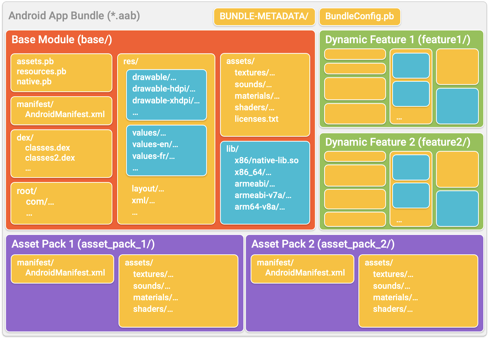

# Recent improvements to the Android App Bundle

Link: https://android-developers.googleblog.com/2020/08/recent-android-app-bundle-improvements.html

1. Over 600K apps and games currently use the app bundle in production, representing over 40% of all releases on Google Play.
2. App bundles are used by 50% of the top developers on Google Play
   * The case of Adobe - used it to reduce the size by 20%
3. **Play Asset Delivery** helps cut delivery costs and reduce the size of games.
   * The case of GameLoft - 10% more new players than their previous asset delivery systems
4. Further reading
   * [**FAQs on Play App Signing**](https://medium.com/androiddevelopers/answers-to-common-questions-about-app-signing-by-google-play-b28fef836af0)
   * [**How to test your app bundle**]()

### Play Feature Delivery

1. **Modular app development** using dynamic feature modules with a range of customizable delivery options

2. **Shrink resources** in dynamic feature modules as well as our base module

   * 'Significantly greater size reduction' -> available from Android Studio 4.2 currently in Canary under experimental flag

     ```groovy
     android.experimental.enableNewResourceShrinker=true
     ```

3. **Install time modules** are now **automatically fused** when app bundles are processed into distribution APKs.

   * means we can separate our app into modules during development while reducing the number of APKs distributed to each device
   * It will speed up our app's download and installation
   * **Removable flag**  for install-time modules to prevent fusing -> allowing us to uninstall a module on the device after it's been used.
   * Expected result of it -> reducing size -> make it less likely to be uninstalled.

4. **Feature-to-feature dependency** 

   * Now stable in Android Studio 4.0
   * 'A dynamic feature module depends on another feature module' 
   * Definintion of this relationship -> resulting in fewer *requests and easier modularisation of our app*.

5. **Internal app sharing**

   * We can upload test build to Play and get a sharable link to download.
   * Using this link, we can get an identical binary which is same as Playstore's one



### Play Asset Delivery

1. Extended from the app bundle format, allowing to package **up to 2GB of game assets** alongside the binary in a single artifact.
2. Games larger than 150MB -> replacing the legacy expansion files (OBBs) and relying on Google Play to keep assets up to date.
3. Taking care of compression and delta patching, minimizing the size of the download and getting our game to update faster.
4. Delivery method
   * **Install-time** : as part of the initial game installation
   * **on-demand** : when requested to download
   * **fast-follow** : *additional download after the game installation completes*, independently of the user opening app. it lets us *minimise time to first interaction* while getting assets to users as quick as possible.
   * **texture compression format targeting** -> coming soon, allowing us to *include multiple texture compression* and rely on Play to deliver them to the most advanced format supported by the requesting device.

### Google Play's best-in-class distribution

1. Google has endeavoured on making sure **delivery is as seamless and efficient as possbile** while hiding the complexity from the user experience.
   * **Upgrading the download service** that Google Play uses -> speeding up the installation of app bundle apps by averagely 6% and increasing install success globally by 1%.
2. Rolling out multiple **improvements to dynamic feature module distribution**
   * allowing dynamic feature module to be installed when our app is VISIBLE or higher
   * lowering the free storage threshold that triggers insufficient storage errors
   * removing user confirmation for large dynamic features over Wi-Fi

### Requirement for new apps in the second half or 2021

1. Continuing to make app bundles better publishing format than APKs on Google Play
   * The new **app bundle explorer** : We can manage all our app bundles in one place. (one of Play Console)
2. **Requiring new apps and games to publish with the App Bundle on Google Play in the second half of 2021**
   * Deprecation of Legacy APK expansion files (OBBs)
   * Deprecation of the legacy instant app ZIP format -> We'll be required instant experiences to be published via [**instant-enabled app bundles**]((https://developer.android.com/topic/google-play-instant/getting-started/instant-enabled-app-bundle?authuser=1)).