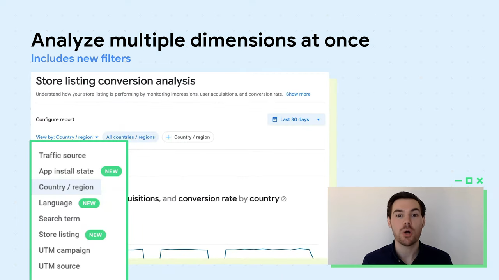

# What’s new with acquisition reports in Play Console

Created By: PilJu BAE

Links: https://youtu.be/OxHzToomptQ

# 새로운 측정 기준 개선

- 시계열 차트, 필터, 재방문 사용자 

User acquisition > Acquisition reports 

→ Store performance

- Store analysis
- Conversion analysis

    

    시간이 지남에 따라 스토어 실적을 더 잘 모니터링 할 수 있도록 데이터를 시계열 보기로 표시 해주고 있음

    

필터링 추가 

- 언어 및 스토어 등록 정보와 같은 새로운 측정 기준 도입

    다양한 측정 기준의 예 - 미국에 있는 스페인어 사용자 검색어 보기 

처음 설치한 사용자 외에 재 설치 사용자 측정 추가

- 재 설치 사용자의 추가로 설치에 대한 수치가 전반적으로 증가하는데, 중복 제거 기능을 개선

검색, 탐색기 및 타사 추천에 초점을 맞추기 위해 트래픽 소스를 개선

- 여기에는 타사 추천과 기타 측정 기준 및 필터를 포함한 모든 트래픽 소스가 포함
- 성장을 위한 타겟 영역을 식별 할 수 있음
- 이러한 벤치 마크를 사용하여 새로운 현지화 추가, 특정 국가에 대한 맞춤 스토어 등록 정보 추가, 스토어 등록 정보 실험으로 변경 사항 테스트와 같은 새로운 마케팅 기회 가능
