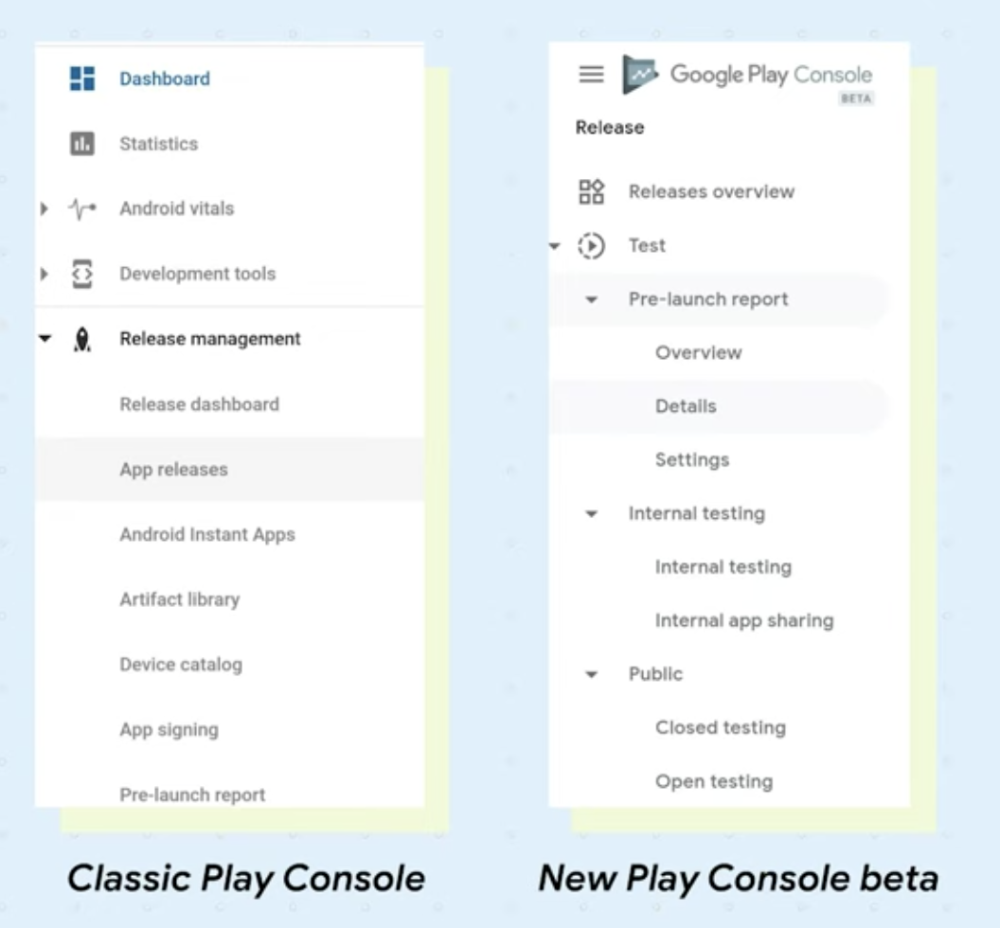

# What’s new with release management in Play Console

### 이번의 가장 큰 변화

#### Changes to navigation

각각의 트랙을 카테고리별로 그룹화 하여 찾기 쉽게 변경.

기존의 콘솔에서는 App releases 메뉴 내에서 일일히 트랙별로 검색해서 찾아야 했던 반면에,
피쳐 별로 카테고리화 하여 더욱 찾기 쉽게 변경 됨. (테스트, 런칭 등)

### New Release overview

모든 릴리즈를 한 눈에!

Internal testing / Closed testing / Open testing 등의 각각의 모든 Test 트랙과 
Product 트랙의 상태를 한 눈에 검토 할 수 있도록 변경 되었으며,
필터와 검색 도구를 통해 모든 Release들을 빠르게 찾을 수 있도록 수정 됨.

각각의 개요로 릴리즈의 상태, 마지막 업데이트 수, 런칭 된 국가 수 등을 볼 수 있으며,
해당 페이지가 새로운 릴리즈 관리 프로세스에서 필수적인 페이지가 될 것으로 판단 중.

특정 트랙에 대한 관리나 정보가 필요 한 경우, 해당 트랙의 페이지 내에서 더욱 상세한 내용을 확인할 수 있음.

### Type of testing tracks

##### Internal testing

- 최대 100 테스터용 릴리즈를 생성 / 관리 할 수 있는 내부 테스트

##### Closed testing

- 신뢰 할 수 있는 테스터로부터 피드백을 받을 수 있는 테스트

#### Open testing

- 릴리즈 전 최종 품질 검사를 위해 불특정 테스터에게 시행되는 테스트

이번 업데이트에서는 위의 3가지 유형의 트랙에 맞게 QA 프로세스를 구현 할 수 있도록 매우 유연한 시스템을 제공.

[(Test Track 설정 관련 메뉴얼)](https://support.google.com/googleplay/android-developer/answer/3131213?hl=ko)

### Staged rollout

많은 유저에게 영향을 미치기 전, 문제를 파악 할 수 있는 단계를 확인 할 수 있도록 Rollout (단계적 출시) 기능을 제공.

(Rollout 메뉴얼 링크)[https://support.google.com/googleplay/android-developer/answer/6346149?hl=ko]

### Managed publishing

앱 승인 후 즉시 런칭 되는 것이 아닌, 앱을 게시 할 시기를 결정 하도록 하는 관리형 게시 기능의 추가.

(사실 기존의 예약 게시의 확장판)

[(관리형 게시 관련 메뉴얼)](https://support.google.com/googleplay/android-developer/answer/9859654?hl=ko)

### Release dashboard

출시 된 Release 에 대한 모든 분석 사항들을 한 눈에 볼 수 있는 Dashboard 를 제공.

기존 플레이 콘솔에서보다 추가 된 그래프, 수치 등을 제공