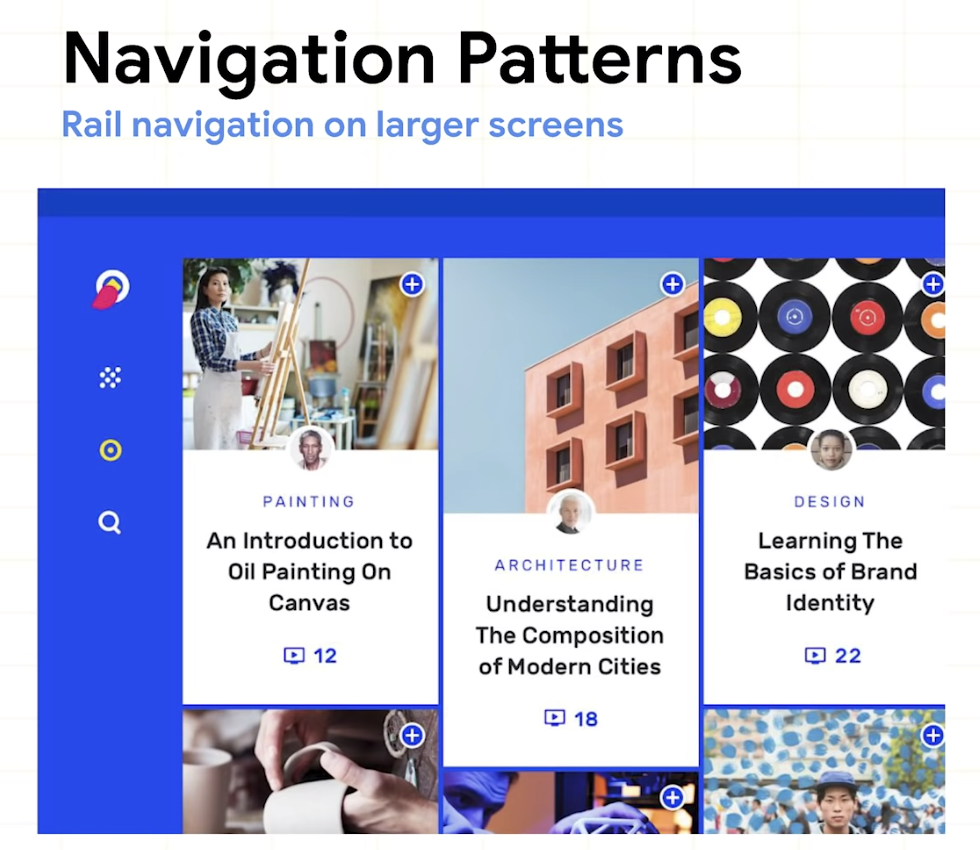
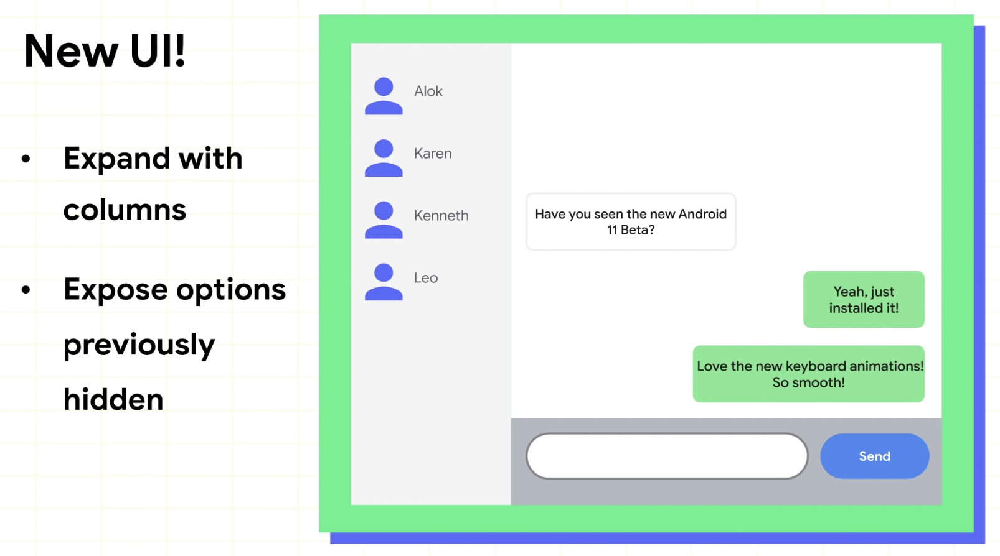
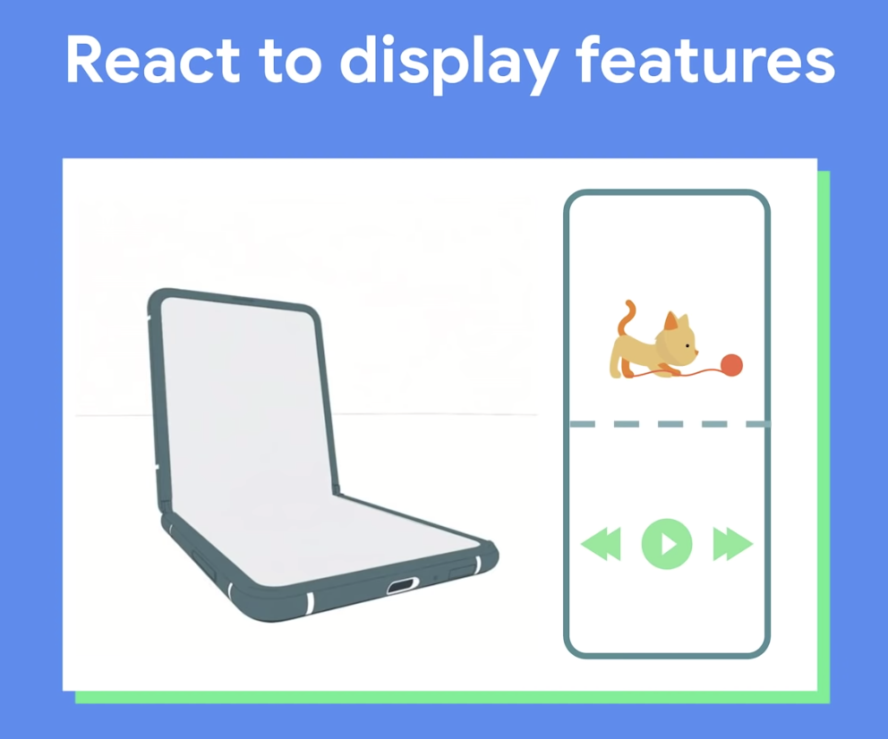
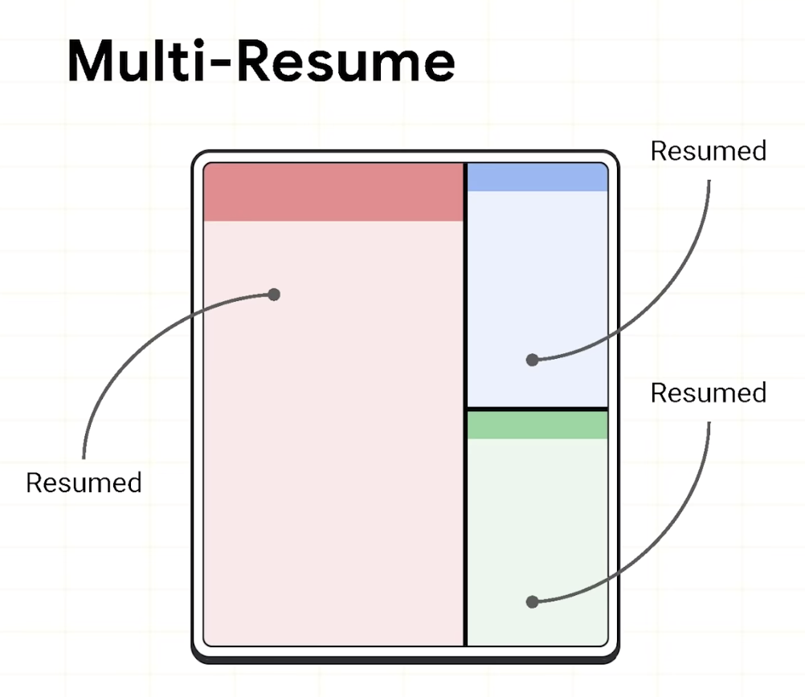
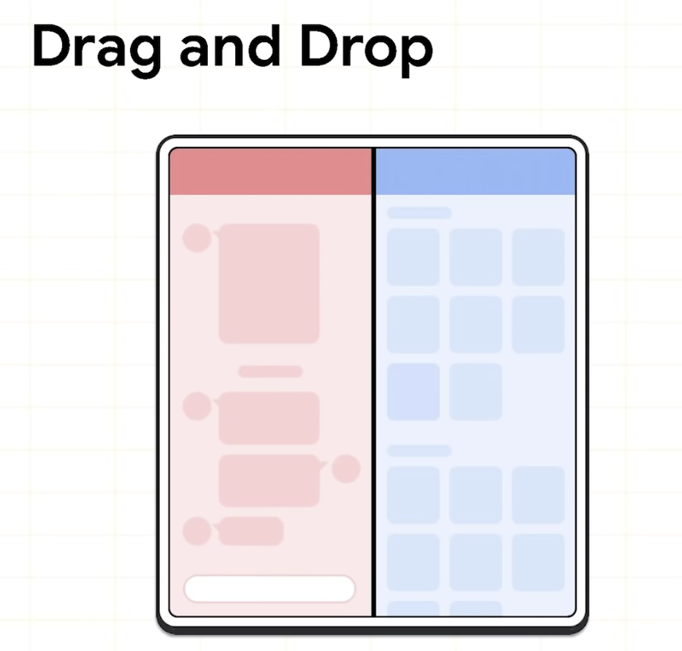

# Expanding your app beyond the phone

휴대전화를 넘어 Tablets, Foldables, Chrome OS 및 기타 데스크탑 환경에 대한 이야기

화면이 페이지 클수록 이동이 적고 많은 일을 할수가 있게 된다.


### Overview

- App Continuity
- UX/UI Considerations
- Multi-Window
- Input
- Emulator


### App Continuity

사용자가 디바이스를 접든/안접든 (방향이나 창 크기 변경같은 구성변경)
스크롤 위치, 동영상 재생 타임 스탬프, 입력한 텍스트는 유지하도록 한다.

- 멀티 윈도우, 창 크기 변경 등 이러한 구성 변경은 사용자에게 원할해야 한다. 
  장치를 열거나 닫거나 창 크기를 조정하면 앱은 상태를 유지해서 사용자에게 혼란을 주면 안된다.
- 다른 윈도우 크기와 방향을 지원해야한다.
- 화면 크기 변경을 적절하게 처리해야한다.
  

### UX/UI Considerations

다른 디바이스에 앱을 보여줄 UX/UI 고려사항

- 새로운 종횡비 (극단적으로 21:9도 있고, 1:1도 있고, 특히 자유 형식 창) - 메니페스트로 최소 종횡비를 설정할 수 있다.

- 바텀 네비게이션이 늘어나지 않는다.

  

  

폰에서는 바텀 네비게이션을 사용하고, 화면이 커지면 하단이 크게 늘어나기 때문에 중간에 나오게 하거나 레일 네비게이션을 사용

- 큰 화면을 위해 레이아웃을 조절해라





Jetpack Window Manager를 이용하여 처리할수 있다. (블로그 게시글에서 확인 가능)


### Multi-Window



멀티 윈도우는 앱 개발자에게 특정한 과제를 가져다 주며, 그 중 하나가 활동 생명주기이다.

Android 10에서 다중 Resume 개념을 도입

카메라와 같은 독점 자원을 여러 Resumed 앱이 동시에 접근 시도한다면? 이를 위해 새로운 활동 콜백 `onTopResumedActivityChanged()` 을 추가

```java
protected void onTopResumedActivityChanged(boolean topResumed) {
	if (topResumed) {
		//Top resumed activity
		//Can be a signal to re-acquire exclusive resources
	} else {
		// No longer the top resumed activity
	}
}
```



화면이 커짐에 따라 멀티 윈도우를 많이 사용할 것이고, 앱간에 데이터 전송 (사진 편집 앱에서 사진을 드래그&드랍해서 채팅 메시지 옮기는 동작) 이 늘어날 것이다.

### Input

- 마우스와 키보드가 first class input 매체 이다. 
  - 모든 장치가 터치를 지원하지 않을수 있다. 
  - 마우스 스크롤로 목록을 스크롤 할수 있어야 한다.
  - 키보드, 트랙패드, 마우스, 스타일러스 펜으로 앱을 탐색할수 있어야한다.
- 위의 인풋장치의 네이티브 행동을 지원해야한다.
  - 마우스 우클릭
  - 마우스 호버
  - 공통의 단축키


### Emulator

자유 형식 창을 지원하는 에뮬레이터를 지원한다. 

이를 통해 위의 항목을 테스트 할수 있다.

