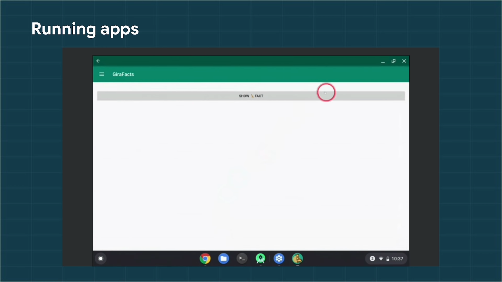

# Android Development on Chrome OS
[**Youtube**](https://www.youtube.com/watch?time_continue=49&v=-e08ixmih20&feature=emb_logo)    

</img>
Starting in `Chrome 84`, interact with the Linux on Chrome OS    
Download and install    
reboot

</img>
Download and install `Android Studio for Chrome OS`   

</img>
</img>
</img>
Click Run, and your app will be installed directly on the device.    

</img>
</img>
