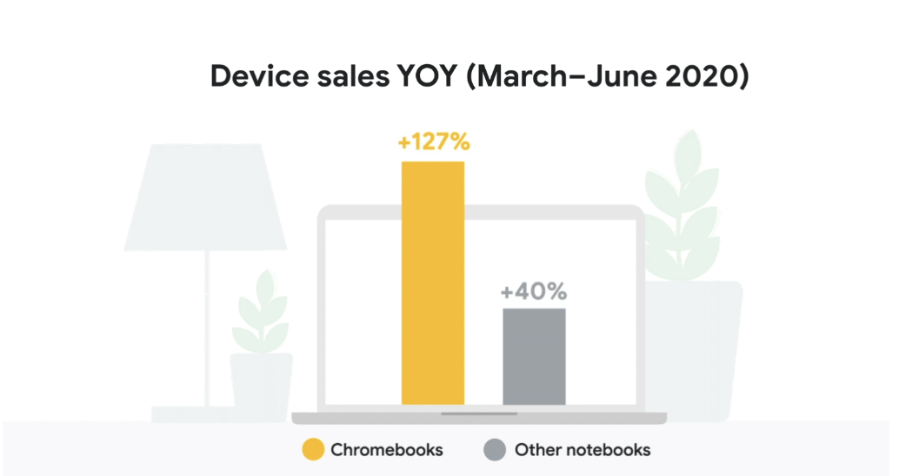
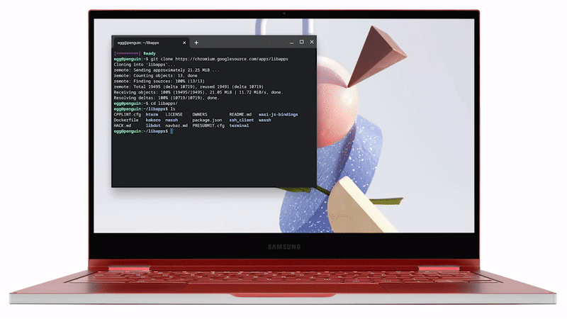

# ChromeOS.dev—A blueprint to build world-class apps and games for Chrome OS
[**Article**](https://android-developers.googleblog.com/2020/08/introducing-chrome-os-dev.html?return=https://developer.android.com/courses/pathways/android-week9-large-screens?authuser%3D1%23article-https://android-developers.googleblog.com/2020/08/chromeosdev-blueprint.html)   
[**ChromeOS.dev**](https://chromeos.dev/en)      
[**ChromeOS.dev GitHub**](https://github.com/chromeos/chromeos.dev)      
[**ChromeOS + Android**](https://chromeos.dev/en/android)      

While people are `spending more time at home than on the go`, they’re relying increasingly on personal `desktops` and `laptops` to make everyday life easier.   

</img>

To `deliver app experiences` that truly improve people’s lives, developers must be equipped with the right tools, resources, and best practices. That’s why we’re excited to introduce `ChromeOS.dev`   

Available in `English` and `Spanish` (with other languages coming soon), features the `latest news`, `product announcements`, `technical documentation`, and `code samples`

## New features for Chrome OS developers

### Customizable Linux Terminal

</img>

### Android Emulator support
[**Supported Chromebooks**](https://chromeos.dev/en/android-environment)    

### Deploy apps directly to Chrome OS

no need to use developer mode or to connect different devices physically `via USB`. Combined with `Android Emulator support`

### Updated support from Android lint checks