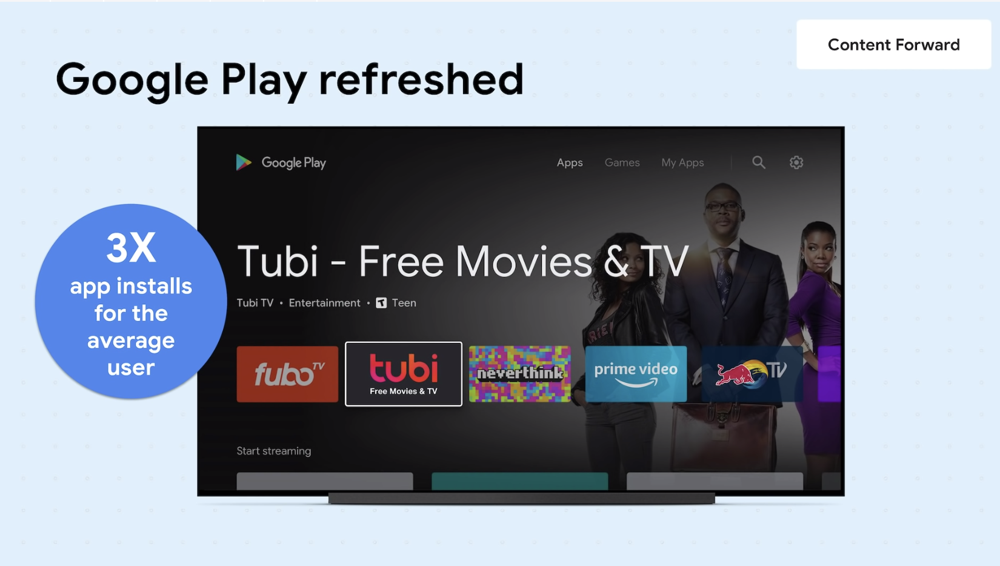

## What's new on Android TV

전염병 이슈로 인해 작년과 대비하여 티비 시청률이 81% 향상 

또한, TV로 할수 있는것이 많다. 뉴스, 게임, TV로 보는 Youtube 등등..

운동을 더 많이 해라 ?

Google도 변화에 맞게 TV 경험을 변화하기위해 노력중이다. 

[Android TV 지원]

[7000개 이상의 앱]

- 더 많은 컨텐츠 제공을 위해 **콘텐츠 전달**
- Assistant 지원
- 상업 친화적

TV가 진화함에 따라 계속 발전 중.

Google Play 스토어 개선

- 새로운 UI
- 새로운 앱 컬렉션

-> 작년 대비 3배 이상 앱을 다운로드 함

홈화면에 파트너가 지원하는 콘텐츠, 구글 플레이가 추천하는 콘텐츠를 보여준다.

이를 통해 사용자는 새로운 영화, 방송, 앱을 찾을수 있다.

cast connect를 도입하여 Android TV 앱과 직접 통신하고 전송시에도 더 풍부한 앱 환경을 사용

구글 어시스턴트로 TV앱에서 미디어를 재생할수 있도록 함

구글 어시스턴트를 개선하기 위해 미디어 검색, 액션 영화 찾기등에 개인화 된 추천을 제공한다.

몇번의 클릭 만으로 구독할수 있도록 구독을 쉽게 만들었다. 이를 위해 많은 파트너와 협력중이다. 

상거래를 더욱 빠르게 만들기 위해 노력중이다.

구매 확인을 위한 Ping 지원이 곧 제공될 예정

1. Android TV의 인스턴스앱 
2. 에뮬레이터 개선
3. Gboard의 새로운 음성 지원
4. Leanback 라이브러리 향상
5. 자동 저 지연 모드 ( == 게임 모드)

### 1. Android TV의 인스턴스앱 

인스턴스앱 , 앱을 설치하기전 앱을 쓸수 있다. 

모바일 게임에서 인스턴트 앱으로 획득률이 크게 증가한것을 볼수 있다.

Android TV에서 인스턴스 앱을 쓸수 있게 되었다. (Try now 버튼)

인스턴스 앱은 아래에서 가능하다.

- 주문형 비디오(VOD)
- 라이브 TV
- 게임

### 2. 에뮬레이터 개선

Android TV 에뮬레이터에서 Google Play를 지원한다. 설치, 구독, 결제 테스트가 가능하다.

### 3. Gboard의 새로운 음성 지원

1. 음성 입력
2. 예측 입력
3. 키보드가 작아졌고, 왼쪽/중간/오른쪽으로 정렬
4. QWERTY 레이아웃을 적용했다.
5. 여러가지 키보드 입력 레이아웃 (이메일 입력, 숫자 입력 등)
6. 30 개 이상의 로케일에 최적화

### Leanback 라이브러리 향상

Leanback 라이버리는 Android TV 용 앱을 더 빠르고 잘 구축할 수 있게 해준다.

Paging, Top-Tab Navigation, AppCompat 개선 사항에 대해 얘기

- Paging

  

  비디오 스트리밍 앱은 흔하게 페이징을 사용하지만 적용이 어렵다.

  이를 해결하기 위해 Paging3를 사용하면 되고, Leanback 라이브러리에 포함되어 있다.

Android TV에서는 PagingDataAdapter에 Presenter를 넘겨줘야한다.

다른건 모바일과 동일

- Top-Tab Navigation

일반적으로 표준 방법에서는 왼쪽탐색을 지원해서, 상단탐색을 넣기위해서는 개발자가 직접 구현해야한다.

코드 구현

- AppCompat

AppCompat은 유용하나 TV에서 지원하지 않는다. 그래서 모바일과 티비 코드는 다르게 가져가야했다.

하지만 Leanback에서 AppCompat을 기존적으로 지원한다.

AppCompat 이슈가 없어져서 모바일. TV 코드가 동일해도 된다.

### 자동 저 지연 모드 ( == 게임 모드)

TV는 이미지, 비디오 퀄리티 향상, 부드러운 프레임등 많은 후 처리를 한다.

그로인해 화상회의나 게임 같은 경우 원하는 성능이 나오지 않는다.

HDMI Auto Low Latency Mode 를 Android TV에서 지원하여 더 짧은 지연 대기를 갖게 된다.

소스코드나 Manifest에서 ALLM 을 선호하도록 설정할 수 있다.

