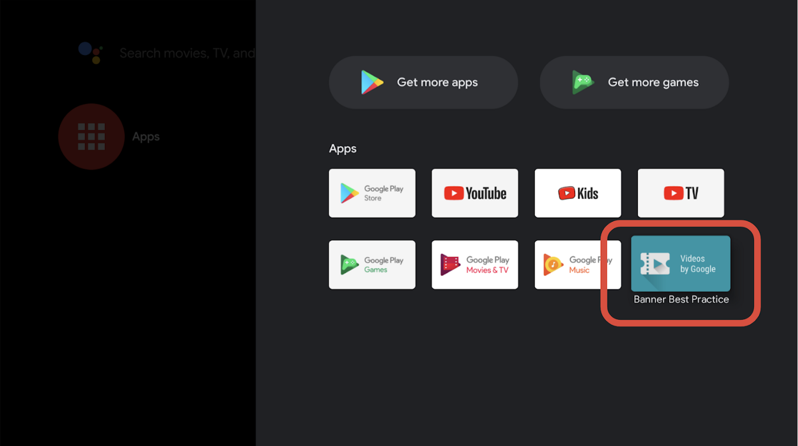
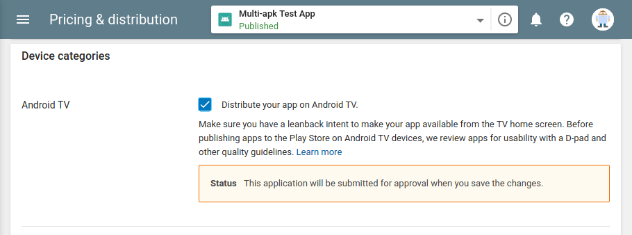
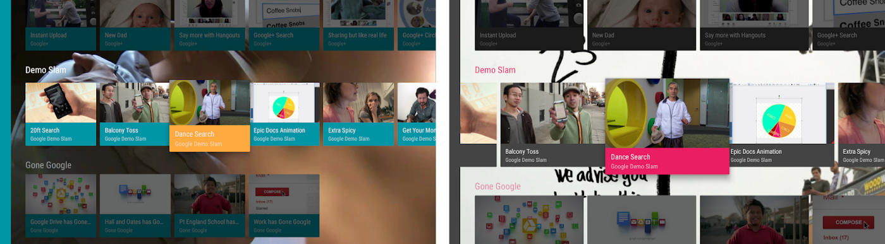
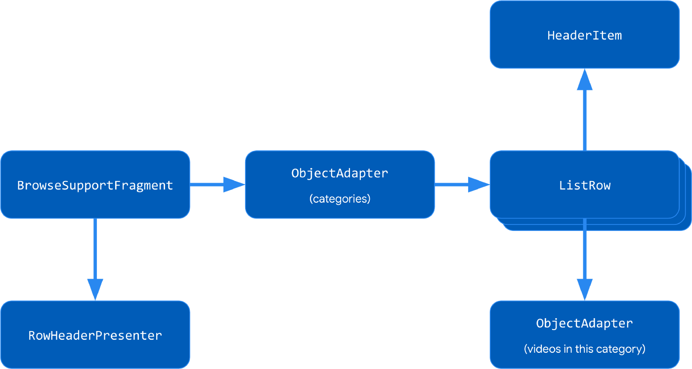
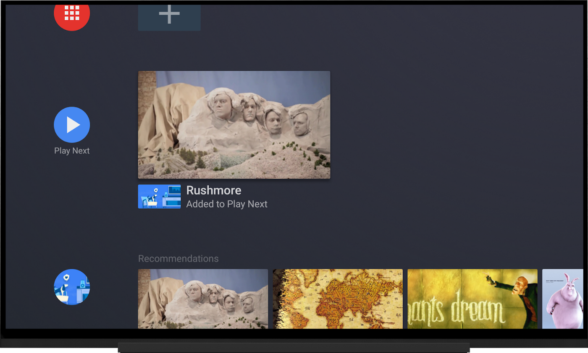
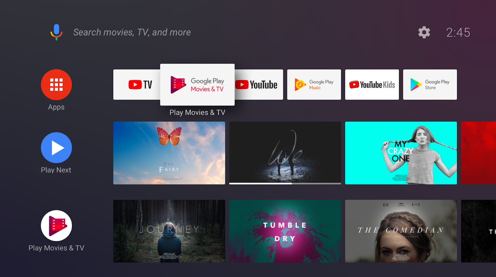

# Android TV: Best practices for engaging Apps

## 1. The modern home and living room

- Google은 가정용 기술의 다음 도약이 하드웨어, 소프트웨어 및 AI의 교차점에서 올 것이라고 믿는다.
- Google Assistant를 중심으로 한다.
- Android TV는 미디어, 게임, 음악을 한곳에 모아 놓은 Google의 TV 플랫폼
- 상위 10 대 스마트 TV 제조업체 중 7 개가 Android TV가 탑재 된 TV를 만들고 있다.

## 2. What makes an Android app an Android TV app?()

- TV앱 시작 하는 법에 대해서 이야기 하고 있음
- TV앱의 경우 리모컨을 통해서 상호작용하므로 터치스크린을 사용하지 않는다고 선언

```xml
<manifest xmlns:android="http://schemas.android.com/apk/res/android">

    <uses-feature
        android:name="android.hardware.touchscreen"
        android:required="false" />
```

- 앱에서  Leanback 을 사용한다고 선언
- 이를 사용하면 TV Google Play 스토어에만 표시

```xml
<uses-feature
        android:name="android.software.leanback"
        android:required="true" />
```

- 배너를 선언

```xml
<application
        ...
        android:banner="@drawable/my_banner">
```

- 메인 인텐트 선언, 기존 앱과는 카테고리 항목이 다르다.
```xml
<activity ... >
    <intent-filter>
        <action android:name="android.intent.action.MAIN" />
        <category android:name="android.intent.category.LEANBACK_LAUNCHER" />
    </intent-filter>
</activity>
    
</manifest>
```

### 2.1 banner

- 320×180-pixel icon in the /res/drawable-xhdpi folder
- 앱과 동일한 크기로 넣게되면 검은 사각형 안에 배치됨



## 3. Google Play Store publication

- 린백 기능이 선언되어 있음을 감지하는 대신 앱이 큰 화면에서 어떻게 작동하는지 주의깊게 고려하여 
`distribute your app on Android TV` 을 명시적으로 선택해라
- 예를 들어, 일부 하이브리드 또는 다중 플랫폼 개발 도구는 단순히이 기능을 활성화함. 
그러나 이러한 환경에서 만든 앱은 TV 용으로 테스트되지 않을 수 있으므로 TV에서 제대로 작동하지 않을 수도 있음.



## 4. Leanback library

- 머티리얼 디자인의 TV용 위젯 세트
- 예: channels (rows), a navigation drawer 등
- Leanback 라이브러리를 커스터마이징 하기위한 2가지 방법
    1. color, dimension 값 변경
    2. custom presenter를 작성하는 것
    


### 4.1 Colors and dimensions

- 위젯에는 모양을 다양하게 값을 조정할 수 있는 속성과 메서드가 있음



### 4.2 Custom presenters



- onCreateViewHolder : 레이아웃 전개.
- onBindViewHolder : 컨텐츠 설정
- onUnbindViewHolder : 리소스 해

```kotlin
class IconHeaderItemPresenter : RowHeaderPresenter() {

    override fun onCreateViewHolder(viewGroup: ViewGroup): ViewHolder {
        // inflate layout
    }

    override fun onBindViewHolder(viewHolder: Presenter.ViewHolder, item: Any) {
        // set text, icons, etc.
    }

    override fun onUnbindViewHolder(viewHolder: Presenter.ViewHolder) {
        // free resources
    }

}
```

```xml
<androidx.leanback.widget.NonOverlappingLinearLayout 
    xmlns:android="http://schemas.android.com/apk/res/android"
    android:layout_width="match_parent"
    android:layout_height="match_parent"
    android:orientation="horizontal">

    <ImageView
        android:id="@+id/header_icon"
        android:layout_width="32dp"
        android:layout_height="32dp"
        android:contentDescription="@string/header_icon" />

    <TextView
        android:id="@+id/header_label"
        android:layout_width="wrap_content"
        android:layout_height="wrap_content"
        android:layout_marginTop="6dp" />

</androidx.leanback.widget.NonOverlappingLinearLayout>
```

```kotlin
override fun onBindViewHolder(viewHolder: Presenter.ViewHolder, item: Any) {
    val headerItem = (item as ListRow).headerItem
    viewHolder.view.apply {
        (findViewById<View>(R.id.header_icon) as ImageView).apply {
            val drawableResId = when (headerItem.id) {
                ID_POPULAR -> R.drawable.ic_popular
                ID_EDITOR_PICKS -> R.drawable.ic_editor_picks
                ...
            }
            setImageDrawable(resources.getDrawable(drawableResId, null))
        }
        (findViewById<View>(R.id.header_label) as TextView).text = headerItem.name
    }
}
```

## 5. Android TV integration

- Android TV의 기능과 통합하여 사람들이 내 콘텐츠를 발견하고 매력적인 경험을 제공하도록 돕기 위한 4 가지 기능

    - Assistant media controls
    - The Play Next channel
    - Android TV channels
    - Assistant media discovery
    
### 5.1 Media controls

- 미디어 재생을 위한 기능
    - play and pause
    - skip to the previous channel
    - skip to the previous episode
    - skip the next item

- ExoPlayer를 사용하여 앱 내에서 미디어를 재생하는 경우 아래와 같이 얻을 수 있음.
- [https://github.com/google/ExoPlayer/tree/release-v2/extensions/mediasession](https://github.com/google/ExoPlayer/tree/release-v2/extensions/mediasession)

```java
mediaSession = new MediaSessionCompat(this, "sample");
mediaSessionConnector = new MediaSessionConnector(mediaSession);
mediaSessionConnector.setPlayer(player);
```

- callback 

```java
class MyMediaSessionCallback: MediaSessionCompat.Callback {
    override fun onPause() { ... }
    override fun onPlay() { ... }
    override fun onStop() { ... }
    override fun onSeekTo(position: Long) { ... }
    override fun onSkipToNext() { ... }
    override fun onSkipToPrevious() { ... }}

mediaSession.setCallback(myMediaSessionCallback) 
```

### 5.2 Play Next channel



- 이 공간을 사용하여 다음에 볼 콘텐츠를 추천하려면 시리즈의 다음 TV 에피소드를 추가 할 때만 그렇게해야합니다. 
모든 경우에 올바른 "다음보기 유형"및 "프로그램 유형"을 사용해야합니다. 
이렇게하면 Android TV가 자산을보다 효과적으로 조정하고 사용자에게 높은 신뢰도 기능을 제공 할 수 있습니다.

- [Watch Next guidelines for app developers](https://developer.android.com/training/tv/discovery/guidelines-app-developers)

```kotlin
val program = WatchNextProgram.Builder()
            .setWatchNextType(WatchNextPrograms.WATCH_NEXT_TYPE_CONTINUE)
             .setContentId(myProgramId)
             .setType(PreviewPrograms.TYPE_MOVIE)
             .setTitle("Program Title")
             .setDescription("Program Description")
             .setPosterArtUri(
                 Uri.parse("http://example.com/poster_art.png"))
             .setLastEngagementTimeUtcMillis(System.currentTimeMillis())
            Then you build
                     .build()
```

```kotlin
PreviewChannelHelper(context).publishWatchNextProgram(program)
```

## 6. Android TV Channel

- 채널은 앱에서 콘텐츠를 추천 할 수 있도록하는 Android TV 홈 화면의 행



- 채널을 추가하려면 PreviewChannel 및 PreviewPrograms를 AndroidX의 PreviewChannelHelper에 게시
- 최상의 성능을 위해 백그라운드 스레드에서 실행하는 것이 좋음

```kotlin
val helper = PreviewChannelHelper(context)

val previewChannel = PreviewChannel.Builder()
        .setDisplayName(name)
        .setDescription(description)
        .setAppLinkIntentUri(Uri.parse(deeplinkUri))
        .setInternalProviderId(getPlaylistId())
        .setLogo(bitmap)
        .build()

val channelId = helper.publishChannel(previewChannel)

val program = PreviewProgram.Builder()
        .setChannelId(channelId)
        // Matches the intent filter in the manifest for VIEW action
        .setIntentUri(Uri.parse("https://.../program/$id"))
        .build()
helper.publishPreviewProgram(program)

```
