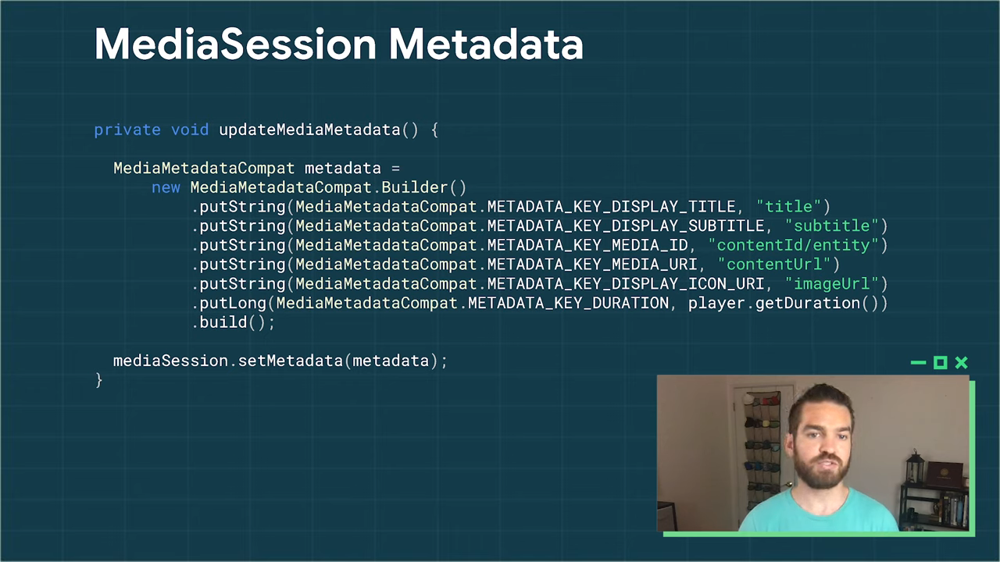

# Cast Connect

Created By: PilJu BAE

Links: https://youtu.be/3L-XjCf018s

docs: https://developer.android.com/codelabs/cast-connect-atv?return=https%3A%2F%2Fdeveloper.android.com%2Fcourses%2Fpathways%2Fandroid-week9-android-tv%3Fauthuser%3D1%23codelab-https%3A%2F%2Fdeveloper.android.com%2Fcodelabs%2Fcast-connect-atv&authuser=1#0


- Web Receiver :  Chromecast, Google Nest Hub -  Cast 기기에서 실행되는 HTML 자바 스크립트 앱
- Sender : Android 또는 iOS 앱, Chrome 브라우저 또는 Cast 기기에 대한 연결을 트리거하는 어시스턴트가 있는 음성

## 목표

사용자는 음성 또는 모바일 장치로 쉽게 세션을 시작하고 리모컨으로 계속해서 경험을 제어하여 Android TV 앱에 쉽게 다시 참여할 수 있습니다.

# Preparing Your App

- Jetpack (AndroidX)
- Media Session is required
- play-services-cast-tv library - Cast Connect Api 포함
- Android TV package name

    Cast 개발자 콘솔에서 TV 를 테스트 기기로 등록해야 함.

    [https://cast.google.com/u/1/publish/#/signup](https://cast.google.com/u/1/publish/#/signup)

    

- Sender flag enabling

# Media Session


### PlaybackStateCompat

- 빌더를 사용하여 MediaSession에 대한 상태 및 사용 가능한 작업을 설정
- 재생중인 미디어 유형에 따라 사용자 지정
- 재생 상태는 UI를 구동하고 플레이어에게 사용 가능한 재생 작업과 확장 컨트롤러 및 미디어 컨트롤러를 알리는 데 사용


 ExoPlayer를 사용하는 경우 수동으로 변경 사항을 추적하는 대신 MediaSessionConnector를 사용하여 재생 상태를 자동으로 추적



현재 미디어 세션에서 재생중인 콘텐츠에 대한 메타 데이터를 설정

```java
private class MyMediaLoadCommandCallback extends MediaLoadCommandCallback {
	public void onPause() {
		myPlayer.pause();
	}
	public void onPlay() {
		myPlayer.play();
	}
	public void onSeekTo(long pos) {
		myPlayer.seekTo(pos);
	}
	...
}
mediaSession.setCallback(new MyMediaSessionCallback());

```

### MediaSession Callback

재생, 일시 중지 또는 검색과 같은 콜백을 받으면 MediaSession을 업데이트하고 플레이어에서 이러한 작업을 수행


### Driven by Cast MediaStatus

- 웹 수신기가 일반적으로 제공하는 것과 동일한 미디어 상태를 전송하여 기존 기능을 유지
- 이 미디어 상태는 MediaSession에서 속성을 가져오고 추가 사용자 지정을 통해 자동으로 생성

# Senders


Android Receiver 호환 플래그를 true로 설정
Android TV를 전송할 때 Android Receiver 호환이 설정되어 있지 않으면 기본 Android TV 앱을 열지 않고 일반 수신기 열림.

### Add Cast Connect to your Android TV App

```xml
<activity android:name="com.example.MyPlayerActivity">
    <intent-filter>
        <!-- Let Android TV know you support the cast protocol-->
        <action android:name="...android.gms.cast.tv.android.LAUNCH"/>
        <!-- Add support for load-by-entity or LoadRequestData -->
        <action android:name="com.google.android.gms.cast.tv.action.LOAD"/>
    </intent-filter>
</activity>
```

- App home 과 같이 세션이 처음 시작될 때 로드하려는 첫번째 activity
- Play Activity 또는 딥 링크를 처리하는데 사용하는 다른 Activity 에서 처리

### Connect and Release MediaSession

```java
//onStart() - Connecting MediaManager
MediaManager mediaManager = castReceiverContext.getMediaManager();
mediaManager.setSessionCompatToken(mMediaSession.getSessionToken());
```

```java
//onStop() - releaseing MediaSession
mediaSession.release();
castReceiverContext.getMediaManager().setSessionCompatToken(null);
```


### Handling a Load intent

1. onCreate() 

    MediaLoadCommandCallback 설정 


1. onCreate, onNewIntent 에서 오는 인텐트가 Cast SDK 에서 오는 건지 확인
    - MediaManager 를 사용
    - return - MediaLoadComandCallback 전달 → 인텐트 파싱 → onLoad trigger

### MediaLoadCommandCallback 예시


이제 콘텐츠가 Android TV 장치에서 기본적으로 재생

# Cast Media Commands on Android TV

## MediaSession 에서 다루지 않는 CastSDK 의 고급 기능


### MediaCommandCallback

- 다양한 오디오 언어 및 기능의 캡션에 대한 트랙 설정
- 광고 건너뛰기


### MediaStatus

- Cast Protocol 의 기반, MediaSession 에서 생성
- 캐스트 관련 속성을 반영하도록 추가로 사용자 지정
- Modifier
    - Sender 에게 사용자 정의 데이터 제공
    - 한번만 설정 가능
    - 제거될 때 까지 전송된 모든 미디어 상태에 적용

 


### MediaStatusInterceptor

- 전송되기 전에 MediaStatus 값을 마지막으로 확인하고 설정
- 디버깅, 로깅, 분석 등 비즈니스 특정 작업을 위함

# Cast Connect Features

### Existing Cast Features

- Tracks
- Queueing
- Ads
- Live

### WebReceiver Fallback - 이런 상황 지원(?)

- Cast is multi-user
- ATV is single-user
- User mismatch
- Sender credentials


### ReceiverOptionsProvider

- checkLaunchRequestSupport 메서드를 재정의
    - true : Android TV 실행
    - false : 웹 Receiver 실행


- Sender가 제공한 자격 증명 데이터가 포함된 시작 요청이 제공
- 앱에 따라 익명 사용자 허용, 금지 가능
- 플랫폼에 따라 자격 증명 확인 또는 거부, 허용
- Cast Sender 사용자가 Android TV 사용자와 일치하지 않고 Android TV 앱이 즉석에서 전환하거나 다른 사용자로부터 동일한 콘텐츠를 제공 할 수 없는 상황
→ Android TV에 연결을 시도하는 사용자의 자격 증명을 확인하고 대신 웹 수신기 열어줌.