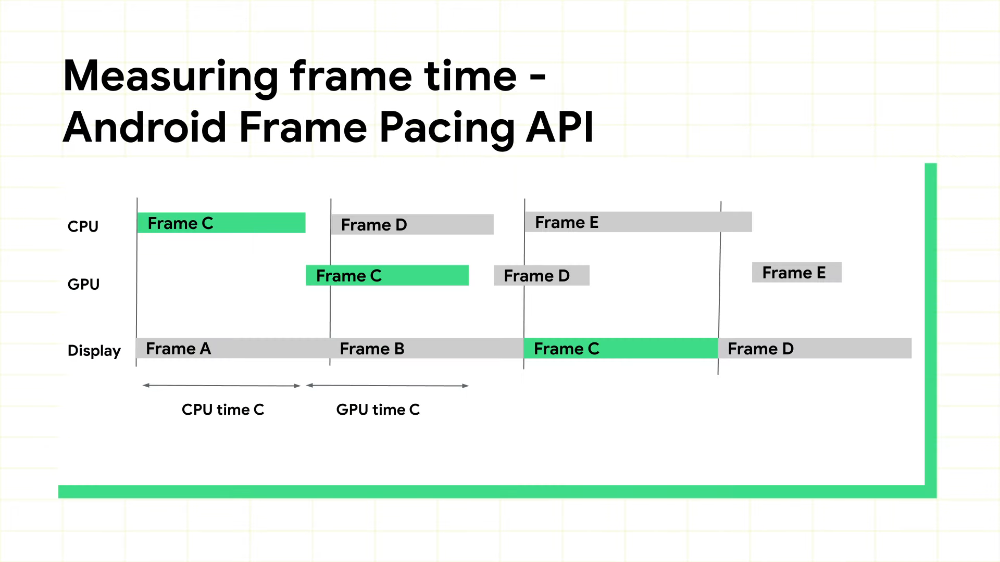
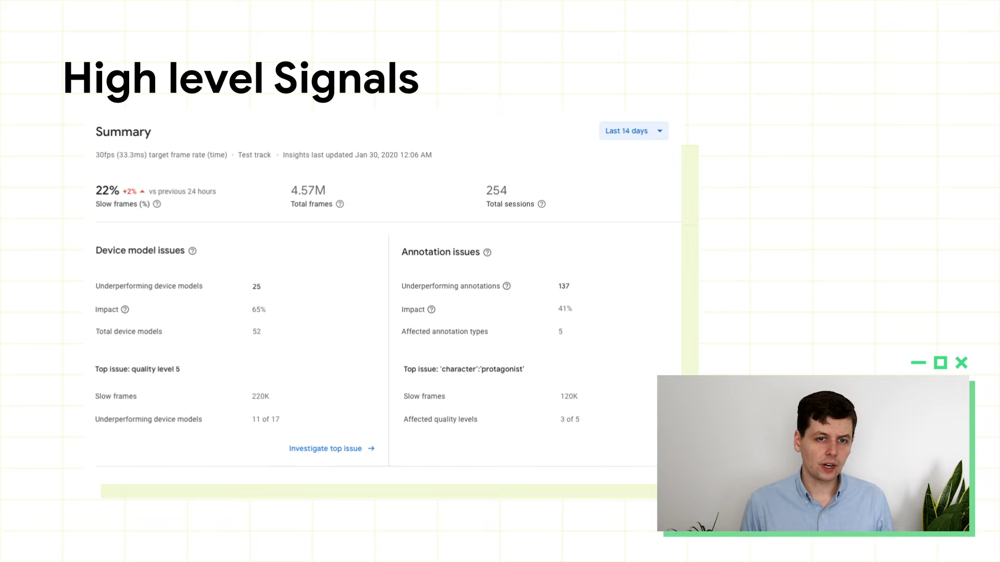
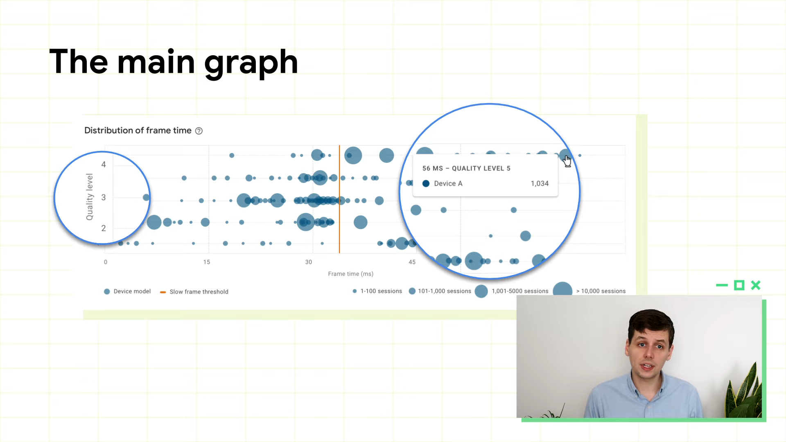
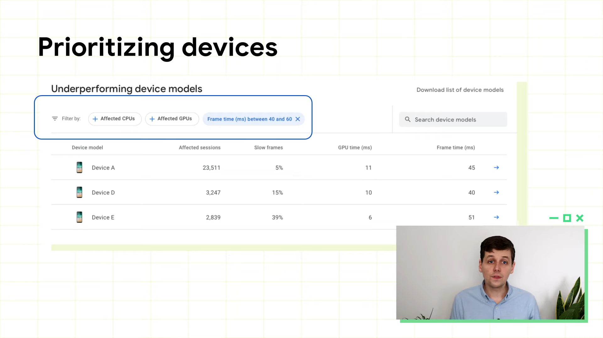

# Android Performance Tuner deep dive

Created By: PilJu BAE
Links: https://youtu.be/AO0O8HaqG-w

프레임 속도 안정성, 그래픽 충실도 측정 

GPU 타임과 같은 경우 Unity 2019.3.12 버전 이상 필요

### FrameTime

한 화면의 한 프레임을 렌더링하는데 걸리는 시간

프레임 속도의 역수 

초당 10프레임 = 0.1 초, 100 ms 의 시간 필요

1. Android Frame Pacing API 에서 프레임 시간을 사용하도록 선택
    - 각 프레임에서 작업하는데 소요된 CPU 및 GPU 의 시간 제공 하므로 사용자가 CPU 또는 GPU에 바인딩 되었는지 확인
2. 자체 Frame Pacing 라이브러리를 사용
3. Unity 플러그인 ticks 
    - 각 프레임 시작 부분에 있는 Unity flag
    - 프레임 렌더링과 CPU 시간만 확인하므로 CPU 대 GPU 시간의 분석은 확인할 수 없음

### Interpreting the Data

사용자의 정보는 약 10분 간격 정도로 그룹화하여 Play Console 로 업데이트, 수치 확인 가능

### 게임 세션 성능 시각화

- x 축은 각 프레임을 만드는데 걸리는 시간
- y 축은 기기의 품질 수준
- 주황색 선 → 33ms 또는 30fps

### Prioritizing devices

프레임 속도를 개선하려는 경우, 좋지 않은 프레임 시간을 가지는 디바이스 케이스를 필터링 할 수 있음

ex) 40 ~ 60 ms 입력해서 영향을 받는 세션 수를 기준으로 정렬

