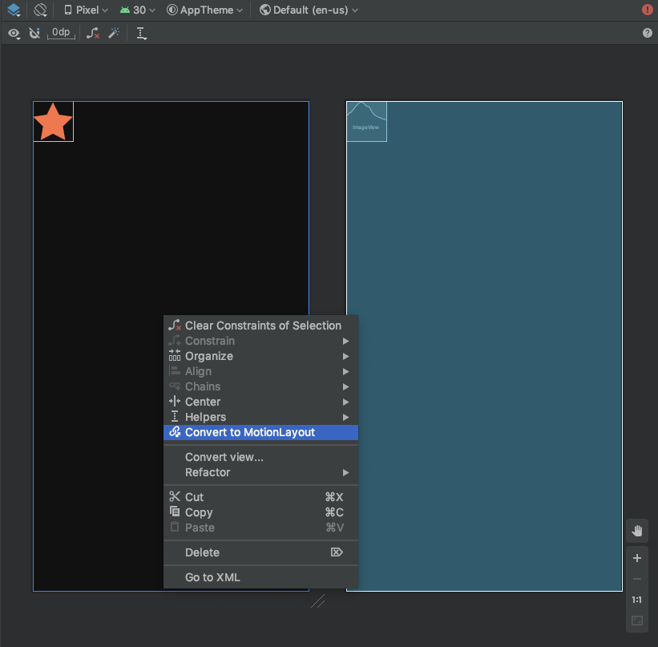
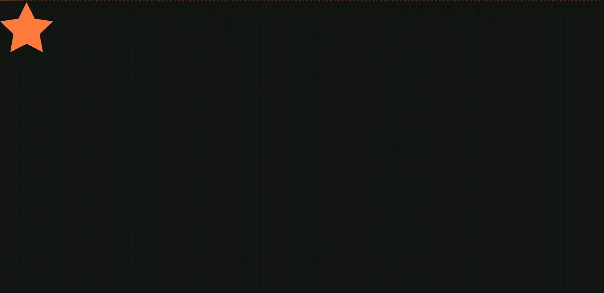
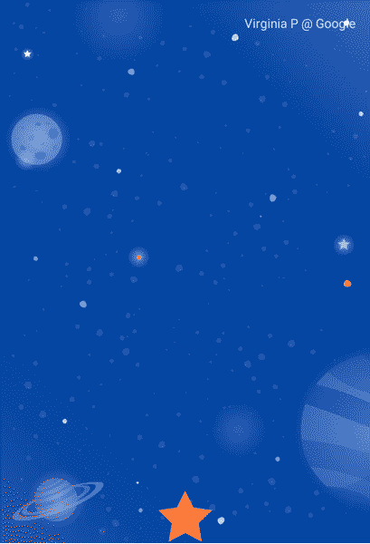
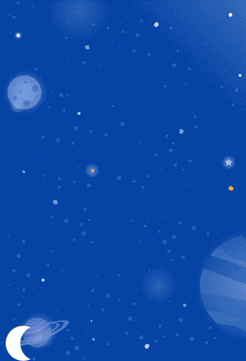
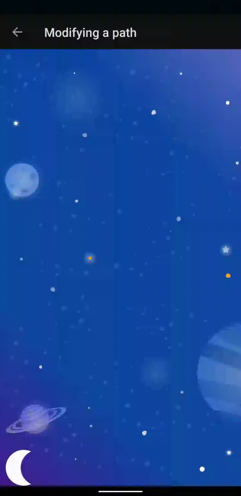
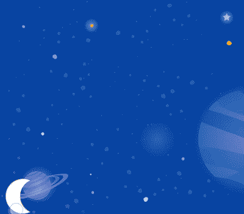
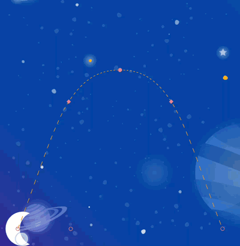
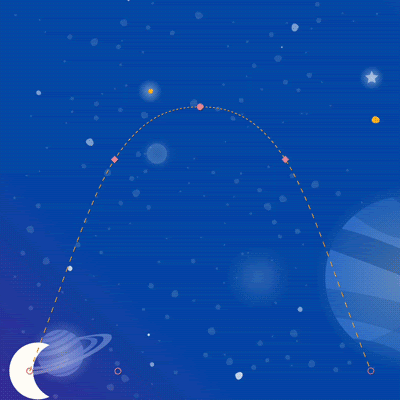
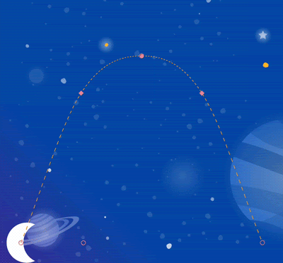
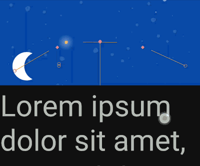

# Advanced Android in Kotlin 03.2: Animation with MotionLayout
[**CodeLab**](https://developer.android.com/codelabs/motion-layout#0)
## Creating animations with MotionLayout
</img>

```xml
<!-- activity_step1.xml →
<!-- add app:layoutDescription="@xml/step1" -->

<androidx.constraintlayout.motion.widget.MotionLayout
       ...
       app:layoutDescription="@xml/activity_step1_scene">

       <ImageView android:id="@+id/red_star"
```
`ConstraintLayout` ->  `MotionLayout`    

```xml
<?xml version="1.0" encoding="utf-8"?>

<!-- Describe the animation for activity_step1.xml -->
<MotionScene xmlns:app="http://schemas.android.com/apk/res-auto"
            xmlns:android="http://schemas.android.com/apk/res/android">
   <!-- A transition describes an animation via start and end state -->
   <Transition
           app:constraintSetStart="@+id/start"
           app:constraintSetEnd="@+id/end"
           app:duration="2000">
       <!-- MotionLayout will handle clicks on @id/star to "toggle" the animation between the start and end -->
       <OnClick
               app:targetId="@id/red_star"
               app:clickAction="toggle" />
   </Transition>

   <!-- Constraints to apply at the end of the animation -->
   <ConstraintSet android:id="@+id/start">
       <Constraint
               android:id="@+id/red_star"
               android:layout_width="wrap_content"
               android:layout_height="wrap_content"
               app:layout_constraintStart_toStartOf="parent"
               app:layout_constraintTop_toTopOf="parent" />
   </ConstraintSet>

   <!-- Constraints to apply at the end of the animation -->
   <ConstraintSet android:id="@+id/end">
       <Constraint
               android:id="@+id/red_star"
               android:layout_width="wrap_content"
               android:layout_height="wrap_content"
               app:layout_constraintEnd_toEndOf="parent"
               app:layout_constraintBottom_toBottomOf="parent" />
   </ConstraintSet>
</MotionScene>
```
</img>

## Animating based on drag events
```xml
<androidx.constraintlayout.motion.widget.MotionLayout
       ...
       app:layoutDescription="@xml/step2" >

   <ImageView
           android:id="@+id/left_star"
           ...
   />

   <ImageView
           android:id="@+id/right_star"
           ...
   />

   <ImageView
           android:id="@+id/red_star"
           ...
   />

   <TextView
           android:id="@+id/credits"
           ...
           app:layout_constraintTop_toTopOf="parent"
           app:layout_constraintEnd_toEndOf="parent"/>
</androidx.constraintlayout.motion.widget.MotionLayout>
```
```xml
<ConstraintSet android:id="@+id/start">
   <Constraint
           android:id="@+id/red_star"
           android:layout_width="wrap_content"
           android:layout_height="wrap_content"
           app:layout_constraintStart_toStartOf="parent"
           app:layout_constraintEnd_toEndOf="parent"
           app:layout_constraintBottom_toBottomOf="parent" />

   <Constraint
           android:id="@+id/left_star"
           android:layout_width="wrap_content"
           android:layout_height="wrap_content"
           android:alpha="0.0"
           app:layout_constraintStart_toStartOf="parent"
           app:layout_constraintEnd_toEndOf="parent"
           app:layout_constraintBottom_toBottomOf="parent" />

   <Constraint
           android:id="@+id/right_star"
           android:layout_width="wrap_content"
           android:layout_height="wrap_content"
           android:alpha="0.0"
           app:layout_constraintStart_toStartOf="parent"
           app:layout_constraintEnd_toEndOf="parent"
           app:layout_constraintBottom_toBottomOf="parent" />
</ConstraintSet>
```
```xml
<ConstraintSet android:id="@+id/end">

   <Constraint
           android:id="@+id/left_star"
           android:layout_width="wrap_content"
           android:layout_height="wrap_content"
           android:alpha="1.0"
           app:layout_constraintHorizontal_chainStyle="packed"
           app:layout_constraintStart_toStartOf="parent"
           app:layout_constraintEnd_toStartOf="@id/red_star"
           app:layout_constraintTop_toBottomOf="@id/credits" />

   <Constraint
           android:id="@+id/red_star"
           android:layout_width="wrap_content"
           android:layout_height="wrap_content"
           app:layout_constraintStart_toEndOf="@id/left_star"
           app:layout_constraintEnd_toStartOf="@id/right_star"
           app:layout_constraintTop_toBottomOf="@id/credits" />

   <Constraint
           android:id="@+id/right_star"
           android:layout_width="wrap_content"
           android:layout_height="wrap_content"
           android:alpha="1.0"
           app:layout_constraintStart_toEndOf="@id/red_star"
           app:layout_constraintEnd_toEndOf="parent"
           app:layout_constraintTop_toBottomOf="@id/credits" />
</ConstraintSet>
```
```xml
<Transition
       app:constraintSetStart="@+id/start"
       app:constraintSetEnd="@+id/end">
   <!-- MotionLayout will track swipes relative to this view -->
   <OnSwipe app:touchAnchorId="@id/red_star" />
</Transition>
```
</img>

## Modifying a path
```xml
<MotionScene xmlns:motion="http://schemas.android.com/apk/res-auto"
             xmlns:android="http://schemas.android.com/apk/res/android">
    <!-- A transition describes an animation via start and end state -->
    <Transition
            motion:constraintSetStart="@+id/start"
            motion:constraintSetEnd="@+id/end"
            motion:duration="3000">
        <OnClick
                motion:targetId="@id/moon"
                motion:clickAction="toggle"
        />

        <KeyFrameSet>
            <KeyPosition
                motion:framePosition="50"
                motion:motionTarget="@id/moon"
                motion:keyPositionType="parentRelative"
                motion:percentY="0.5"
                />
        </KeyFrameSet>
    </Transition>

    <!-- Constraints to apply at the start of the animation -->
    <ConstraintSet android:id="@+id/start">
        <Constraint
                android:id="@id/moon"
                android:layout_width="wrap_content"
                android:layout_height="wrap_content"
                motion:layout_constraintStart_toStartOf="parent"
                motion:layout_constraintBottom_toBottomOf="parent"
        />
        <Constraint
                android:id="@id/credits"
                android:layout_width="wrap_content"
                android:layout_height="wrap_content"
                android:alpha="0.0"
                android:layout_marginStart="16dp"
                motion:layout_constraintStart_toStartOf="parent"
                motion:layout_constraintBottom_toBottomOf="@id/moon"
                motion:layout_constraintTop_toTopOf="@id/moon"
        />
    </ConstraintSet>

    <!-- Constraints to apply at the end of the animation -->
    <ConstraintSet android:id="@+id/end">
        <Constraint
                android:id="@id/moon"
                android:layout_width="wrap_content"
                android:layout_height="wrap_content"
                motion:layout_constraintEnd_toEndOf="parent"
                motion:layout_constraintBottom_toBottomOf="parent"
        />
        <Constraint
                android:id="@id/credits"
                android:layout_width="wrap_content"
                android:layout_height="wrap_content"
                android:alpha="1.0"
                android:layout_marginStart="16dp"
                motion:layout_constraintStart_toStartOf="parent"
                motion:layout_constraintBottom_toBottomOf="@id/moon"
                motion:layout_constraintTop_toTopOf="@id/moon"
        />
    </ConstraintSet>
</MotionScene>
```
</img>

## Building complex paths
```xml
<KeyFrameSet>
   <KeyPosition
           app:framePosition="25"
           app:motionTarget="@id/moon"
           app:keyPositionType="parentRelative"
           app:percentY="0.6"
           app:percentX="0.1"
   />
   <KeyPosition
           app:framePosition="50"
           app:motionTarget="@id/moon"
           app:keyPositionType="parentRelative"
           app:percentY="0.5"
           app:percentX="0.3"
   />
   <KeyPosition
           app:framePosition="75"
           app:motionTarget="@id/moon"
           app:keyPositionType="parentRelative"
           app:percentY="0.6"
           app:percentX="0.1"
   />
</KeyFrameSet>
```
</img>

## Changing attributes during motion
```xml
<KeyFrameSet>
    <KeyAttribute
        motion:framePosition="50"
        motion:motionTarget="@id/moon"
        android:scaleY="2.0"
        android:scaleX="2.0"
        android:rotation="-360" />
            
    <KeyAttribute
        motion:framePosition="100"
        motion:motionTarget="@id/moon"
        android:rotation="-720" />
</KeyFrameSet>
```
</img>

## Changing custom attributes
```xml
<KeyAttribute
       app:framePosition="0"
       app:motionTarget="@id/moon">
   <CustomAttribute
           app:attributeName="colorFilter"
           app:customColorValue="#FFFFFF"
   />
</KeyAttribute>
<KeyAttribute
        motion:framePosition="50"
        motion:motionTarget="@id/moon"
        android:scaleY="2.0"
        android:scaleX="2.0"
        android:rotation="-360">
   <CustomAttribute
           app:attributeName="colorFilter"
           app:customColorValue="#FFB612"
   />
</KeyAttribute>
<KeyAttribute
       app:framePosition="100"
       app:motionTarget="@id/moon"
       android:rotation="-720">
   <CustomAttribute
           app:attributeName="colorFilter"
           app:customColorValue="#FFFFFF"
   />
</KeyAttribute>
```
</img>

## Drag events and complex paths
```xml
<OnSwipe
       app:touchAnchorId="@id/moon"
       app:touchAnchorSide="bottom"
/>
```
</img>

```xml
<OnSwipe
       app:touchAnchorId="@id/moon"
       app:touchAnchorSide="bottom"
       app:dragDirection="dragRight"
/>
```
</img>

## Drag events and complex paths
```xml
<androidx.coordinatorlayout.widget.CoordinatorLayout
       ...>
   <com.google.android.material.appbar.AppBarLayout
           android:id="@+id/appbar_layout"
           android:layout_width="match_parent"
           android:layout_height="180dp">

       <androidx.constraintlayout.motion.widget.MotionLayout
            android:id="@+id/motion_layout"
            android:layout_width="match_parent"
            android:layout_height="match_parent"
            app:layoutDescription="@xml/step8"
            app:motionDebug="SHOW_PATH"
            android:minHeight="80dp"
            app:layout_scrollFlags="scroll|enterAlways|snap|exitUntilCollapsed" >
          ....
       </androidx.constraintlayout.motion.widget.MotionLayout>
   </com.google.android.material.appbar.AppBarLayout>
  
   <androidx.core.widget.NestedScrollView
           ...
           app:layout_behavior="@string/appbar_scrolling_view_behavior" >
           ...
   </androidx.core.widget.NestedScrollView>
</androidx.coordinatorlayout.widget.CoordinatorLayout>
```
```kotlin
private fun coordinateMotion() {
    val appBarLayout: AppBarLayout = findViewById(R.id.appbar_layout)
    val motionLayout: MotionLayout = findViewById(R.id.motion_layout)

    val listener = AppBarLayout.OnOffsetChangedListener { unused, verticalOffset ->
        val seekPosition = -verticalOffset / appBarLayout.totalScrollRange.toFloat()
        motionLayout.progress = seekPosition
    }

    appBarLayout.addOnOffsetChangedListener(listener)
}
```
</img>