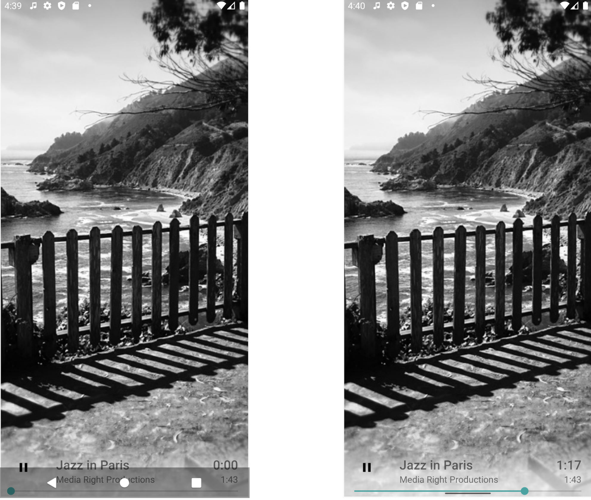
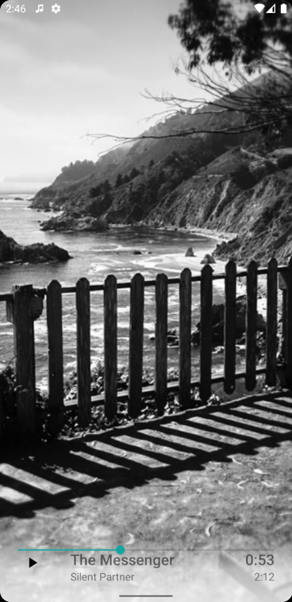
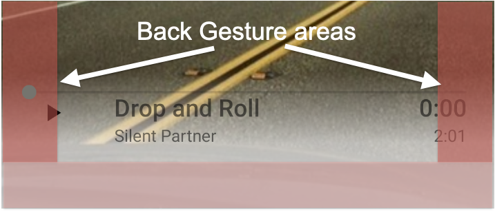

# Gesture Navigation and the edge-to-edge experience=
[**CodeLab**](https://developer.android.com/codelabs/gesture-navigation/)

## Introduction
For `Android version 10 or higher`, `navigation gestures` are supported as a new mode   
1. `swipes up from the bottom edge of the screen` -> to the Android home screen    
2. `swipe inward from the left or right edges` -> to the previous screen    

### What you'll learn
1. How to use `inset listeners` on views   
2. How to use the `Gesture Exclusion API`   
3. How `immersive mode behaves` when gestures are active   

### Enable Gesture Navigation
System settings > System > System Navigation > Gesture Navigation.

## Go edge-to-edge (FullScreen)

### Draw behind the navigation bar
```xml
<!-- change navigation bar color -->
<item name="android:navigationBarColor">
    @android:color/transparent
</item>

<!-- change status bar color -->
<item name="android:statusBarColor">
    @android:color/transparent
</item>
```
### System UI visibility flags
```kotlin
  val content: FrameLayout = findViewById(R.id.fragmentContainer)
  content.systemUiVisibility = View.SYSTEM_UI_FLAG_LAYOUT_STABLE or
            View.SYSTEM_UI_FLAG_LAYOUT_FULLSCREEN or
            View.SYSTEM_UI_FLAG_LAYOUT_HIDE_NAVIGATION
```    
</img>    
Notice that the `SeekBar` is `hidden behind` the navigation bar and that `Play/Pause` is mostly covered by the `navigation bar`    
System settings > System > System Navigation > Gesture Navigation    
The app is `now drawing edge-to-edge`, but there are `usability issues`, app controls which `conflict and overlap`, and these must be resolved.

## Insets
change `FrameLayout` -> `FragmentContainerView` for `FragmentContainer`    

```kotlin
val initialPadding = playerView.paddingBottom

playerView = view.findViewById(R.id.playerLayout)
playerView.setOnApplyWindowInsetsListener { view, insets ->
   view.updatePadding(
      bottom = insets.systemWindowInsetBottom + initialPadding
   )
   insets
}
```
move Seekbar to bottom layout  

</img>    
Now `seekbar` and `bottom gesture area` departed.

## Gesture Exclusion API
</img>   
`MySeekBar.kt` 
```kotlin
private val gestureExclusionRects = mutableListOf<Rect>()

override fun onLayout(changed: Boolean, left: Int, top: Int, right: Int, bottom: Int) {
    super.onLayout(changed, left, top, right, bottom)

    if (changed) {
        updateGestureExclusion()
    }
}

override fun onDraw(canvas: Canvas) {
    super.onDraw(canvas)
    updateGestureExclusion()
}

private fun updateGestureExclusion() {
    // Skip this call if we're not running on Android 10+
    if (Build.VERSION.SDK_INT < 29) return

    // First, lets clear out any existing rectangles
    gestureExclusionRects.clear()

    // Now lets work out which areas should be excluded. For a SeekBar this will
    // be the bounds of the thumb drawable.
    thumb?.also { t ->
        gestureExclusionRects += t.copyBounds()
    }

    // Finally pass our updated list of rectangles to the system
    systemGestureExclusionRects = gestureExclusionRects
}
```
`View.class`
```java
@Override
public void setSystemGestureExclusionRects(@NonNull List<Rect> rects) {
    Preconditions.checkNotNull(rects, "rects must not be null");
    mUserGestureExclusionRects = rects;
    updateGestureExclusionRects();
}
```