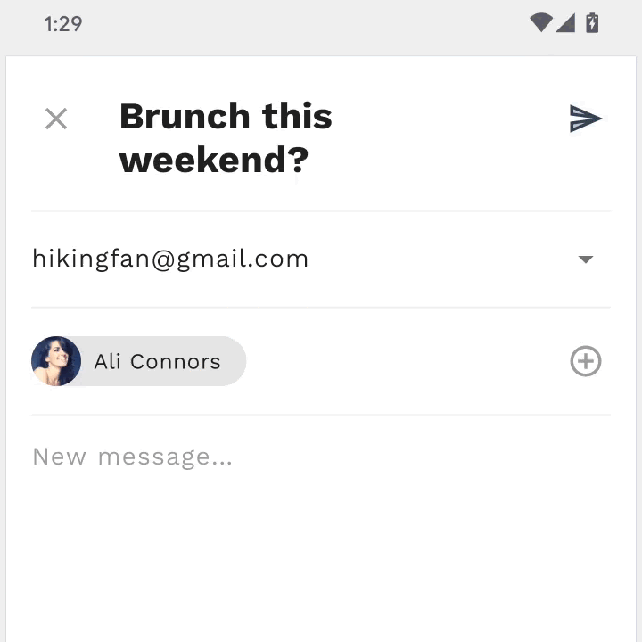

# Material Motion with MDC

1. link: https://medium.com/androiddevelopers/material-motion-with-mdc-c1f09bb90bf9

2. Material Motion System has been released as part of MDC v1.2.0, and covers

   * Container transform
   * Shared axis
   * Fade through
   * Fade

3. Built on Android Platform (android.transition) and AndroidX formfactor (androidx.transition)

4. Reference: [Reply](https://material.io/design/material-studies/reply.html), which is simple email client app

   * Opening an email
   * Opening the search page
   * Switching mailboxes

5. Furthermore: [Material motion codelab](https://codelabs.developers.google.com/codelabs/material-motion-android/#0)

   

## Container Transform


1. It can be used when one thing *turns into* another thing.
2. Parent-Child Transitions from [Navigational Transition](https://material.io/design/navigation/navigation-transitions.html) which guides users between two scenes in our app.
   * When an element expands to fill the entire screen, the act of expansion expresses that the new screen is a **child** element. The screen from which it expanded is its **parent** element.

### Use case in Reply

1. Container transfrom between *HomeFragment* which holds a list of emails and *EmailFragment* which has details of email.

2. First step is using *Data Binding* to make sure each item has an unique transition name. (One of Shared Element)

   ```xml
   android:transitionName="@{@string/email_card_transition_name(email.id)}"
   ```

   * If minimum SDK level is 24, we can directly use this attribute.
   * If our app supports below 21, use this `ViewCompat.setTransitionName()` instead.

3. Second step is giving a static transition name. (Only one in the view hierachy)

   ```xml
   android:transitionName="@string/email_card_transition_name"
   ```

4. Both will be placed inside a drawable whose bounds are clipped inside a 'container' that animates its shape from a list item to a details page.

5. The container's contents are swapped by fading the incoming screen in on top of the outgoing screen.

6. Creating and set our destination Fragment's `sharedElementEnterTransition` to a new instance of `MaterialContainerTransform`. 

   ```kotlin
   sharedElementEnterTransition = MaterialContainerTransform().apply {
      // The drawing view is the id of the view above which the container transform 
      // will play in z-space.
      drawingViewId = R.id.nav_host_fragment
      duration = resources.getInteger(R.integer.reply_motion_duration_large).toLong()
      // Set the color of the scrim to transparent as we also want to animate the 
      // list fragment out of view
      scrimColor = Color.TRANSPARENT
      setAllContainerColors(requireContext().themeColor(R.attr.colorSurface))
   }
   ```

7. Transacting between 2 fragments with mapping between our departure and destination's view transition name when clicking email.

   ```kotlin
   override fun onEmailClicked(cardView: View, email: Email) {
        exitTransition = MaterialElevationScale(false).apply {
            duration = resources.getInteger(R.integer.reply_motion_duration_large).toLong()
        }
        reenterTransition = MaterialElevationScale(true).apply {
              duration = resources.getInteger(R.integer.reply_motion_duration_large).toLong()
        }
        val emailCardDetailTransitionName = getString(R.string.email_card_detail_transition_name)
        val extras = FragmentNavigatorExtras(cardView to emailCardDetailTransitionName)
        val directions = HomeFragmentDirections.actionHomeFragmentToEmailFragment(email.id)
        findNavController().navigate(directions, extras)
    }
   ```

   * *Material Component provides two helper transitions to smoothly animate a fragment that is being replaced.*
     * **Hold** would simply keep our list of email in place.
     * **MaterialElevationScale** will scale out our list of emails when exiting, and scale them back in when reentering.
     * Without setting an exit transition, our email list would immediately be removed and disappear from view.

8. `postponeEnterTransition` and `startPostponedEnterTransition()`

   ```kotlin
   postponeEnterTransition()
   view.doOnPreDraw { startPostponedEnterTransition() }
   ```

   * We can postpone until the transition system knows all views are populated.

9. Use case in ComposeFragment, transitioning from chip to cardView. (In codelab)

   ```kotlin
   val transform = MaterialContainerTransform().apply {
      startView = binding.recipientCardView
      endView = chip
      scrimColor = Color.TRANSPARENT
      startElevation = requireContext().resources.getDimension(
          R.dimen.email_recipient_card_popup_elevation_compat
      )
      addTarget(chip)
   }
   
   TransitionManager.beginDelayedTransition(binding.composeConstraintLayout, transform)
   ```





 10. Container Transform from FAB to compose email page (in codelab)

     * Destination Fragment side

       ```kotlin
       enterTransition = MaterialContainerTransform().apply {
          startView = requireActivity().findViewById(R.id.fab)
          endView = emailCardView
          duration = resources.getInteger(R.integer.reply_motion_duration_large).toLong()
          scrimColor = Color.TRANSPARENT
          containerColor = requireContext().themeColor(R.attr.colorSurface)
          startContainerColor = requireContext().themeColor(R.attr.colorSecondary)
          endContainerColor = requireContext().themeColor(R.attr.colorSurface)
       }
       returnTransition = Slide().apply {
          duration = resources.getInteger(R.integer.reply_motion_duration_medium).toLong()
          addTarget(R.id.email_card_view)
       }
       ```

     * MainActivity side

       ```kotlin
       currentNavigationFragment?.apply {
          exitTransition = MaterialElevationScale(false).apply {
              duration = resources.getInteger(R.integer.reply_motion_duration_large).toLong()
          }
          reenterTransition = MaterialElevationScale(true).apply {
              duration = resources.getInteger(R.integer.reply_motion_duration_large).toLong()
          }
       }
       
       val directions = ComposeFragmentDirections.actionGlobalComposeFragment(currentEmailId)
       findNavController(R.id.nav_host_fragment).navigate(directions)
       ```

       * CurrentNavigationFragment is defined below.

         ```kotlin
         val currentNavigationFragment: Fragment?
                 get() = supportFragmentManager.findFragmentById(R.id.nav_host_fragment)
                         ?.childFragmentManager
                         ?.fragments
                         ?.first()
         ```

         


# Shared axis: Opening the search page


1. It's used for transitions between UI elements with spatial or navigational relationship.

2. Between the email list and the search page, we can find shared z-axis transition is used.

3. *Continuous and direcdtional* animation -> There are 'paired' animation

   *  Fragment A's `exitTransition` and Fragment B's `enterTransition`
   *  Fragment A's `reenterTransition` and Fragment B's `returnTransition`

4. **MaterialSharedAxis** implements the shared axis pattern, and accepts `forward` to control this directionality.

5. Exit and Reenter transitions for the current fragment 

   ```kotlin
   currentNavigationFragment?.apply {
      exitTransition = MaterialSharedAxis(
         MaterialSharedAxis.Z, 
         /* forward= */ true
      ).apply {
         duration = resources.getInteger(R.integer.reply_motion_duration_large).toLong()
      }
      reenterTransition = MaterialSharedAxis(
         MaterialSharedAxis.Z, 
         /* forward= */ false
      ).apply {
          duration =resources.getInteger(R.integer.reply_motion_duration_large).toLong()
      }
   }
   ```

6. Enter and Return transitions for the destination fragment

   ```kotlin
   enterTransition = MaterialSharedAxis(
      MaterialSharedAxis.Z, 
      /* forward= */ true
   ).apply {
      duration = resources.getInteger(R.integer.reply_motion_duration_large).toLong()
   }
   returnTransition = MaterialSharedAxis(
      MaterialSharedAxis.Z, 
      /* forward= */ false
   ).apply {
      duration = resources.getInteger(R.integer.reply_motion_duration_large).toLong()
   }
   ```

   * `forward` of exit - enter are set to true / one of reenter and return is with false.

   * `android:transitionGroup="true"`  in the xml file corresponding to the destination fragment

     * This attribute is only available on API level 24 or higher.

     * If our app supports below 21, use this `ViewGroupCompat.setTransitionGroup`.

       

# Fade through: Switching mailbox


1. This can be used to transition between UI elements not having a strong releationship.

2. **MaterialFadeThrough** has no directionality. 

   * Therefore we can set an exit transition on our outgoing fragment,
   * and set and enter transition on our incoming one.

   ```kotlin
   currentNavigationFragment?.apply {
      exitTransition = MaterialFadeThrough().apply {
          duration = resources.getInteger(R.integer.reply_motion_duration_large).toLong()
      }
   }
   ```

   ```kotlin
   enterTransition = MaterialFadeThrough().apply {
      duration = resources.getInteger(R.integer.reply_motion_duration_large).toLong()
   }
   ```

3. The need to set `android:transitionGroup='true'` applies here but it has been taken care of during *shared axis*.


# Furthermore

1. Possibility to customize this -> [customize motion](https://material.io/design/motion/customization.html)
2. The motion system can be applied to not only Fragment but also transition between activities all the way down to Views.
3. [Reference](https://material.io/develop/android/theming/motion) in material.io
4. [Material Component repo](https://github.com/material-components/material-components-android/blob/master/docs/theming/Motion.md)
5. [Material Motion Codelab](https://codelabs.developers.google.com/codelabs/material-motion-android/#0)

