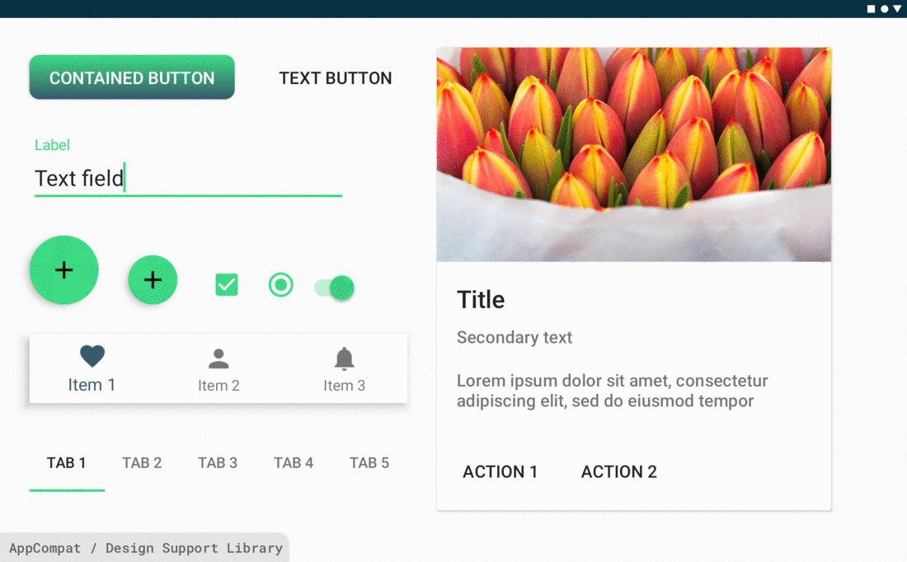
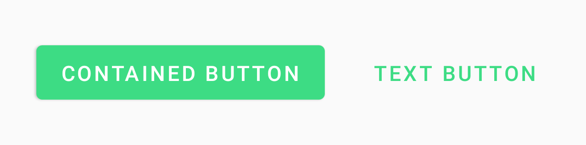
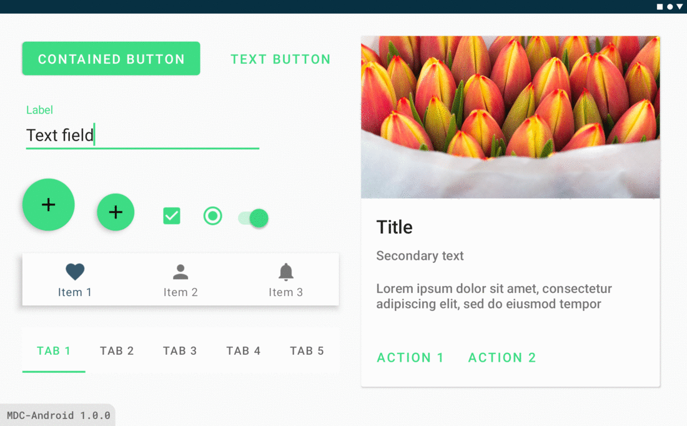
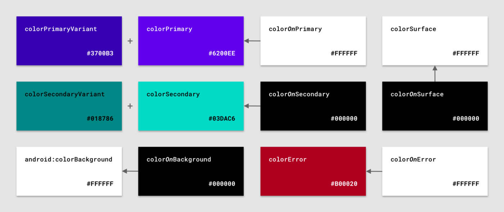
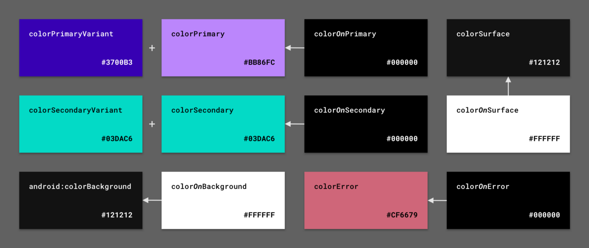
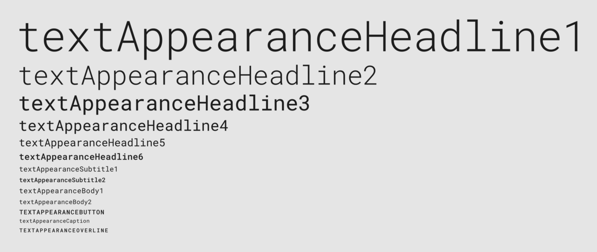
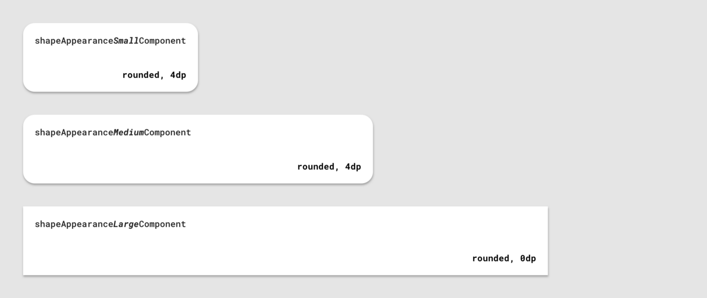

# Migrating to Material Components for Android

- 최근 Material Design Components (이하 MDC) 1.1.0 발표

- MDC는 Design Support Library를 대체함


## 1. Migrating from the Support Library to Jetpack

- Support Library to Android Jetpack
    - [official developer documentation](https://developer.android.com/jetpack/androidx/migrate)
    - [ “Migrating to AndroidX: The time is right” talk](https://www.youtube.com/watch?v=Hyt7LR5mXLc)
    - Android Studio - Refactor > Migrate to AndroidX
    
- Change your theme

```
<!-- Copyright 2020 Google LLC.
   SPDX-License-Identifier: Apache-2.0 -->
-<style name="Theme.App" parent="Theme.AppCompat.*">
+<style name="Theme.App" parent="Theme.MaterialComponents.*">
    ...
</style>
```

<!-- Copyright 2020 Google LLC.
   SPDX-License-Identifier: Apache-2.0 -->
| AppCompat theme | MDC-Android theme |
| --------------- | ----------------- |
| `Theme.AppCompat` | `Theme.MaterialComponents` |
| `Theme.AppCompat.NoActionBar` | `Theme.MaterialComponents.NoActionBar` |
| `Theme.AppCompat.Dialog.*` | `Theme.MaterialComponents.Dialog.*` |
| `Theme.AppCompat.DialogWhenLarge` | `Theme.MaterialComponents.DialogWhenLarge` |
| `Theme.AppCompat.Light` | `Theme.MaterialComponents.Light` |
| `Theme.AppCompat.Light.DarkActionBar` | `Theme.MaterialComponents.Light.DarkActionBar` |
| `Theme.AppCompat.Light.NoActionBar` | `Theme.MaterialComponents.Light.NoActionBar` |
| `Theme.AppCompat.Light.Dialog.*` | `Theme.MaterialComponents.Light.Dialog.*` |
| `Theme.AppCompat.Light.DialogWhenLarge` | `Theme.MaterialComponents.Light.DialogWhenLarge` |
| `Theme.AppCompat.DayNight` | `Theme.MaterialComponents.DayNight` |
| `Theme.AppCompat.DayNight.DarkActionBar` | `Theme.MaterialComponents.DayNight.DarkActionBar` |
| `Theme.AppCompat.DayNight.NoActionBar` | `Theme.MaterialComponents.DayNight.NoActionBar` |
| `Theme.AppCompat.DayNight.Dialog.*` | `Theme.MaterialComponents.DayNight.Dialog.*` |
| `Theme.AppCompat.DayNight.DialogWhenLarge` | `Theme.MaterialComponents.DayNight.DialogWhenLarge` |


<!-- Copyright 2020 Google LLC.
   SPDX-License-Identifier: Apache-2.0 -->
| AppCompat theme overlay | MDC-Android theme overlay |
| ----------------------- | ------------------------- |
| `ThemeOverlay.AppCompat` | `ThemeOverlay.MaterialComponents` |
| `ThemeOverlay.AppCompat.Light` | `ThemeOverlay.MaterialComponents.Light` |
| `ThemeOverlay.AppCompat.Dark` | `ThemeOverlay.MaterialComponents.Dark` |
| `ThemeOverlay.AppCompat.*.ActionBar` | `ThemeOverlay.MaterialComponents.*.ActionBar.*` |
| `ThemeOverlay.AppCompat.Dialog.*` | `ThemeOverlay.MaterialComponents.Dialog.*` |
| N/A | `ThemeOverlay.MaterialComponents.*.BottomSheetDialog` |
| N/A | `ThemeOverlay.MaterialComponents.MaterialAlertDialog.*` |
| N/A | `ThemeOverlay.MaterialComponents.MaterialCalendar.*` |
| N/A | `ThemeOverlay.MaterialComponents.Toolbar.*` |


- Design support -> MDC 1.0




## 2. Button changes

- 위 사항 들을 변경하고 나면, 버튼의 변화를 관찰할 수 있다. 
- custom background 가 제거됨
- 대부분 녹색의 강조색상이 사용되고, 자간이 넓어짐 (위쪽 gif 참조)



```xml
<!-- Copyright 2020 Google LLC.
   SPDX-License-Identifier: Apache-2.0 -->
<Button
    android:id="@+id/containedButton"
    android:background="@drawable/bg_button_gradient"
    android:textColor="@android:color/white"
    ... />
<Button
    android:id="@+id/textButton"
    style=”?attr/borderlessButtonStyle”
    ... />
```
    
- MDC widgets and auto-inflation
    - AppCompat과 마찬가지로, MDC 또한 inflation시점에 일부 프레임워크 위젯을 MDC 위젯으로 교체한다.

<!-- Copyright 2020 Google LLC.
   SPDX-License-Identifier: Apache-2.0 -->
| Framework widget | AppCompat widget (replaced by [`AppCompatViewInflater`](https://developer.android.com/reference/androidx/appcompat/app/AppCompatViewInflater)) | MDC-Android widget (replaced by [`MaterialComponentsViewInflater`](https://github.com/material-components/material-components-android/blob/master/lib/java/com/google/android/material/theme/MaterialComponentsViewInflater.java)) |
| ---------------- | -------------------------------------------------------------------------------------------------------------------------------------------- | -------------------------------------------------------------------------------------------------------------------------------------------------------------------------------------------------------------------------------- |
| `Button` | [`AppCompatButton`](https://developer.android.com/reference/androidx/appcompat/widget/AppCompatButton) | [`MaterialButton`](https://github.com/material-components/material-components-android/blob/master/lib/java/com/google/android/material/button/MaterialButton.java) |
| `CheckBox` | [`AppCompatCheckBox`](https://developer.android.com/reference/androidx/appcompat/widget/AppCompatCheckBox) | [`MaterialCheckBox`](https://github.com/material-components/material-components-android/blob/master/lib/java/com/google/android/material/checkbox/MaterialCheckBox.java) |
| `RadioButton` | [`AppCompatRadioButton`](https://developer.android.com/reference/androidx/appcompat/widget/AppCompatRadioButton) | [`MaterialRadioButton`](https://github.com/material-components/material-components-android/blob/master/lib/java/com/google/android/material/radiobutton/MaterialRadioButton.java) |
| `TextView` | [`AppCompatTextView`](https://developer.android.com/reference/androidx/appcompat/widget/AppCompatTextView) | [`MaterialTextView`](https://github.com/material-components/material-components-android/blob/master/lib/java/com/google/android/material/textview/MaterialTextView.java) |
| `AutoCompleteTextView` | [`AppCompatAutoCompleteTextView`](https://developer.android.com/reference/androidx/appcompat/widget/AppCompatAutoCompleteTextView) | [`MaterialAutoCompleteTextView`](https://github.com/material-components/material-components-android/blob/master/lib/java/com/google/android/material/textfield/MaterialAutoCompleteTextView.java) |

- 참고로 MDC 1.0.0에서는 Buttons 만 교체되었습니다. 위의 다른 위젯은 라이브러리의 후속 버전에 추가되었습니다.

## 3. Updating to MDC 1.1.0

주요 변화점

- Full Material Theming support for color, typography, and shape
- Dark theme support
- Android 10 gesture navigation insets in widgets
- New widgets like the extended FAB, date picker, badges, and toggle buttons
- Accessibility improvements, bug fixes, and more


- MDC 1.0 -> MDC 1.1



- Textfield 변화
    - user research에 의해 개선
    - 기존 레거시로 되돌리려면..
    
    ```xml
    <!-- Copyright 2020 Google LLC.
       SPDX-License-Identifier: Apache-2.0 -->
    <com.google.android.material.textfield.TextInputLayout
        ...
    +    style="@style/Widget.Design.TextInputLayout">
        ...
    </com.google.android.material.textfield.TextInputLayout>
  
    ```
    - 테마 수정을 통해 기존 레거시로 되돌리려면
    
    ```xml
      
  <!-- Copyright 2020 Google LLC.
     SPDX-License-Identifier: Apache-2.0 -->
  <style name="Theme.App" parent="Theme.MaterialComponents.*">
      ...
  +    <item name=”textInputStyle”>@style/Widget.App.TextInputLayout</item>
  </style>
  
  +<style name=”Widget.App.TextInputLayout” parent=”Widget.Design.TextInputLayout”>
  +    <!-- Custom attrs -->
  +</style>
    
    ```
  
  ## 4. Prefer MDC styles and widgets
  
   - Design support 보다 MDC 사용하는 것이 더 좋다.
   - 마이그레이션할때 고려해야하는 요소
   
   1. 레이아웃에 직접 사용되는 위젯은 MDC 버전으로 변경해야함.
   2. 모든 스타일, 기본 스타일 및 기본 스타일 속성은 MDC 버전으로 변경해야함.
   3. 프로그래밍 방식으로 또는 사용자 지정 클래스의 부모로 사용되는 모든 위젯은 MDC 버전으로 변경해야함
   

 <!-- Copyright 2020 Google LLC.
    SPDX-License-Identifier: Apache-2.0 -->
 | MDC-Android widget (moved from Design Support Library) | Design Support Library default style | MDC-Android default style | Default style attr |
 | ------------------------------------------------------ | ------------------------------------ | ------------------------- | ------------------ |
 | [`AppBarLayout`](https://github.com/material-components/material-components-android/blob/master/lib/java/com/google/android/material/appbar/AppBarLayout.java) | `Widget.Design.AppBarLayout` | `Widget.MaterialComponents.AppBarLayout.*` | `appBarLayoutStyle` |
 | [`BottomNavigationView`](https://github.com/material-components/material-components-android/blob/master/lib/java/com/google/android/material/bottomnavigation/BottomNavigationView.java) | `Widget.Design.BottomNavigationView` | `Widget.MaterialComponents.BottomNavigationView` | `bottomNavigationStyle` |
 | [`BottomSheetBehavior`](https://github.com/material-components/material-components-android/blob/master/lib/java/com/google/android/material/bottomsheet/BottomSheetBehavior.java) | `Widget.Design.BottomSheet.Modal` | `Widget.MaterialComponents.BottomSheet.*` | `bottomSheetStyle` |
 | [`BottomSheetDialog`](https://github.com/material-components/material-components-android/blob/master/lib/java/com/google/android/material/bottomsheet/BottomSheetDialog.java)<br>[`BottomSheetDialogFragment`](https://github.com/material-components/material-components-android/blob/master/lib/java/com/google/android/material/bottomsheet/BottomSheetDialogFragment.java) | `Theme.Design.Light.BottomSheetDialog` | `Theme.MaterialComponents.*.BottomSheetDialog`<br>`ThemeOverlay.MaterialComponents.*.BottomSheetDialog` | `bottomSheetDialogTheme` |
 | [`CollapsingToolbarLayout`](https://github.com/material-components/material-components-android/blob/master/lib/java/com/google/android/material/appbar/CollapsingToolbarLayout.java) | `Widget.Design.CollapsingToolbar` | N/A | N/A |
 | [`FloatingActionButton`](https://github.com/material-components/material-components-android/blob/master/lib/java/com/google/android/material/floatingactionbutton/FloatingActionButton.java) | `Widget.Design.FloatingActionButton` | `Widget.MaterialComponents.FloatingActionButton` | `floatingActionButtonStyle` |
 | [`NavigationView`](https://github.com/material-components/material-components-android/blob/master/lib/java/com/google/android/material/navigation/NavigationView.java) | `Widget.Design.NavigationView` | `Widget.MaterialComponents.NavigationView` | `navigationViewStyle` |
 | [`Snackbar`](https://github.com/material-components/material-components-android/blob/master/lib/java/com/google/android/material/snackbar/Snackbar.java) | `Widget.Design.Snackbar` | `Widget.MaterialComponents.Snackbar` | `snackbarStyle` |
 | [`TabLayout`](https://github.com/material-components/material-components-android/blob/master/lib/java/com/google/android/material/tabs/TabLayout.java)<br>[`TabItem`](https://github.com/material-components/material-components-android/blob/master/lib/java/com/google/android/material/tabs/TabItem.java) | `Widget.Design.TabLayout` | `Widget.MaterialComponents.TabLayout` | `tabStyle` |
 | [`TextInputLayout`](https://github.com/material-components/material-components-android/blob/master/lib/java/com/google/android/material/textfield/TextInputLayout.java)<br>[`TextInputEditText`](https://github.com/material-components/material-components-android/blob/master/lib/java/com/google/android/material/textfield/TextInputEditText.java) | `Widget.Design.TextInputLayout` | `Widget.MaterialComponents.TextInputLayout.*` | `textInputStyle` |
 
 <!-- Copyright 2020 Google LLC.
    SPDX-License-Identifier: Apache-2.0 -->
 | AppCompat widget | AppCompat default style | AppCompat default style attr | MDC-Android widget | MDC-Android default style | MDC-Android default style attr |
 | ---------------- | ----------------------- | ---------------------------- | ------------------ | ------------------------- | ------------------------------ |
 | [`AlertDialog.Builder`](https://developer.android.com/reference/androidx/appcompat/app/AlertDialog.Builder) | `AlertDialog.AppCompat`<br>`ThemeOverlay.AppCompat.Dialog.Alert` | `alertDialogStyle`<br>`alertDialogTheme` | [`MaterialAlertDialogBuilder`](https://github.com/material-components/material-components-android/blob/master/lib/java/com/google/android/material/dialog/MaterialAlertDialogBuilder.java) | `MaterialAlertDialog.MaterialComponents`<br>`ThemeOverlay.MaterialComponents.MaterialAlertDialog` | `alertDialogStyle`<br>`materialAlertDialogTheme` |
 | [`AppCompatAutoCompleteTextView`](https://developer.android.com/reference/androidx/appcompat/widget/AppCompatAutoCompleteTextView) | `Widget.AppCompat.AutoCompleteTextView` | `autoCompleteTextViewStyle` | [`MaterialAutoCompleteTextView`](https://github.com/material-components/material-components-android/blob/master/lib/java/com/google/android/material/textfield/MaterialAutoCompleteTextView.java) | `Widget.MaterialComponents.AutoCompleteTextView.*`<br>`ThemeOverlay.MaterialComponents.AutoCompleteTextView.*` | `autoCompleteTextViewStyle` |
 | [`AppCompatButton`](https://developer.android.com/reference/androidx/appcompat/widget/AppCompatButton) | `Widget.AppCompat.Button` | `buttonStyle` | [`MaterialButton`](https://github.com/material-components/material-components-android/blob/master/lib/java/com/google/android/material/button/MaterialButton.java) | `Widget.MaterialComponents.Button` | `materialButtonStyle` |
 | [`AppCompatCheckBox`](https://developer.android.com/reference/androidx/appcompat/widget/AppCompatCheckBox) | `Widget.AppCompat.CompoundButton.CheckBox` | `checkboxStyle` | [`MaterialCheckbox`](https://github.com/material-components/material-components-android/blob/master/lib/java/com/google/android/material/checkbox/MaterialCheckBox.java) | `Widget.MaterialComponents.CompoundButton.CheckBox` | `checkboxStyle` |
 | [`AppCompatImageView`](https://developer.android.com/reference/androidx/appcompat/widget/AppCompatImageView) | N/A | N/A | [`ShapeableImageView`](https://github.com/material-components/material-components-android/blob/master/lib/java/com/google/android/material/imageview/ShapeableImageView.java) | `Widget.MaterialComponents.ShapeableImageView` | N/A |
 | [`AppCompatRadioButton`](https://developer.android.com/reference/androidx/appcompat/widget/AppCompatRadioButton) | `Widget.AppCompat.CompoundButton.RadioButton` | `radioButtonStyle` | [`MaterialRadioButton`](https://github.com/material-components/material-components-android/blob/master/lib/java/com/google/android/material/radiobutton/MaterialRadioButton.java) | `Widget.MaterialComponents.CompoundButton.RadioButton` | `radioButtonStyle` |
 | [`AppCompatTextView`](https://developer.android.com/reference/androidx/appcompat/widget/AppCompatTextView) | `Widget.AppCompat.TextView` | N/A | [`MaterialTextView`](https://github.com/material-components/material-components-android/blob/master/lib/java/com/google/android/material/textview/MaterialTextView.java) | `Widget.MaterialComponents.TextView` | N/A |
 | [`CardView`](https://developer.android.com/reference/androidx/cardview/widget/CardView) | `CardView` | `cardViewStyle` | [`MaterialCardView`](https://github.com/material-components/material-components-android/blob/master/lib/java/com/google/android/material/card/MaterialCardView.java) | `Widget.MaterialComponents.CardView` | `materialCardViewStyle` |
 | [`PopupMenu`](https://developer.android.com/reference/androidx/appcompat/widget/PopupMenu) | `Widget.AppCompat.PopupMenu.*` | `popupMenuStyle` | N/A | `Widget.MaterialComponents.PopupMenu.*` | `popupMenuStyle` |
 | [`SwitchCompat`](https://developer.android.com/reference/androidx/appcompat/widget/SwitchCompat) | `Widget.AppCompat.CompoundButton.Switch` | `switchStyle` | [`SwitchMaterial`](https://github.com/material-components/material-components-android/blob/master/lib/java/com/google/android/material/switchmaterial/SwitchMaterial.java) | `Widget.MaterialComponents.CompoundButton.Switch` | `switchStyle` |
 | [`Toolbar`](https://developer.android.com/reference/androidx/appcompat/widget/Toolbar) | `Widget.AppCompat.Toolbar` | `toolbarStyle` | [`MaterialToolbar`](https://github.com/material-components/material-components-android/blob/master/lib/java/com/google/android/material/appbar/MaterialToolbar.java) | `Widget.MaterialComponents.Toolbar` | `toolbarStyle` |
 
 - 예시
 
```xml
<!-- Copyright 2020 Google LLC.
   SPDX-License-Identifier: Apache-2.0 -->
-<androidx.cardview.widget.CardView
+<com.google.android.material.card.MaterialCardView
    android:id="@+id/card"
    ...>
    ...
-</androidx.cardview.widget.CardView>
+</com.google.android.material.card.MaterialCardView>

-<androidx.appcompat.widget.SwitchCompat
+<com.google.android.material.switch.SwitchMaterial
    android:id="@+id/switch"
    ... />
``` 


## 5. Color

- 새로운 속성
    1. 적절하게 명명 된 프레임 워크의 기존 특성 (예. android:colorBackground)
    2. 적절하게 이름이 지정된 AppCompat의 기존 속성 (예 : colorPrimary및 colorError)
    3. 새로운이 MDC에 의해 도입 된 속성 (예 :. colorSurface, colorOnPrimary등) 

- MDC color attributes with baseline light theme values



- MDC color attributes with baseline dark theme values



- full color attribute mapping table below:

<!-- Copyright 2020 Google LLC.
   SPDX-License-Identifier: Apache-2.0 -->
| AppCompat / framework color attr | MDC-Android color attr |
| -------------------- | ---------------------- |
| `colorPrimary` | `colorPrimary` | Keep |
| `colorPrimaryDark` | `colorPrimaryVariant`<br>(specify `android:statusBarColor` explicitly) |
| N/A | `colorOnPrimary` |
| `colorAccent` | `colorSecondary` |
| N/A | `colorSecondaryVariant` |
| N/A | `colorOnSecondary` |
| N/A | `colorSurface` |
| N/A | `colorOnSurface` |
| `android:colorBackground` | `android:colorBackground` |
| N/A | `colorOnBackground` |
| `colorError` | `colorError` |
| N/A | `colorOnError` |
| `android:textColorPrimary`, `android:textColorSecondary`, etc. | N/A<br>(prefer MDC "on" attrs or use defaults) |
| `colorControlNormal`, `colorControlHighlight`, `colorControlActivated` | N/A<br>(prefer MDC "on" attrs or use defaults)<br>_**Note:** These are still used to tint [`MaterialCheckBox`](https://github.com/material-components/material-components-android/tree/master/lib/java/com/google/android/material/checkbox/MaterialCheckBox.java#L119), [`MaterialRadioButton`](https://github.com/material-components/material-components-android/tree/master/lib/java/com/google/android/material/radiobutton/MaterialRadioButton.java#L110), [`SwitchMaterial`](https://github.com/material-components/material-components-android/tree/master/lib/java/com/google/android/material/switchmaterial/SwitchMaterial.java#L148) and [`MaterialToolbar` icons](https://github.com/material-components/material-components-android/tree/master/lib/java/com/google/android/material/appbar/res/values/styles.xml#L78)._ |

- 예시 

```xml
<!-- Copyright 2020 Google LLC.
   SPDX-License-Identifier: Apache-2.0 -->
<style name="Theme.App" parent="Theme.MaterialComponents.*">
    ...
    <item name="colorPrimary">@color/navy_700</item>
-    <item name="colorPrimaryDark">@color/navy_900</item>
+    <item name="colorPrimaryVariant">@color/navy_900</item>
-    <item name="colorAccent">@color/green_300</item>
+    <item name="colorSecondary">@color/green_300</item>
+    <item name=”colorSecondaryVariant”>@color/green_500</item>
+    <item name="android:statusBarColor">@color/navy_900</item>
</style>
```

## 6. Typography

-  New TextAppearance styles/attributes
    - 기존 AppCompat / 프레임 워크 스타일을 대체 하는 새로운 TextAppearance.MaterialComponents.*스타일 세트 및 해당 textAppearance*테마 속성이 도입
    
    
    
    - See the full type style and attribute mapping table below:
    
    <!-- Copyright 2020 Google LLC.
       SPDX-License-Identifier: Apache-2.0 -->
    | AppCompat text style | MDC-Android text style | MDC-Android text attr |
    | -------------------- | ---------------------- | --------------------- |
    | `TextAppearance.AppCompat.Display4` | `TextAppearance.MaterialComponents.Headline1` | `textAppearanceHeadline1` |
    | `TextAppearance.AppCompat.Display3` | `TextAppearance.MaterialComponents.Headline2` | `textAppearanceHeadline2` |
    | `TextAppearance.AppCompat.Display2` | `TextAppearance.MaterialComponents.Headline3` | `textAppearanceHeadline3` |
    | `TextAppearance.AppCompat.Display1` | `TextAppearance.MaterialComponents.Headline4` | `textAppearanceHeadline4` |
    | `TextAppearance.AppCompat.Headline` | `TextAppearance.MaterialComponents.Headline5` | `textAppearanceHeadline5` |
    | `TextAppearance.AppCompat.Title`<br>`TextAppearance.AppCompat.Large` | `TextAppearance.MaterialComponents.Headline6` | `textAppearanceHeadline6` |
    | `TextAppearance.AppCompat.Subhead`<br>`TextAppearance.AppCompat.Menu` | `TextAppearance.MaterialComponents.Subtitle1` | `textAppearanceSubtitle1` |
    | `TextAppearance.AppCompat.Small` | `TextAppearance.MaterialComponents.Subtitle2` | `textAppearanceSubtitle2` |
    | `TextAppearance.AppCompat.Body1` | `TextAppearance.MaterialComponents.Body1` | `textAppearanceBody1` |
    | `TextAppearance.AppCompat.Body2` | `TextAppearance.MaterialComponents.Body2` | `textAppearanceBody2` |
    | `TextAppearance.AppCompat.Button` | `TextAppearance.MaterialComponents.Button` | `textAppearanceButton` |
    | `TextAppearance.AppCompat.Caption` | `TextAppearance.MaterialComponents.Caption` | `textAppearanceCaption` |
    | N/A | `TextAppearance.MaterialComponents.Overline` | `textAppearanceOverline` |
    
    - 예제
    
    ```xml
   <!-- Copyright 2020 Google LLC.
      SPDX-License-Identifier: Apache-2.0 -->
   <com.google.android.material.card.MaterialCardView
       ...>
       ...
       <TextView
           android:id=”@+id/headerText”
   -        android:textAppearance="@style/TextAppearance.AppCompat.Title"
   +        android:textAppearance="?attr/textAppearanceHeadline6"
           ... />
       <TextView
           android:id=”@+id/subheadText”
           android:textColor="?android:attr/textColorSecondary"
   -        android:textAppearance="@style/TextAppearance.AppCompat.Body2"
   +        android:textAppearance="?attr/textAppearanceBody2"
           ... />
       <TextView
           android:id=”@+id/supportingText”
           android:textColor="?android:attr/textColorSecondary"
   -        android:textAppearance="@style/TextAppearance.AppCompat.Body2"
   +        android:textAppearance="?attr/textAppearanceBody2"
           ... />
   </com.google.android.material.card.MaterialCardView>
    
    ```

    - Customize type scales with font family
    
    ```xml
   
  <!-- Copyright 2020 Google LLC.
     SPDX-License-Identifier: Apache-2.0 -->
  <style name="Theme.App" parent="Theme.MaterialComponents.*">
      ...
  +    <item name="textAppearanceHeadline6">@style/TextAppearance.App.Headline6</item>
  +    <item name="textAppearanceBody2">@style/TextAppearance.App.Body2</item>
  </style>
  
  +<style name="TextAppearance.App.Headline6"
  +    parent="TextAppearance.MaterialComponents.Headline6">
  +    <item name="fontFamily">@font/roboto_mono_medium</item>
  +</style>
  +<style name="TextAppearance.App.Body2"
  +    parent="TextAppearance.MaterialComponents.Body2">
  +    <item name="fontFamily">@font/roboto_mono_regular</item>
  +</style>
    ```
    
## 7. Shape

- Material Design shape system은 MDC 위젯의 코너를 다루는 방법이 적용됨
    - `ShapeAppearance.*` style
    -  `cornerFamily`, `cornerSize*` dimension
    
   
   
- Widget backgrounds

    - MaterialShapeDrawable 기본 구현 클래스
    - 모든 MDC 위젯은 기본적으로이 drawable을 배경으로 사용

- 예제 

1. 코너 관련 속성
```xml
<!-- Copyright 2020 Google LLC.
   SPDX-License-Identifier: Apache-2.0 -->
<com.google.android.material.bottomnavigation.BottomNavigationView
-    android:background="@android:color/white"
    ... />

<com.google.android.material.card.MaterialCardView
-    app:cardCornerRadius="2dp"
    ...>
    ...
</com.google.android.material.card.MaterialCardView>

```

2. 코너 관련 dimension

```xml

<!-- Copyright 2020 Google LLC.
   SPDX-License-Identifier: Apache-2.0 -->
<style name="Theme.App" parent="Theme.MaterialComponents.*">
    ...
+    <item name="shapeAppearanceSmallComponent">@style/ShapeAppearance.App.SmallComponent</item>
+    <item name="shapeAppearanceMediumComponent">@style/ShapeAppearance.App.MediumComponent</item>
+    <item name="shapeAppearanceLargeComponent">@style/ShapeAppearance.App.LargeComponent</item>
</style>

+<style name="ShapeAppearance.App.SmallComponent"
+   parent="ShapeAppearance.MaterialComponents.SmallComponent">
+    <item name="cornerFamily">rounded</item>
+    <item name="cornerSize">8dp</item>
+</style>
+<style name="ShapeAppearance.App.MediumComponent"
+    parent="ShapeAppearance.MaterialComponents.MediumComponent">
+    <item name="cornerFamily">rounded</item>
+    <item name="cornerSize">12dp</item>
+</style>
+<style name="ShapeAppearance.App.LargeComponent"
+    parent="ShapeAppearance.MaterialComponents.LargeComponent">
+    <item name="cornerFamily">rounded</item>
+    <item name="cornerSize">16dp</item>
+</style>

```

3. 위젯 백그라운드

```xml
<!-- Copyright 2020 Google LLC.
   SPDX-License-Identifier: Apache-2.0 -->
-<Button
+<androidx.appcompat.widget.AppCompatButton
    android:background="@drawable/bg_button_gradient"
+    android:textAppearance="?attr/textAppearanceButton"
    ... />

```

## 8. What’s next?

- MDC 1.2 이미 릴리즈 된듯
