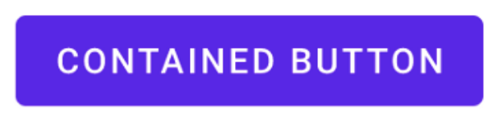
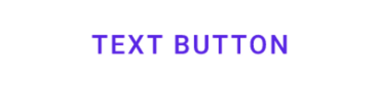
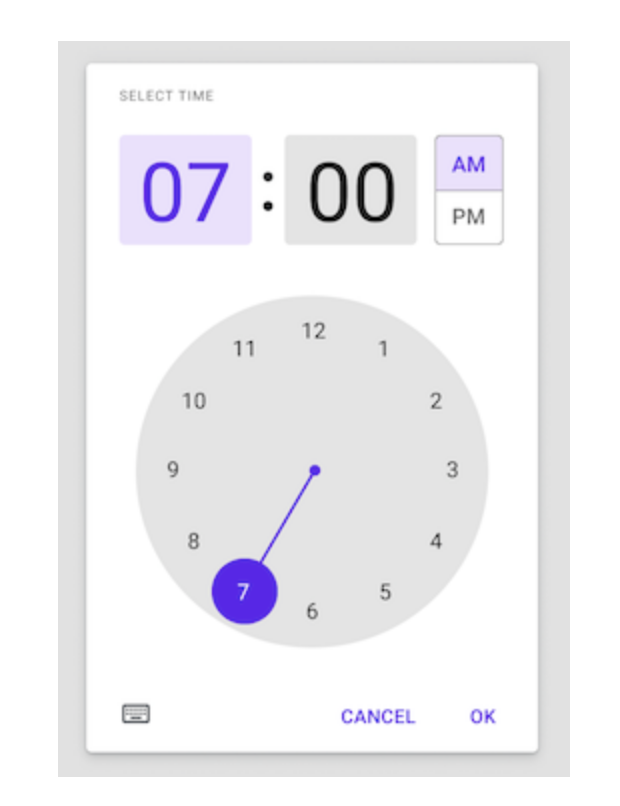
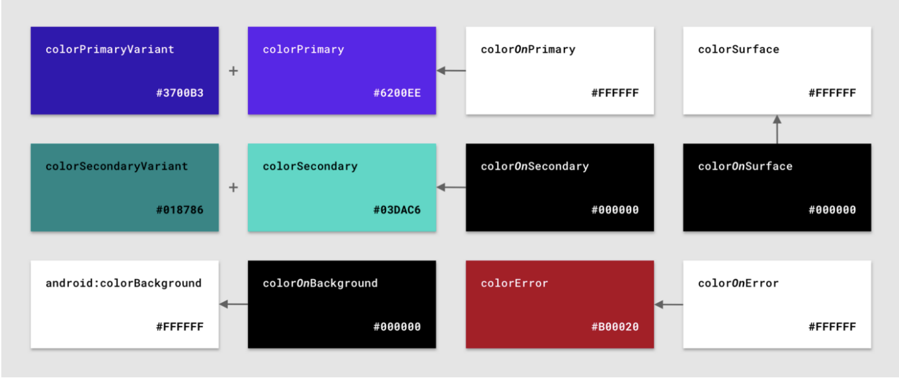
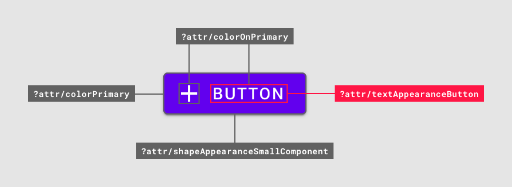
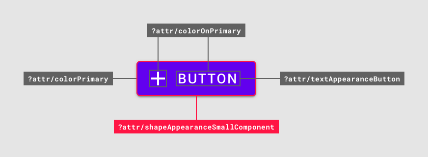

# We Recommend Material Design Components

Created By: PilJu BAE

Links: https://medium.com/androiddevelopers/we-recommend-material-design-components-81e6d165c2dd

### [d.android.com/design](http://d.android.com/design)

안드로이드 앱이 플랫폼과 일치하는 형태로 보이길 기대

[Material Design Components](https://github.com/material-components/material-components-android) (MDC)

# Widgets

- 스타일이 지정된 위젯을 제공
- MaterialComponets theme를 사용한다면 ViewInflater 에서 Material 위젯으로 자동 인스턴스화
- 추가 스타일

    

    ```xml
    <Button ...
        style="?attr/materialButtonStyle"/>
    ```

    

    ```xml
    <Button ...
        style="?attr/borderlessButtonStyle"/>
    ```

- [다른 위젯들](https://material.io/components)

    [Bottom Navigation](https://material.io/develop/android/components/bottom-navigation) , [Bottom Sheet](https://material.io/develop/android/components/sheets-bottom), [Floating Action Button](https://material.io/develop/android/components/floating-action-button)

    [Chips](https://material.io/develop/android/components/chips), [Date Picker,](https://material.io/develop/android/components/picker) [Time Picker](https://github.com/material-components/material-components-android/blob/master/docs/components/TimePicker.md)



# Material Theming

제품 브랜드를 반영하도록 Material Design을 사용자 정의하는 방법

- [color](https://material.io/design/color/the-color-system.html#color-usage-and-palettes) : [Material Theming with MDC: Color](https://medium.com/androiddevelopers/material-theming-with-mdc-color-860dbba8ce2f)
    - 12가지 팔레트 제공

    

    [12 color “slots”](res/12%20color%20slots.csv)

    - alpha

        `?attr/` 로 사용할 수 없고, 단일 리소스 방식에 위배 되므로 권장하는 방식이 아님 

        ```xml
        <!-- 60% alpha = 99 -->
        <color name=”navy_700_alpha_60”>#9937596D</color>
        ```

        아래와 같은 방식 추천

        ```xml
        <!-- In res/color/primary_60.xml -->
        <selector ...>
            <item android:alpha="0.6" android:color="?attr/colorPrimary" />
        </selector>
        ```

- [typography](https://material.io/design/typography/the-type-system.html#type-scale) : [Material Theming with MDC: Type](https://medium.com/androiddevelopers/material-theming-with-mdc-type-8c2013430247)

    

    - `TextAppearance`
    - Calculating `letterSpacing`

        (Tracking from Sketch / font size in sp) = letter spacing

        (0.25 tracking / 14sp font size) = 0.0178571429 em (measurement)

    - `android:lineHeight` API 28 에서 추가
- [shape](https://material.io/design/shape/about-shape.html#shaping-material) : [Material Theming with MDC: Shape](https://medium.com/androiddevelopers/material-theming-with-mdc-shape-126c4e5cd7b4)

    

    - `ShapeAppearance` - style

        ```xml
        <!-- In res/values/shape.xml -->
        <style name="ShapeAppearance.App.SmallComponent" parent="ShapeAppearance.MaterialComponents.SmallComponent">
            <item name="cornerFamily">cut</item>
            <item name="cornerSize">4dp</item>
            ...
        </style>
        ```

# Material Motion 🆕


- [Material Motion with MDC](https://medium.com/androiddevelopers/material-motion-with-mdc-c1f09bb90bf9)

# Others

- [Dark Theme with MDC](https://medium.com/androiddevelopers/dark-theme-with-mdc-4c6fc357d956)
- Jetpack Compose

    [Android Compose Theme Adapter](https://github.com/material-components/material-components-android-compose-theme-adapter)

    MDC XML → Compose MaterialTheme 로 변경

- MDC new project template 추가

    [Migrating to Material Components for Android](https://medium.com/androiddevelopers/migrating-to-material-components-for-android-ec6757795351)
