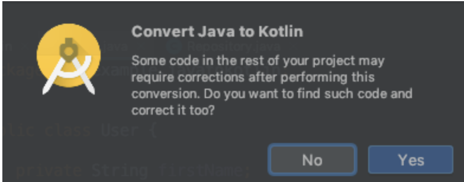
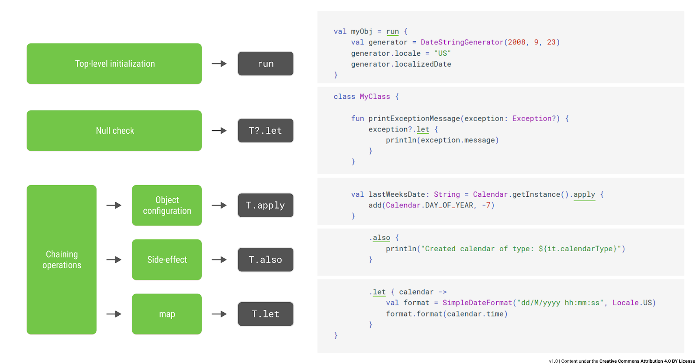
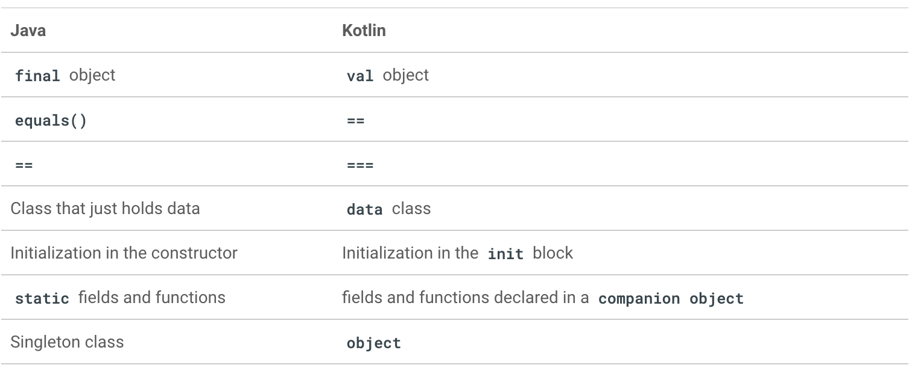

# Converting to Kotlin
[**CodeLab**](https://developer.android.com/codelabs/java-to-kotlin?authuser=1&return=https%3A%2F%2Fdeveloper.android.com%2Fcourses%2Fpathways%2Fandroid-week5-languages%3Fauthuser%3D1%23codelab-https%3A%2F%2Fdeveloper.android.com%2Fcodelabs%2Fjava-to-kotlin#0/)
## Getting set up
[**See Java example**](/Java%20samples.md)

## Convert to Kotlin
Go to the ```User.java``` file and convert it to Kotlin: ```Menu bar -> Code -> Convert Java File to Kotlin File```.<br/>
If your IDE prompts for correcting after conversion, press ```Yes```.<br/>
Shortcut = ```left (Shift + option + command) + k```<br/><br/>
</img><br/><br/>

```kotlin
class User(var firstName: String?, var lastName: String?)
```
`getter` and `setter` method, making its value mutable.<br/>
Kotlin's keyword for mutable variables is ```var```<br/>
Java properties had only ```getters```, would have been declared as ```val```<br/>
```val``` is similar to the ```final``` keyword in Java.<br/>
variable can accept a ```null``` value. It does this by appending a `?` to the type declaration.<br/><br/>

## Data Class
```kotlin
data class User(var firstName: String?, var lastName: String?)
```
class only holds data<br/>
 It will derive the `equals()`, `hashCode()`, and `toString()` functions.<br/>
 to create an instance<br/>
 ```kotlin
val user1 = User("Jane", "Doe")
 ```
<br/>

## Equality
```kotlin
val user1 = User("Jane", "Doe")
val user2 = User("Jane", "Doe")
val structurallyEqual = user1 == user2 // true
val referentiallyEqual = user1 === user2 // false
```
`==` operator calls `equals()`<br/>
`===` operator and checks if two references point to the `same object`<br/><br/>

## Default arguments, named arguments
```kotlin
data class User(var firstName: String?, var lastName: String? = null)

// usage
val jane = User("Jane") // same as User("Jane", null)
val joe = User("Joe", "Doe")
```
```kotlin
data class User(var firstName: String? = null, var lastName: String?)

// usage
val john = User(firstName = "John", lastName = "Doe") 
val jane = User(lastName = "Doe") // same as User(null, "Doe")
val john2 = User("John", "Doe")
```
<br/>

## Object initialization, companion object and singletons
[**See Kotlin example**](/Kotlin%20samples.md)

Remove the `?` in `User?` within the users type declaration<br/>
Remove the `?` in `User?` for the return type of `getUsers()` so it returns `List<User>?`

## Handling singletons
```kotlin
object Repository {

    private var users: MutableList<User>? = null
    fun getUsers(): List<User>? {
       return users
    }

    val formattedUserNames: List<String>
        get() {
            val userNames: MutableList<String> = ArrayList(users!!.size)

            for (user in users) {
                var name: String
                name = if (user!!.lastName != null) {
                    if (user!!.firstName != null) {
                        user!!.firstName + " " + user!!.lastName
                    } else {
                        user!!.lastName
                    }
                } else if (user!!.firstName != null) {
                    user!!.firstName
                } else {
                    "Unknown"
                }
                userNames.add(name)
        }
       return userNames
   }

    // keeping the constructor private to enforce the usage of getInstance
    init {
        val user1 = User("Jane", "")
        val user2 = User("John", null)
        val user3 = User("Anne", "Doe")
        users = ArrayList<Any?>()
        users.add(user1)
        users.add(user2)
        users.add(user3)
    }
}
```
When using the `object` class, we just call `functions` and `properties` directly on the object, like this:
```kotlin
val formattedUserNames = Repository.formattedUserNames
```
## Handling nullability
* handling nullability
  * Doing a null check `( if (users != null) {...} )`
  * Using the `elvis operator` `?:` (covered later in the codelab)
  * Using some of the Kotlin standard functions (covered later in the codelab)

```kotlin
private var users: MutableList<User>? = null

// For simplicity, we can use the mutableListOf() function and provide the list element type. mutableListOf<User>()
private val users = mutableListOf<User>()

// Since the users variable is already initialized, remove this initialization from the init block
users = ArrayList<Any?>()
```

```kotlin
 init {
        val user1 = User("Jane", "")
        val user2 = User("John", null)
        val user3 = User("Anne", "Doe")
        //users = ArrayList<Any?>() this code can be deleted.
        users.add(user1)
        users.add(user2)
        users.add(user3)
    }
```
With these changes, our `users` property is now `non-null`, and we can remove all the unnecessary `!!` operator
```kotlin
//val userNames: MutableList<String> = ArrayList(users.size)
val userNames = ArrayList<String>(users.size)

for (user in users) {
    var name: String
    name = if (user.lastName != null) {
        if (user.firstName != null) {
            user.firstName + " " + user.lastName
        } else {
            user.lastName
        }
    } else if (user.firstName != null) {
        user.firstName
    } else {
        "Unknown"
    }

    userNames.add(name)
}
```
## Destructuring
```kotlin
for ((firstName, lastName) in users) {
    var name: String
    name = if (lastName != null) {
        if (firstName != null) {
            firstName + " " + lastName
        } else {
            lastName
        }
    } else if (firstName != null) {
        firstName
    } else {
        "Unknown"
    }

    userNames.add(name)
}
```
## if expression
```kotlin
name = if (lastName != null) {
    if (firstName != null) {
        firstName + " " + lastName
    } else {
        lastName
    }
} else if (firstName != null) {
    firstName
} else {
    "Unknown"
}
```
## Elvis operator
```kotlin
name = if (lastName != null) {
    ...
} else {
    firstName ?: "Unknown"
}
```
## String templates
```kotlin
firstName + " " + lastName
// can be convert to
"$firstName $lastName"
```
## simplified code for formattedUserNames
```kotlin
val formattedUserNames: List<String>
    get() {
        val userNames = ArrayList<String>(users.size)

        for ((firstName, lastName) in users) {
            val name = if (lastName != null) {
                if (firstName != null) {
                    "$firstName $lastName"
                } else {
                    lastName
                }
            } else {
                firstName ?: "Unknown"
            }
            userNames.add(name)
        }
        return userNames
    }
```
<br/>

## Operations on collections
```kotlin
val formattedUserNames: List<String>
        get() {
            return users.map { user ->
                if (user.lastName != null) {
                    if (user.firstName != null) {
                        "${user.firstName} ${user.lastName}"
                    } else {
                        user.lastName ?: "Unknown"
                    }
                }  else {
                    user.firstName ?: "Unknown"
                }
            }
        }
```
<br/>

## Properties and backing properties
[**Function VS Property**](https://blog.kotlin-academy.com/kotlin-should-i-define-function-or-property-6786951da909)

```kotlin
private val _users = mutableListOf<User>()

// fun getUsers(): List<User>? {
//     return users
// }

val users: List<User>
    get() = _users
```
private `_users` property becomes the backing property for the public `users` property.

## Top-level and extension functions and properties
```kotlin
// extension function
fun User.getFormattedName(): String {
    return if (lastName != null) {
        if (firstName != null) {
            "$firstName $lastName"
        } else {
            lastName ?: "Unknown"
        }
    } else {
        firstName ?: "Unknown"
    }
}

// extension property
val User.userFormattedName: String
    get() {
        return if (lastName != null) {
            if (firstName != null) {
                "$firstName $lastName"
            } else {
                lastName ?: "Unknown"
            }
        } else {
            firstName ?: "Unknown"
        }
    }

// usage:
val user = User(...)
val name = user.getFormattedName()
val formattedName = user.userFormattedName
```
We can then use the extension functions and properties as if they're part of the `User` class.<br/>
Because the `formatted name` is a property of the `User` class and `not a functionality of the Repository class`

```kotlin
val User.formattedName: String
    get() {
        return if (lastName != null) {
            if (firstName != null) {
                "$firstName $lastName"
            } else {
                lastName ?: "Unknown"
            }
        } else {
            firstName ?: "Unknown"
        }
    }

object Repository {
   ...
   val formattedUserNames: List<String>
        get() {
            return _users.map { user -> user.formattedName }
        }
    ...
}
```

## Scope functions: let, apply, with, run, also
</img><br/><br/>
Since we're configuring our `_users` object in our `Repository`, we can make the code more idiomatic by using the `apply` function:<br/>
```kotlin
init {
    val user1 = User("Jane", "")
    val user2 = User("John", null)
    val user3 = User("Anne", "Doe")
   
    _users.apply {
       // this == _users
       add(user1)
       add(user2)
       add(user3)
    }

    // with example
    val myObj = with(DateStringGenerator(2008, 9, 23)) {
        locale = "US"
        lacalizedDate
    }
 }
```

## Wrap up
```kotlin
data class User(var firstName: String?, var lastName: String?)

val User.formattedName: String
    get() {
       return if (lastName != null) {
            if (firstName != null) {
                "$firstName $lastName"
            } else {
                lastName ?: "Unknown"
            }
        } else {
            firstName ?: "Unknown"
        }
    }

object Repository {
    private val _users = mutableListOf(
        User("Jane", ""), 
        User("John", null), 
        User("Anne", "Doe")
    )

    val users: List<User>
        get() = _users

    val formattedUserNames: List<String>
        get() = _users.map { user -> user.formattedName }
}
```
<br/>

</img><br/><br/>