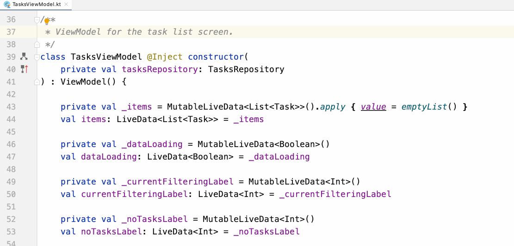
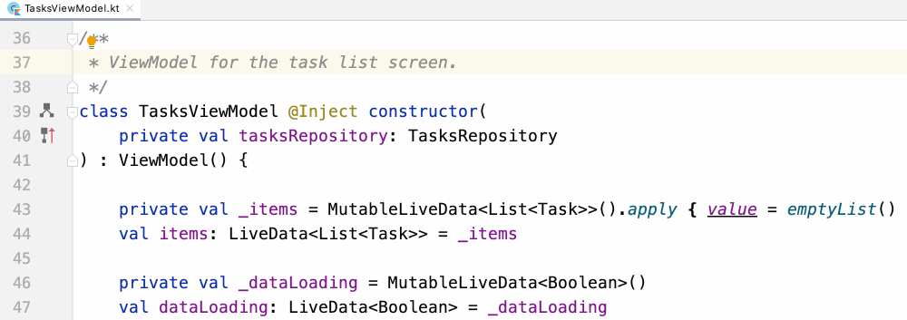
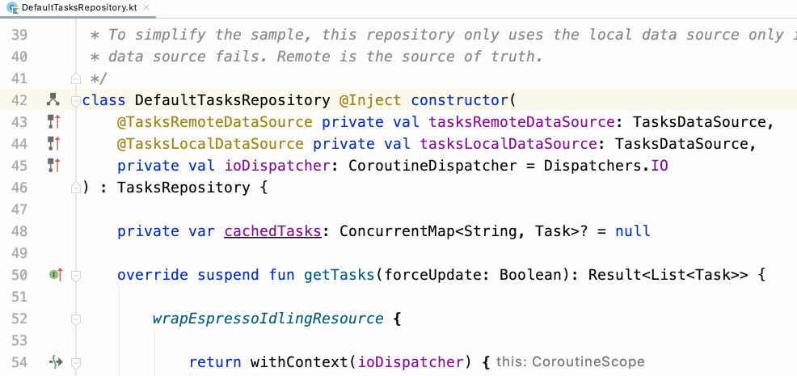

# Dagger and Hilt navigation support in Android Studio

1. In order to tackle the difficulties that we encounter when we use **Dagger-Related code**, 

   * Android Studio 4.1 (currently in Beta)

     * **A new icon** allows us to easily navigate between codes regarding Dagger
       * Dependency producers, consumers, components, subcomponents and modules
     * **Find usages** works in same way.

   * Android Studio 4.2 (currently in Canary)

     * **HIlt support** added, so it helps us to navigate between components, from **entry points**

     




2. A new Gutter icon which we can see in projects using Dagger2 or Hilt:

   * Icon with arrow up : where the type is provided (e.g where dependencies come from)

   * Tree-shaped Icon : where the type is used as a dependency

     

   

​																		*New Dagger and Hilt gutter icons in Android Studio*

3. In Action

   * In this example,  ```TaskViewModel``` has a dependency on ```TaskRepository```. 

   * Tapping that icon takes us to the ```@Binds``` method in ```AppModuleBinds``` that provides ```TaskRepository```.

     

   
   

4. In Action 2

   * Given the below , if the dependency is provided using a qualifier, we can go directly to the provider method.

   * `DefaultTasksRepository` depends on a `TasksDataSource` provided with a qualifier.

   *  Tapping on the gutter icon takes you to the method in `AppModule` that provides that type with that qualifier.

     




5. How to find where the dependencys are used in:

   * Assuming that a dependency is being used in multiple classes (consumers), we can choose what consumer the IDE brings us to.
   * Given sample codes, we can find that `DefaultTasksRepository` is used by different `ViewModel`s.
   * Tapping that icon lets us know where the dependency is used

   


6. Using **Find Usages**
   * By right clicking on the `bindRepository` of the `AppModulesBinds` class and select **Find Usages**


