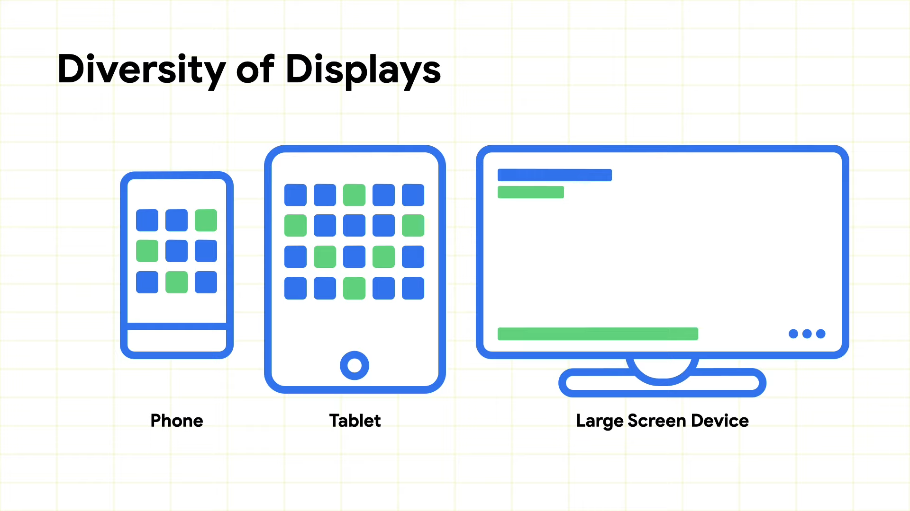
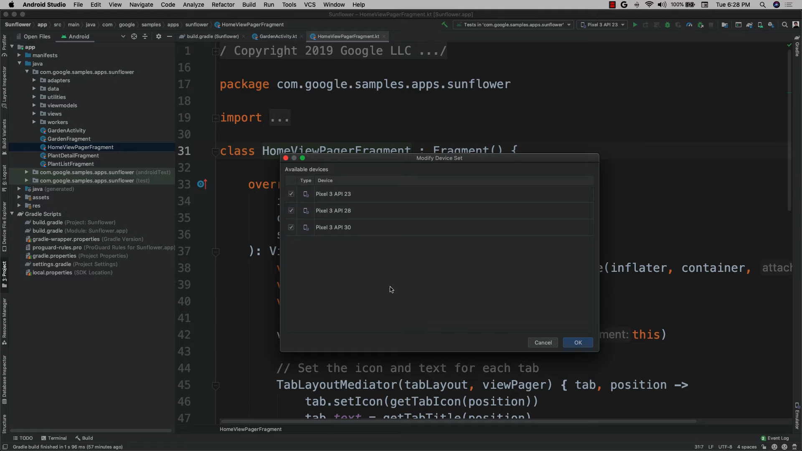
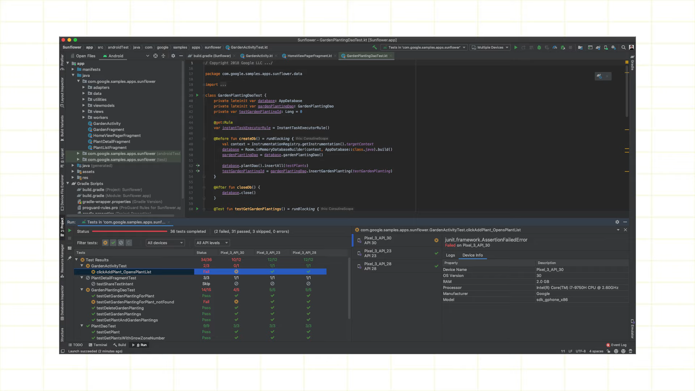

# Faster compatibility testing in Android Studio
[**YouTube Link**](https://www.youtube.com/watch?v=GM7CXRJKpEI)

</img> 

안드로이드 생태계가 다양해 지고, 사용자가 많아 지면서 개발자가 더 잘 만들기 위해 노력이 필요  

</img> 

QA를 통한 ManualQA를 진행하기 전에 개발단계에서 문제점을 찾을 수 있게 도와주는것이 목표  

</img> 

Play Console Statistics 가장 많이 사용되는 버전을 확인가능  

</img>  
</img> 

ADV에 테스트를 원하는 안드로이드 버전의 에뮬레이터들을 생성 
Modify Device Set에서 테스트할 에뮬레이터들을 선택 
테스트를 수행하면 한 화면에 안드로이드 버전에 따른 TestCase의 결과를 확인 가능 