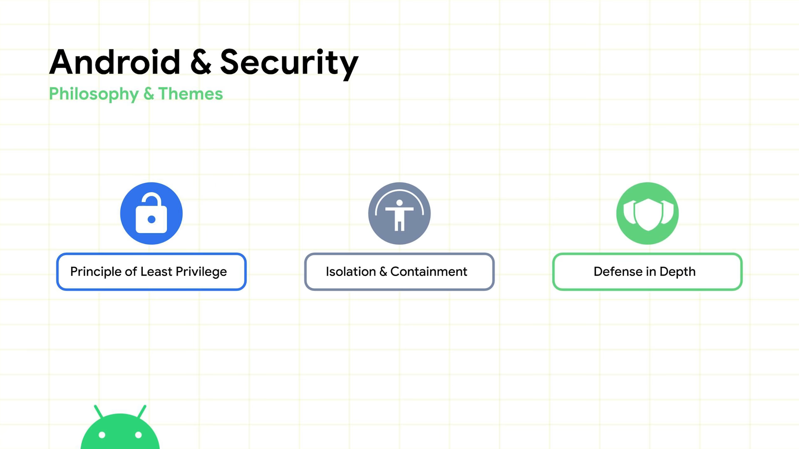
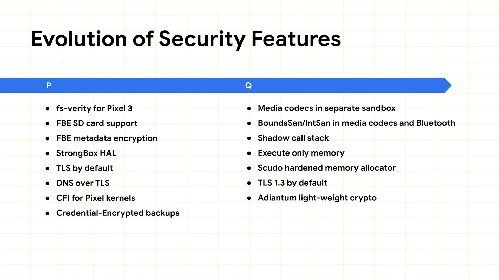
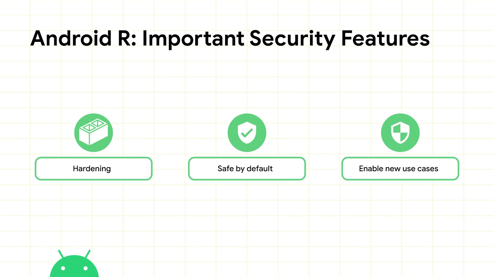
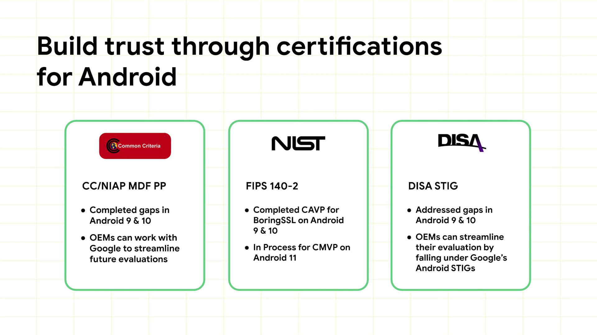
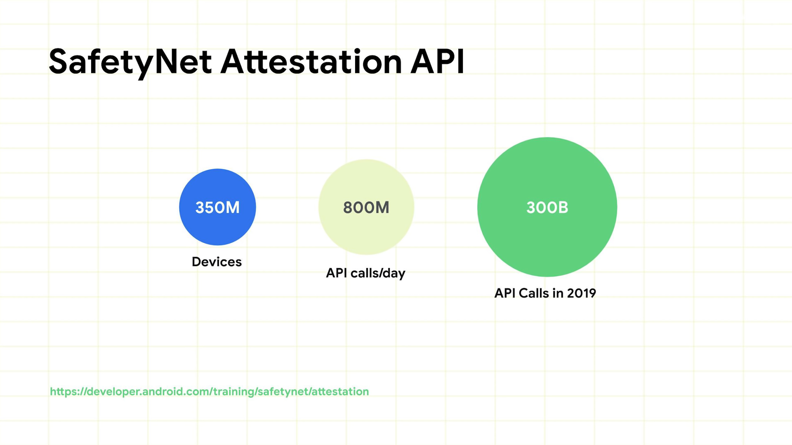
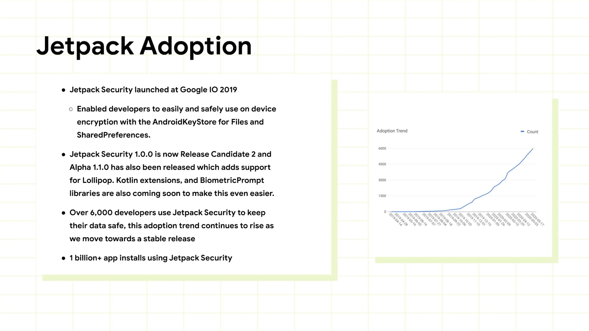

# Raising the bar in making Android safe for users

Created By: PilJu BAE
Last Edited: Jul 26, 2020 7:25 PM
Links: https://youtu.be/MNkFSCRUk6E

# Our security approach

1. 최소 권한의 원칙

    시스템의 모든 구성 요소가 작동을 위해 가능한 최소 권한을 가져야 함을 의미

2. 격리

    격리는 시스템 구성 요소와 앱이 서로 격리되어 하나의 취약점으로 인해 시스템 전체가 악용되지 않도록 

3. 심층 방어 

    전체 플랫폼의 보안에 대해 추론하기 위해 시스템의 단일 구성 요소에 의존해서는 안됨을 의미

# A Quick look at the past

1. P

    SELinux 도입

    사용자 데이터 파티션의 암호화를 도입, SD 카드를 포함하도록 확장

    데이터 센터 타이탄 보안 칩을 축소하여 Pixel 3에 추가

    StrongBox HAL을 통해 기본 API를 생태계에 제공

    TLS를 시작하면 모든 아웃 바운드 트래픽에 대해 기본적으로 활성화

    모든 DNS 조회가 TLS를 통해 이루어 지도록 하여 불법 액세스 지점이나 중개인이 사용자의 DNS 트래픽을 손상시키지 않도록

    엔드 투 엔드 암호화 백업을 도입

    - 사용자의 기본 잠금 화면 자격 증명 또는 암호에서 파생 된 키로 암호화
    - 소유 한 사용자 만 장치에서 암호를 해독
2. Q

    저가형 장치에 Adiantum 경량 암호화를 추가 - 완전한 디스크 암호화

# Android R

1. 플랫폼 강화 

    악용 비용을 높이고 취약점으로 인한 영향을 줄임

2. User privacy를 손상 시킬 수 있는 영구 식별자 유출하기 어렵게 추가 
3. 커널의 여러 시스템 서비스에 대해 제어 흐름 무결성 등의 컴파일러 지원 완화 적용 범위를 크게 확장
4. 플랫폼의 좀 더 안전한 사용 
    - 카메라 및 마이크에 대한 일회성 권한 추가
5. 핵심 플랫폼 구성 요소의 전체 보안 업데이트를 전체 생태계에 제공하기 위한 노력 - Project Mainline

    업데이트 가능한 12 개의 새로운 모듈을 포함하도록 Mainline의 범위를 확장  (DNS Resolver, Neural Network API, Wi-Fi Stack Permissions Controller 등)

# Certifications

1. Common Criteria

    세계에서 가장 포괄적 인 스마트 폰 보안 인증

    31 개국에서 인정되며 암호화, 무결성, 감사 및 제어에 중점

    Android 9 및 10의 Common Criteria의 경우 많은 차이를 해결 했으므로 OEM은 플랫폼에서 사용자 지정 변경 없이 이 평가를 수행 

2. FIPS 140-2

    National Institute of Standards and Technology

    암호화 모듈 자체에 대한 평가

    BoringCrypto가 FIPS 140-2에 대해 처리 중

    매우 적은 비용으로 우리의 인증을 piggy back하고 브랜드를 변경하고 자신의 인증서를 얻을 수 있음.

3. 미국 국방성 보안 기술 구현 안내서 STIG

    미국 국방성 네트워크에 장치를 배포하는 방법에 대한 지침

    Pixel을 참조 구현으로 사용하여 OEM 파트너에 대한 이러한 인증을 실제로 간소화

# SafetyNet

### SafetyNet Attestation API ?

- 앱 개발자가 앱이 실행되는 Android 기기를 평가할 수있는 남용 방지 API
- 악용 사례 감지의 일부로 이 API를 사용
- 시스템이 서버가 정품 앱과 상호 작용하는지 또는 정품 Android 기기에서 실행 중인지 확인

# Jetpack Security Library

일반적인 보안 구성의 워크 플로우를 단순화하고 일반적인 작업을 위한 암호화 된 보안 구성을 생성하기 위함.

### BiometricPrompt API

- Android R
- 앱이 민감한 부분을 잠금 해제하거나 액세스하는 데 필요한 인증 유형을 지정
- Jetpack에 추가 할 예정

# Identity Credentials in Android

- ID 자격 증명 기능
- 모바일 운전 면허증, 주민등록번호, 디지털 ID 등
- Jetpack Security Library 에서 새로운 API 로 제공될 예정

# Looking Ahead

- Transparency - 시스템 강화
- Hardening - 인증서 투명성

### Rust

- 메모리 안전 오류를 완전히 제거 할 수있는 비교적 새로운 시스템 언어
- 동등한 C ++ 코드보다 우수하거나 더 나은 속도로 실행하는 동안 잘못된 프로그램을 작성하기가 어려움
- Deep 시스템 레벨 프로그래밍을 위한 게임 체인저가 될 것